Track 3, AI-Supported Assessment. The track says citizen observations can be inconsistent and error-prone. We measure that with a two-minute photo test. Each volunteer gets a score for each of four kinds of creek damage, saved with every observation they make. The AI takes the same test. It may only ask a volunteer to look again, only where it passed, and only after the volunteer has answered. The AI's help must be measured, not assumed. A second test, planned before anyone took it, is designed to check whether that one question makes people more accurate; its benefit is not yet established. What the AI may and may not do is in its [model card](https://github.com/alejandro-publius/second-look/blob/main/docs/MODEL_CARD.md).

# Second Look

> **A creek observation should carry how well its observer sees.**
>
> People walk past concrete banks, dug-out channels, plants that do not belong and pipes. A two-minute photo test measures who does, per feature. The score travels with every observation, in OneAquaHealth's own FHIR profiles.
>
> Second Look teaches a volunteer the four kinds of creek damage people usually miss, tests them on 16 real photos, and keeps their score for each feature with every observation they make later. A city analyst reads each answer beside the score of the person who gave it.
>
> **At the creek.** The check asks the official OneAquaHealth Citizen Science App's own questions, word for word and in its order. It offers the official question and answer strings in English, Portuguese, Dutch, Norwegian, French and Italian, with marked English fallbacks where the translation's meaning differs. Our own interface text remains English.
>
> **What the AI does.** A vision model takes the same 16-photo test. Where it passed, it may ask the person to look again, once, and only after the person has answered. The person decides what to do with that, and the model never writes the record. You can meet the question in the assisted judge mode, [`/t2/demo`](https://second-look-79t.pages.dev/t2/demo): eight photos, nothing stored, and no model is called while you answer. It asks only when it disagrees with you, so answer Can't tell on a photo of a bank, a channel or a pipe to see it. Judge mode closed during the second wave because it shows the answers to the study's photos. It reopened after that wave's lock, <!--v:results/wave2_window.json#/lock_local-->Friday Oct 2, 2026 at 21:00 PDT<!--/v-->. In the creek check on the live site the checker is off today, so every answer you see there is a person's.
>
> **What is not known yet.** Neither study wave retained an eligible completed sitting, so we could not measure whether the lesson or the checker's question helps people. The results and exclusions are in the [first-wave report](results/usability_20260929.md), [second-wave report](results/usability_w2_20261004.md) and [second-wave assisted-study report](results/assist_w2_20261004.md). The late retry of the second lock job is recorded in [deviations](docs/deviations.md).
>
> **Train. Check. Verify. Record. Act.**

[](https://github.com/alejandro-publius/second-look/actions/workflows/check.yml)
[](LICENSE)
[](results/fhir_validation.json)
[](fhir/ig.lock)

<!-- claim: results/fhir_validation.json#/errors = 0 -->
<!-- claim: results/fhir_validation.json#/terminology_checks_ran = True -->

About the check badge: it links to the latest CI run. `make check` runs the HL7 validator on the committed examples; `make judge-check` reads the saved validation result. The validation result covers those examples.

Which creek shows more natural channel features? Take the two-minute test (about four minutes with its lesson), no camera needed: **https://second-look-79t.pages.dev**

| Left | Right |
|---|---|
| 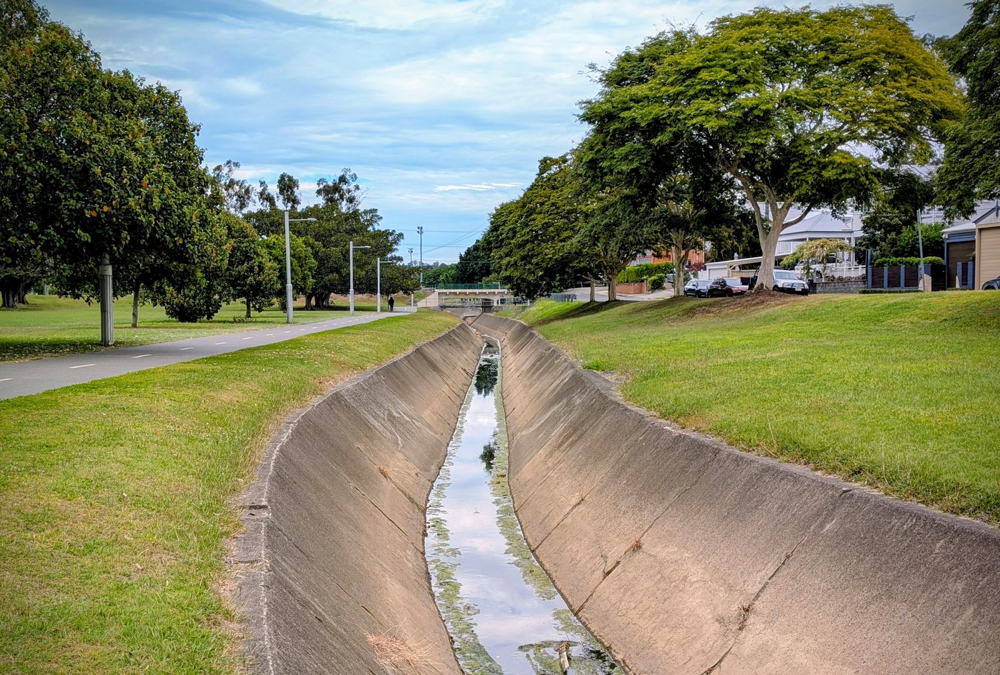 | 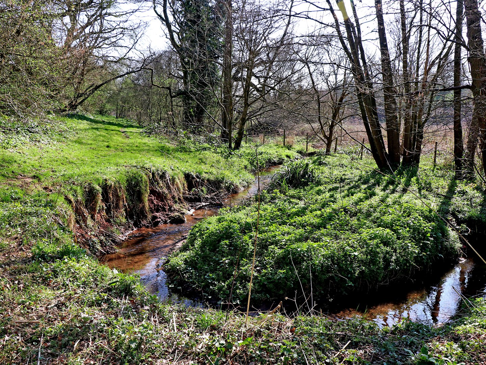 |
| Norman Creek, photo by Gregwadley, CC BY-SA 4.0, Wikimedia Commons | Nurton Brook, photo by Roger Kidd, CC BY-SA 2.0, Wikimedia Commons |

<details><summary>The answer</summary>

The tidy park on the left hides a concrete channel. The bend on the right shows more natural channel features. These photos alone do not establish either creek's ecological or human-health status.

</details>

**[Take the two-minute test](https://second-look-79t.pages.dev/t?src=other)** | **[Judges start here](https://second-look-79t.pages.dev/judges)** | **[Walk a creek from your desk](https://second-look-79t.pages.dev/walk)** | **[The AI's one question, try it](https://second-look-79t.pages.dev/t2/demo)** (open from the second lock)

<p align="center">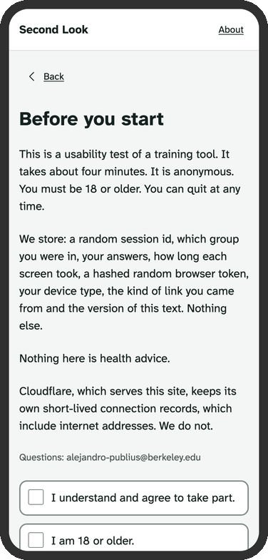</p>

The two-minute test from consent to the score screen: <!--v:results/screens.json#/gif/frames-->32<!--/v--> frames over <!--v:results/screens.json#/gif/seconds-->32.8<!--/v--> seconds. It was made from a local build with the mock API, so it added no session anywhere, and no frame shows a chosen answer on a test photo.

The test is a small randomized study, so there are two orders. The server puts each person at random in one of two groups, called arms: one sees the lesson before the 16 photos, as in the GIF; the other sees the 16 photos first and is offered the lesson after its score. If you take the test and the photos come first, that is your group, not a missing step.

How this answers the organizers' five headers: *The problem* and *Innovation and practical value* are under Why trust a volunteer, and the AI?; *How the solution aligns with OneAquaHealth* under How OneAquaHealth is used; *Effective use of data, technology, AI, APIs and standards* under Architecture and Evals; *A clear demonstration of what was built* under For judges. The Devpost text keeps the five headers as they are. The words this page uses are explained just below.

## Words used here

- **Feature:** one of the four kinds of creek damage the test covers: a built bank, a dug-out channel, a plant that does not belong, and a pipe running into the creek.
- **The checker:** a vision model that looks at a creek photo after the person has answered. It is off on the live site.
- **Pass table:** which features each model passed on the same 16-photo test people take, all four photos of a feature right in at least two of three runs. It is a committed file, and the only thing that lets a model speak.
- **Candidate flag and flag:** a candidate flag is a model saying a feature is there. The gate keeps it as a flag only for a feature that model passed, and a flag can only make one follow-up question eligible.
- **The gate:** the code that turns a model's answer into a flag or drops it, [`core/gate.py`](core/gate.py).
- **The lock:** the cutoff for a wave's data and its pre-registered analysis. Failed job attempts and retries are recorded in [`docs/deviations.md`](docs/deviations.md). The first lock was 2026-09-28T01:00:00Z, which is Sep 27 at 18:00 in California. The second lock, for the second wave, is <!--v:results/wave2_window.json#/lock_utc-->2026-10-03T04:00:00Z<!--/v-->, which is <!--v:results/wave2_window.json#/lock_local-->Friday Oct 2, 2026 at 21:00 PDT<!--/v-->.

<details>
<summary>More words, used further down this page</summary>

- **Arm:** one of the test's two groups, picked at random by the server: lesson first, or the 16 photos first with the lesson offered after the score.
- **Judge mode:** `/demo`, the 16 test photos with right or wrong after each answer, and `/t2/demo`, part 2's eight photos with the checker's question. It is shut while a wave of the study runs, because it gives away the answer key: the code allows it after the first lock, shuts it during the second wave, and allows it again after the second lock. The second wave has closed.
- **Walk:** `/walk`, a short clip of a real creek somewhere else and the same creek check done while you watch. It makes a demo record that is never counted.
- **prereg-v1:** the git tag on the analysis plan, made before anyone took the test. `prereg-v2` and `prereg-v3` fix part 2's plan and the second wave's plan the same way.
- **Golden vectors:** fixed inputs and outputs written by the Python code, which the TypeScript Worker must give back exactly.
- **The Mac:** one team member's laptop, Alex's, which runs the daily jobs (Known weaknesses says what that means).

</details>

## Numbers at a glance

**The result, in short.** Neither wave retained an eligible completed sitting, so we could not measure a human benefit. The AI's result: every model passed built banks, and none passed plants that do not belong. The instruction says to answer can't tell when no stream is in view, and the models often named the plant right and still said can't tell ([`docs/MODEL_CARD.md`](docs/MODEL_CARD.md)). On the point numbers each model beat the floor a checker gets by always answering No, <!--v:results/model_card.json#/benchmark/always_no/correct-->24<!--/v--> of <!--v:results/model_card.json#/benchmark/always_no/n-->48<!--/v-->. The three runs repeat the same photos, so the intervals are too narrow to say more. On <!--v:results/footage_pool.json#/frames_kept-->46<!--/v--> frames of real creek footage the gate dropped <!--v:results/footage_latest.json#/gate/dropped-->29<!--/v--> of <!--v:results/footage_latest.json#/gate/candidates-->64<!--/v--> candidate flags.

### The AI, on the same 16 photos and on real creek footage

| | The 16-photo test people take | Frames from open creek footage |
|---|---|---|
| Pool | 16 photos, 4 per feature, the frozen question wording | <!--v:results/footage_pool.json#/frames_kept-->46<!--/v--> frames from <!--v:results/footage_pool.json#/videos_kept-->5<!--/v--> openly licensed videos in <!--v:results/footage_pool.json#/countries_kept-->3<!--/v--> countries, screened for people and text |
| Right answers, three runs of the 16 photos | Claude Haiku 4.5 <!--v:results/benchmark_20260924T054939Z.json#/models/claude-haiku-4-5-20251001/all/correct-->31<!--/v--> of <!--v:results/benchmark_20260924T054939Z.json#/models/claude-haiku-4-5-20251001/all/n-->48<!--/v-->, Claude Sonnet 5 <!--v:results/benchmark_20260924T054939Z.json#/models/claude-sonnet-5/all/correct-->33<!--/v--> of <!--v:results/benchmark_20260924T054939Z.json#/models/claude-sonnet-5/all/n-->48<!--/v-->, Claude Opus 5.5 <!--v:results/benchmark_20260924T054939Z.json#/models/claude-opus-5-5/all/correct-->33<!--/v--> of <!--v:results/benchmark_20260924T054939Z.json#/models/claude-opus-5-5/all/n-->48<!--/v-->, Claude Fable 5.1 <!--v:results/benchmark_20260924T054939Z.json#/models/claude-fable-5-1/all/correct-->34<!--/v--> of <!--v:results/benchmark_20260924T054939Z.json#/models/claude-fable-5-1/all/n-->48<!--/v-->; per feature, with intervals, in [`results/benchmark_20260924T054939Z.json`](results/benchmark_20260924T054939Z.json) | not measured: none of the frames has a label, so this column reports agreement |
| A checker that always answers No, the floor to beat | <!--v:results/model_card.json#/benchmark/always_no/correct-->24<!--/v--> of <!--v:results/model_card.json#/benchmark/always_no/n-->48<!--/v--> | not asked |
| Right answers without the plant photos | Claude Haiku 4.5 <!--v:results/model_card.json#/benchmark/models/claude-haiku-4-5-20251001/without_plants/correct-->31<!--/v--> of <!--v:results/model_card.json#/benchmark/models/claude-haiku-4-5-20251001/without_plants/n-->36<!--/v-->, Claude Sonnet 5 <!--v:results/model_card.json#/benchmark/models/claude-sonnet-5/without_plants/correct-->33<!--/v--> of <!--v:results/model_card.json#/benchmark/models/claude-sonnet-5/without_plants/n-->36<!--/v-->, Claude Opus 5.5 <!--v:results/model_card.json#/benchmark/models/claude-opus-5-5/without_plants/correct-->33<!--/v--> of <!--v:results/model_card.json#/benchmark/models/claude-opus-5-5/without_plants/n-->36<!--/v-->, Claude Fable 5.1 <!--v:results/model_card.json#/benchmark/models/claude-fable-5-1/without_plants/correct-->34<!--/v--> of <!--v:results/model_card.json#/benchmark/models/claude-fable-5-1/without_plants/n-->36<!--/v--> | not asked |
| Which features each model passed | the table below | not asked: footage decides nothing, a pass is earned on the test |
| Agreement between models | not asked | Haiku 4.5 and Fable 5.1, the pair that agreed least, gave the same answer on <!--v:results/footage_latest.json#/agreement/artificial_bank/pairs/claude-haiku-4-5-20251001 vs claude-fable-5-1/agree-->41<!--/v--> of <!--v:results/footage_latest.json#/agreement/artificial_bank/frames-->46<!--/v--> frames for built banks, <!--v:results/footage_latest.json#/agreement/dug_out_channel/pairs/claude-haiku-4-5-20251001 vs claude-fable-5-1/agree-->15<!--/v--> for a dug-out channel, <!--v:results/footage_latest.json#/agreement/invasive_plant/pairs/claude-haiku-4-5-20251001 vs claude-fable-5-1/agree-->38<!--/v--> for invasive plants and <!--v:results/footage_latest.json#/agreement/pipe_running/pairs/claude-haiku-4-5-20251001 vs claude-fable-5-1/agree-->30<!--/v--> for pipes |
| Flags the gate stopped | not asked: an answer on the test is scored, never flagged | <!--v:results/footage_latest.json#/gate/dropped-->29<!--/v--> of <!--v:results/footage_latest.json#/gate/candidates-->64<!--/v--> candidate flags dropped, <!--v:results/footage_latest.json#/gate/kept-->35<!--/v--> kept, because a model may flag only a feature it passed |
| One checker question about one frame, in cents | not asked | Claude Haiku 4.5 <!--v:results/model_card.json#/cost/footage_cents_per_call/claude-haiku-4-5-20251001-->0.2<!--/v-->, Claude Sonnet 5 <!--v:results/model_card.json#/cost/footage_cents_per_call/claude-sonnet-5-->0.4<!--/v-->, Claude Opus 5.5 <!--v:results/model_card.json#/cost/footage_cents_per_call/claude-opus-5-5-->1.0<!--/v-->, Claude Fable 5.1 <!--v:results/model_card.json#/cost/footage_cents_per_call/claude-fable-5-1-->2.3<!--/v--> |
| Cost per 100 frames, each asked the four questions three times by all four models, with the run's adversarial frames counted in | not asked | <!--v:results/footage_latest.json#/cost/per_100_frames_usd-->51.3<!--/v--> USD, with direct calls at the full price |
| What a phone downloads in the background on a first visit, so a test started online keeps going offline and the creek check works offline after one visit | <!--v:results/precache_budget.json#/megabytes-->2.3<!--/v--> MB in <!--v:results/precache_budget.json#/files-->59<!--/v--> files, under the budget of <!--v:results/precache_budget.json#/budget_megabytes-->3<!--/v--> MB: the pages of the test and the creek check, and a phone-size copy of each of the <!--v:results/precache_budget.json#/photos/files-->38<!--/v--> photos the test shows: the warm-up pair, the lesson and practice photos, and the 16 test photos | not asked |

Which features each model passed on the 16-photo test: all four photos of a feature right in at least two of three runs ([`results/model_pass_table.json`](results/model_pass_table.json)).

| Model | Built bank | Dug-out channel | Invasive plant | Pipe running |
|---|---|---|---|---|
| Claude Haiku 4.5 | <!--v:results/model_pass_table.json#/models/claude-haiku-4-5-20251001/artificial_bank/passed-->passed<!--/v--> | <!--v:results/model_pass_table.json#/models/claude-haiku-4-5-20251001/dug_out_channel/passed-->passed<!--/v--> | <!--v:results/model_pass_table.json#/models/claude-haiku-4-5-20251001/invasive_plant/passed-->did not pass<!--/v--> | <!--v:results/model_pass_table.json#/models/claude-haiku-4-5-20251001/pipe_running/passed-->did not pass<!--/v--> |
| Claude Sonnet 5 | <!--v:results/model_pass_table.json#/models/claude-sonnet-5/artificial_bank/passed-->passed<!--/v--> | <!--v:results/model_pass_table.json#/models/claude-sonnet-5/dug_out_channel/passed-->passed<!--/v--> | <!--v:results/model_pass_table.json#/models/claude-sonnet-5/invasive_plant/passed-->did not pass<!--/v--> | <!--v:results/model_pass_table.json#/models/claude-sonnet-5/pipe_running/passed-->did not pass<!--/v--> |
| Claude Opus 5.5 | <!--v:results/model_pass_table.json#/models/claude-opus-5-5/artificial_bank/passed-->passed<!--/v--> | <!--v:results/model_pass_table.json#/models/claude-opus-5-5/dug_out_channel/passed-->passed<!--/v--> | <!--v:results/model_pass_table.json#/models/claude-opus-5-5/invasive_plant/passed-->did not pass<!--/v--> | <!--v:results/model_pass_table.json#/models/claude-opus-5-5/pipe_running/passed-->passed<!--/v--> |
| Claude Fable 5.1 | <!--v:results/model_pass_table.json#/models/claude-fable-5-1/artificial_bank/passed-->passed<!--/v--> | <!--v:results/model_pass_table.json#/models/claude-fable-5-1/dug_out_channel/passed-->did not pass<!--/v--> | <!--v:results/model_pass_table.json#/models/claude-fable-5-1/invasive_plant/passed-->did not pass<!--/v--> | <!--v:results/model_pass_table.json#/models/claude-fable-5-1/pipe_running/passed-->passed<!--/v--> |

The exact model ids, as sent to the API in the run of 2026-09-24: `claude-haiku-4-5-20251001`, `claude-sonnet-5`, `claude-opus-5-5` and `claude-fable-5-1`. Their prices and the day each was checked are in [`docs/notes/model_ids.md`](docs/notes/model_ids.md).

The full loop, from a desk: <!--v:results/footage_pool.json#/walks-->3<!--/v--> video walks from <!--v:results/footage_pool.json#/walk_country_count-->3<!--/v--> countries, each ending in a FHIR record made on the phone. The HL7 validator checked <!--v:results/fhir_validation.json#/files_validated-->17<!--/v--> records against OneAquaHealth's guide, <!--v:results/fhir_validation.json#/walk_records_validated-->3<!--/v--> of them walk records, with <!--v:results/fhir_validation.json#/errors-->0<!--/v--> errors.

<!-- human-row -->

No finished test from a person was kept before the data lock at <!--v:results/usability_20260929.json#/plan/data_lock_utc-->2026-09-28T01:00:00Z<!--/v-->: <!--v:results/usability_20260929.json#/counts/completed_trained-->0<!--/v--> with the lesson and <!--v:results/usability_20260929.json#/counts/completed_untrained-->0<!--/v--> without it, so there is no human row. The one pre-registered run, with what each of the plan's rules removed, is in [`results/usability_20260929.md`](results/usability_20260929.md).

<!-- /human-row -->

<!-- human-row-2 -->
Does the checker's question help? Too few people finished part 2 for the plan's test: assisted <!--v:results/assist_20260929.json#/primary/n_assisted-->0<!--/v-->, unassisted <!--v:results/assist_20260929.json#/primary/n_unassisted-->0<!--/v-->, and the plan needs 20 in each ([`results/assist_20260929.md`](results/assist_20260929.md)). This measures one thing only: whether the checker's question helps a person whose first answer was wrong or Can't tell. It does not show that the checker cannot mislead anyone, because every flag in this set was correct (Known weaknesses).
<!-- /human-row-2 -->

<!-- wave2-row -->

The second wave, under plan `prereg-v3`: no finished test from a person was kept from <!--v:results/usability_w2_20261004.json#/window/open_utc-->2026-09-30T04:00:00Z<!--/v--> to the second lock at <!--v:results/usability_w2_20261004.json#/window/lock_utc-->2026-10-03T04:00:00Z<!--/v-->: <!--v:results/usability_w2_20261004.json#/counts/completed_trained-->0<!--/v--> with the lesson and <!--v:results/usability_w2_20261004.json#/counts/completed_untrained-->0<!--/v--> without it, so the second wave has no human row either. Its one run, with what each of the plan's rules removed, is in [`results/usability_w2_20261004.md`](results/usability_w2_20261004.md).

<!-- /wave2-row -->

<!-- wave2-row-2 -->
Does the checker's question help, in the second wave? Too few people finished part 2 for the plan's test: assisted <!--v:results/assist_w2_20261004.json#/primary/n_assisted-->0<!--/v-->, unassisted <!--v:results/assist_w2_20261004.json#/primary/n_unassisted-->0<!--/v-->, and the plan needs 20 in each ([`results/assist_w2_20261004.md`](results/assist_w2_20261004.md)). This measures one thing only: whether the checker's question helps a person whose first answer was wrong or Can't tell. It does not show that the checker cannot mislead anyone, because every flag in this set was correct (Known weaknesses).
<!-- /wave2-row-2 -->

## Gallery

There are <!--v:results/screens.json#/screen_count-->34<!--/v--> phone screens at <!--v:results/screens.json#/phone/css_width-->390<!--/v--> by <!--v:results/screens.json#/phone/css_height-->844<!--/v-->, in one drawn frame. <!--v:results/screens.json#/live_count-->25<!--/v--> come from the live site; the <!--v:results/screens.json#/local_mock_count-->9<!--/v--> marked (mock) come from a local build with the mock API, so no screenshot joined the study. `make screens` makes them again, and [`results/screens.json`](results/screens.json) lists each. The photos are credited on /credits.

<table>
<tr>
<td align="center">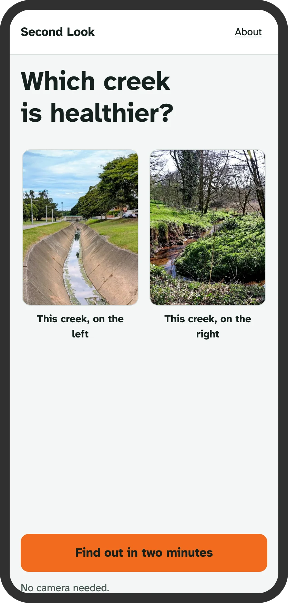<br>Landing<br><code>/</code></td>
<td align="center">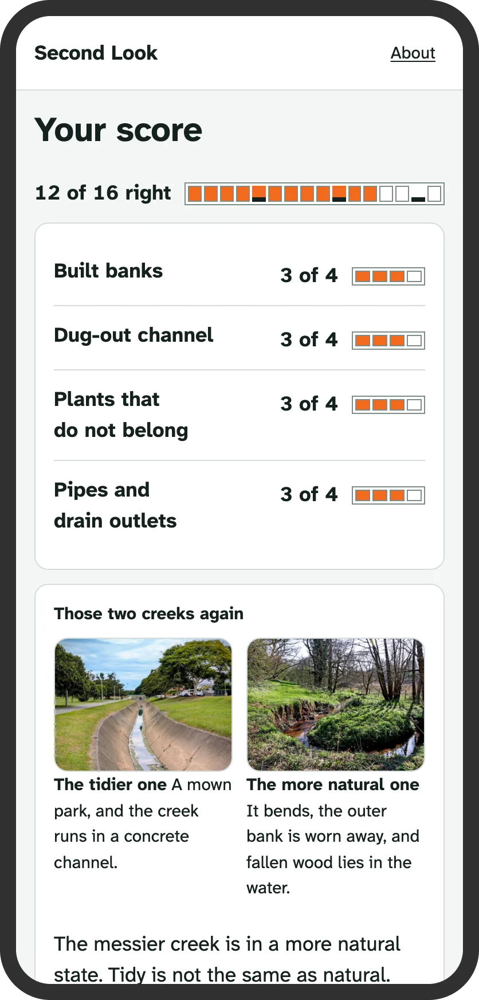<br>The score<br><code>/t</code> (mock)</td>
<td align="center">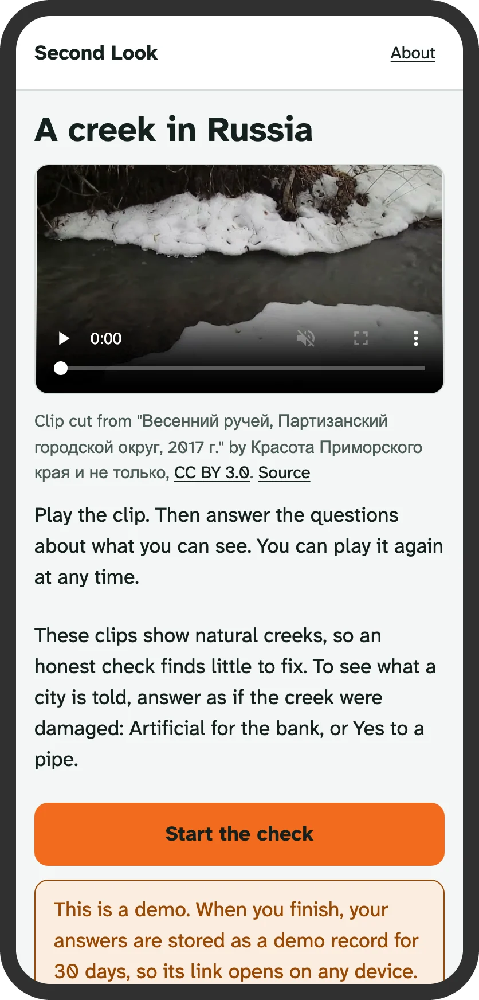<br>A walk<br><code>/walk/v02</code></td>
</tr>
<tr>
<td align="center">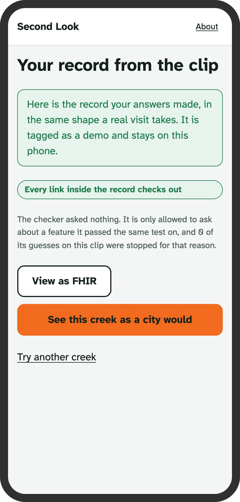<br>The walk record<br><code>/walk/v02</code></td>
<td align="center">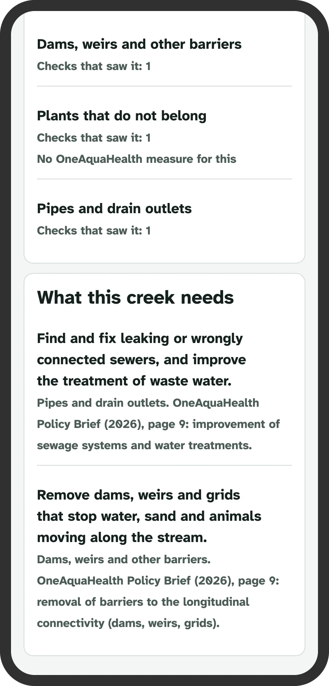<br>The walk as a city sees it, after answering Artificial for the bank<br><code>/city?walk=v02</code></td>
</tr>
</table>

All the screens, with the route and the source of each: [`docs/screens/README.md`](docs/screens/README.md).

<details>
<summary>Two lesson photos with their marks, and the licences of the photos in the screens</summary>

Two lesson photos with their marks, as a person sees them on the lesson cards:

<p>
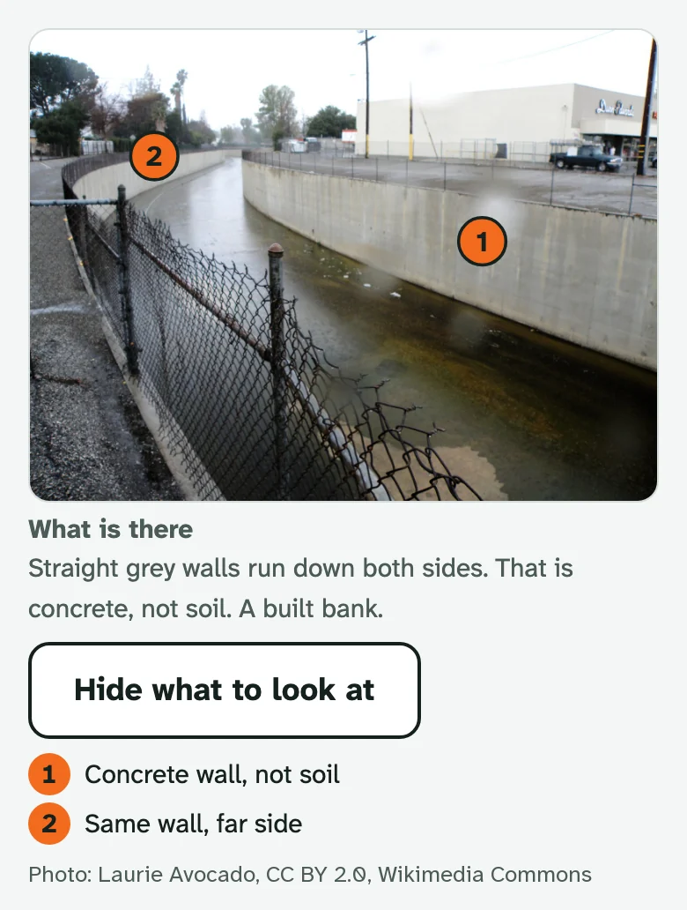
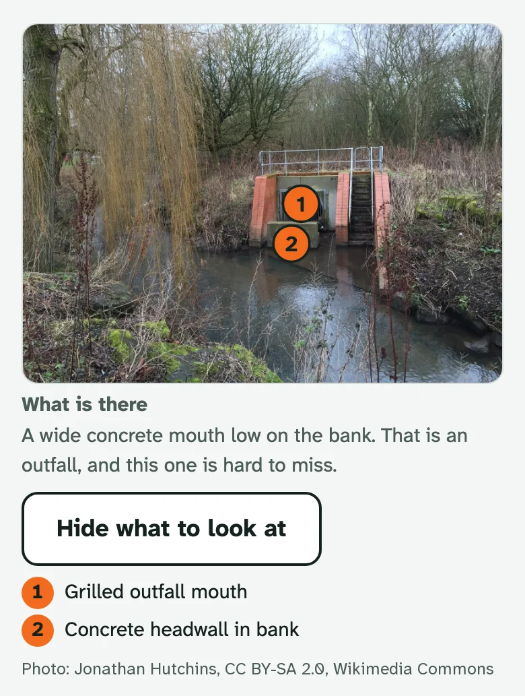
</p>

Photos: Laurie Avocado, CC BY 2.0, and Jonathan Hutchins, CC BY-SA 2.0, both from Wikimedia Commons.

For the licence section: the screenshots, the GIF and the social preview show photos by other people under their own licences (CC BY and CC BY-SA, credited on /credits and in photos/manifest.csv). The social preview and the pipe lesson photo are shared under CC BY-SA 4.0 because their photos are CC BY-SA.

</details>

## Why trust a volunteer, and the AI?

People judge a creek the way they judge a park. Tidy and green reads as healthy. OneAquaHealth's project lead said it in the first workshop: volunteers catch smell, foam and colour, and walk past concrete banks, a channel that was dug out, and pretty plants that do not belong. So the best-looking creek can get the best rating and deserve the worst.

Professional surveyors fixed this long ago. In the UK's River Habitat Survey, "only surveys from accredited surveyors will be entered on the RHS database", and accreditation means a course and a test (RHS manual 2003, pages 3 and 20; [`docs/notes/sources.md`](docs/notes/sources.md)). Some volunteer programs certify people for a method, such as water chemistry. None we know of measures how well each volunteer sees each feature, or keeps that score with every observation, so a volunteer's observation arrives with no mark of how well its observer sees.

Measure each volunteer, per feature, and store the measure with the data. The analyst sees "4 of 4 on built banks, tested Sep 23" beside an answer, never a blended grade or a probability. Follow-up questions are chosen by code from the answers, the person's scores and the weather, two at most: "It has not rained here for N days. Is anything coming out of that pipe?" The AI takes the same test and earns the right to ask one question, feature by feature.

<details>
<summary>Every risk, what stops it, and the test that proves it</summary>

| What can go wrong | What stops it, by construction | Proof |
|---|---|---|
| A volunteer walks past a built bank | The lesson teaches the four features people miss, and the test measures each one; the score is stored with every answer | [`content/lessons/`](content/lessons/), [`core/scoring.py`](core/scoring.py), [`core/tests/test_scoring.py`](core/tests/test_scoring.py) |
| Someone taps at random | Four items per feature, two present and two absent, so chance scores about 2 of 4; a low scorer who answers No is asked for a photo | [`content/test_items.yaml`](content/test_items.yaml), [`core/followups.py`](core/followups.py) rule `low_score` |
| A pretty creek gets the best rating | A good rating beside a reported built bank, sewage or plant that does not belong triggers one question asking the person to keep or change it, in the creek check and in a video walk | [`content/followups.yaml`](content/followups.yaml) rule `rating_check`, [`core/tests/test_followups.py`](core/tests/test_followups.py), [`core/tests/test_walks.py`](core/tests/test_walks.py) |
| A pipe report means nothing without the weather | The dry pipe question fires only after dry days from Open-Meteo, and is skipped when the weather is unknown | [`core/rainfall.py`](core/rainfall.py), [`core/tests/test_rainfall.py`](core/tests/test_rainfall.py) |
| The model invents a feature | Model output becomes a Flag through the gate or is dropped; a fuzz test throws arbitrary output at it | [`core/gate.py`](core/gate.py), [`core/tests/test_gate.py`](core/tests/test_gate.py) |
| The model was never good at that feature | A model may flag only a feature it passed on the same test as the people; the pass table is a committed file, and one from the fake client licenses nothing | [`results/model_pass_table.json`](results/model_pass_table.json), [`core/tests/test_checker.py`](core/tests/test_checker.py) |
| Duplicate and test pins fill the map | A precise pin within 30 metres of an existing spot is offered as that spot; names that read like a test are kept out of the counts and listed apart for a person to check; a coarse pin is never compared | [`core/act.py`](core/act.py), [`core/tests/test_act.py`](core/tests/test_act.py) |
| A record a city's systems cannot read | Sample records from both emitters, the Python API and the TypeScript Worker (<!--v:results/fhir_validation.json#/files_validated-->17<!--/v--> files, walk records among them), are validated against their guide in CI, and golden vectors hold the live emitter to the same output | [`scripts/fhir_validate.py`](scripts/fhir_validate.py), [`worker/test/golden.test.ts`](worker/test/golden.test.ts) |
| Someone edits history | A hash-chained audit log, checked by a script | [`audit/`](audit/), [`scripts/verify_audit.py`](scripts/verify_audit.py) |
| Someone rewrites the audit log, last line included | Once a day its last hash is stamped with OpenTimestamps, if it has changed since the last stamp. A rewrite with fresh hashes still holds together, so the stamped line is compared with the log's own line, by the script and by `/verify` in your browser | `uv run python scripts/verify_audit.py`, then `uv run python scripts/ots_status.py`, which fails when the log no longer has a stamped line; `.venv/bin/ots verify proofs/audit-head-2026-09-24.ots` checks the stamp itself |
| The plan was written after the data came in | The `prereg-v1` tag object and [`docs/analysis_plan.md`](docs/analysis_plan.md) are stamped with OpenTimestamps, a public timestamp service that anchors hashes in Bitcoin; it is not our own chain. The `prereg-v2` and `prereg-v3` tags and their plans are stamped the same way, under [`proofs/`](proofs/). `/verify` shows each proof and its Bitcoin block once confirmed | `.venv/bin/ots verify proofs/prereg-v1.tag.ots`, `.venv/bin/ots verify -f docs/analysis_plan.md proofs/analysis_plan.md.ots` (`uv sync` puts `ots` in `.venv/bin`; it needs a Bitcoin node to finish), or `uv run python scripts/ots_status.py`, which checks the block against a public explorer; [`proofs/README.md`](proofs/README.md) |
| We fool ourselves with the statistics | The analysis plan is tagged before any data; every README number is checked against [`results/`](results/) in CI; a synthetic result is cited only where the sentence says it is a simulation | [`docs/analysis_plan.md`](docs/analysis_plan.md) at `prereg-v1`, [`scripts/verify_claims.py`](scripts/verify_claims.py) |
| Judge mode leaks the answer key | Before the lock, this: judge mode is shut by a lock constant while a wave of the study runs (until Sep 28 for the first wave, until the second lock for the second), and its answer routes refuse before then on the Worker and in the Python API. After the lock, nothing: judge mode says right or wrong on the same 16 photos the test uses, so anyone can rebuild the key and carry a perfect score into their creek checks, and a retake in a fresh browser does the same. Known weaknesses says so, and that it was open for two days between the waves | [`core/lock.py`](core/lock.py), [`apps/api/tests/test_study.py::test_demo_answer_is_shut_before_the_lock`](apps/api/tests/test_study.py), [`worker/test/e2e.mjs`](worker/test/e2e.mjs); what is not stopped: [`docs/THREAT_MODEL.md`](docs/THREAT_MODEL.md) |
| A refresh loses a session | The session resumes from the server; the creek check queues offline and sends later | [`apps/web/lib/offline.ts`](apps/web/lib/offline.ts), [`apps/web/tests/`](apps/web/tests/) |

</details>

## What the AI cannot do

It cannot write the record. It cannot speak on a feature it did not pass, or on a made-up pass table. It cannot ask more than one question, or ask before the person answers. The gate says how, and Three properties that follow names each test. Two more limits:

| It cannot | Enforced by | Test |
|---|---|---|
| Put more than a short labelled note in front of a person | The gate drops a note with markup, line breaks or text direction controls, and the page shows the note only after "the checker noticed", cut to 160 characters | [`core/tests/test_gate.py::test_note_with_markup_or_a_direction_control_is_dropped`](core/tests/test_gate.py), [`core/tests/test_checker.py::test_long_note_is_cut_to_160_and_flat`](core/tests/test_checker.py) |
| State a risk for a named site | Every health or ecology sentence comes from [`content/approved_sentences.yaml`](content/approved_sentences.yaml) with a source | [`core/tests/test_healthcard.py`](core/tests/test_healthcard.py), [`core/tests/test_act.py`](core/tests/test_act.py) |

## The gate, the heart of it

A vision model can help a volunteer look again. It can never decide what is stored. Every model answer takes this path:

1. **The person answers first.** The creek check asks the official app's questions in its order ([`content/form.yaml`](content/form.yaml)), in the app's own words, quoted from its public translation bundle and checked again by `make app-strings-check`; the answers are the person's own.
2. **The model is asked only where it passed.** [`core/checker.py`](core/checker.py) reads the committed pass table, [`results/model_pass_table.json`](results/model_pass_table.json), and does not even ask about a feature that model did not pass on the same 16-photo test people take. A table that does not say `"real": true` licenses nothing.
3. **Its answer is forced.** One photo, one feature, the frozen question wording. Anything that is not yes, no or can't tell with a short note becomes can't tell and counts as malformed (`force_answer` in [`core/checker.py`](core/checker.py)).
4. **The gate turns it into a flag or drops it.** `parse_flags` in [`core/gate.py`](core/gate.py) keeps a `Flag` only for a known feature the model passed, with a sane confidence and a short plain note, and drops everything else with a plain reason. It never raises. On the footage run it dropped <!--v:results/footage_latest.json#/gate/dropped-->29<!--/v--> of <!--v:results/footage_latest.json#/gate/candidates-->64<!--/v--> candidate flags, each for a feature that model had not passed.
5. **A flag can only make one question eligible.** [`core/followups.py`](core/followups.py) picks the follow-up questions from the answers, the rain ([`core/rainfall.py`](core/rainfall.py)), the person's scores and the flags, by the rules in [`content/followups.yaml`](content/followups.yaml): two at most, the model's at most one, no model call inside.
6. **The person taps "I looked again" or "Skip", and no stored answer changes.** The question comes only for a feature the check asks about, and the model's note is shown only as "the checker noticed" ([`core/followups.py`](core/followups.py), [`docs/MODEL_CARD.md`](docs/MODEL_CARD.md)).
7. **The record is built from human inputs only.** `build_record` in [`core/gate.py`](core/gate.py) has no parameter that could carry a flag, a model id or model text. [`core/fhir_emit.py`](core/fhir_emit.py) writes the record under OneAquaHealth's profiles with the person's score, and [`scripts/fhir_validate.py`](scripts/fhir_validate.py) checks it in CI.

Where a person meets it today: in part 2 of the test, offered after the score, and nowhere else a person sees. The assisted half of part 2 sees that one question, "The checker noticed something here. Look again?", from flags made once from the models' stored answers through the same gate ([`results/assist_flags.json`](results/assist_flags.json)); the note is not shown, and no model is called while anyone answers. Its judge mode, [`/t2/demo`](https://second-look-79t.pages.dev/t2/demo), shows the same from the second lock; until then [`/how-we-know`](https://second-look-79t.pages.dev/how-we-know) shows the question a kept flag makes on one footage frame. The creek check and the walks do not show it yet. [`scripts/build_walks.py`](scripts/build_walks.py) sends the footage run's answers through the same gate when the video walks are built, and no flag on those clips passed it, so <!--v:results/footage_pool.json#/walks_with_a_checker_question-->0<!--/v--> of the <!--v:results/footage_pool.json#/walks-->3<!--/v--> walks shows a checker question. The live creek check runs with the checker off (`CHECKER_ENABLED`), so both servers pass it no flags and no model is called. [`examples/footage-flag/`](examples/footage-flag/README.md) shows it act on the footage run.

## Three properties that follow

| Property | Why it holds | The test that fails if it breaks |
|---|---|---|
| The model cannot write the record | The only way to make a record takes no model output | [`core/tests/test_gate.py::test_build_record_signature_carries_human_inputs_only`](core/tests/test_gate.py), and the fuzz test [`core/tests/test_gate.py::test_fuzz_model_output_never_reaches_answers_or_labels`](core/tests/test_gate.py) |
| A model speaks only where it passed, and a made-up pass table licenses nothing | The gate and the checker both read the committed table and require `"real": true` | [`core/tests/test_harden_gate_properties.py::test_every_kept_flag_is_licensed_for_that_exact_model`](core/tests/test_harden_gate_properties.py), [`core/tests/test_checker.py::test_synthetic_pass_table_never_licenses_a_flag_by_default`](core/tests/test_checker.py) |
| Code chooses the questions: two at most, the model's at most one, no network and no model call | Follow-up selection is a pure function | [`core/tests/test_harden_followups_properties.py::test_the_content_table_never_asks_more_than_two_questions_for_any_input`](core/tests/test_harden_followups_properties.py), [`core/tests/test_harden_followups_properties.py::test_the_selector_runs_with_http_and_the_model_client_patched_to_raise`](core/tests/test_harden_followups_properties.py) |

The hard parts of building this, and how each is proved, are in [`WRITEUP.md`](WRITEUP.md). The decisions are in [`docs/adr/`](docs/adr/).

## Architecture

The deep version, with every file named, is [`docs/ARCHITECTURE.md`](docs/ARCHITECTURE.md). The loop is five verbs: Train, Check, Verify, Record, Act. Each diagram below is a source in [`docs/diagrams/`](docs/diagrams/), drawn as an SVG next to it by the Mermaid CLI pinned in [`tools/diagrams`](tools/diagrams). `make diagrams` draws each one again, in CI too. It fails when a drawing is stale, was edited by hand, or has an edge that does not say what flows along it.

**The loop.** The five verbs in one line; the full system map under it names every part and what flows between them.

```mermaid
flowchart LR
  accTitle: The loop in five verbs, Train, Check, Verify, Record and Act
  accDescr: A volunteer trains and takes the photo test, and its per-feature score comes out. On a creek check they answer first, with at most two follow-up questions chosen by code. The answers, with the score, become a FHIR record checked against OneAquaHealth's guide. The records say what the creek needs, in OneAquaHealth's own measures, and which pipes are worth a lab test. A model may raise a question only on a feature it passed on the same test.
  TRAIN["TRAIN<br/>the two-minute photo test"]
  CHECK["CHECK<br/>the guided creek check"]
  VERIFY["VERIFY<br/>follow-ups and the gate"]
  RECORD["RECORD<br/>FHIR under their guide"]
  ACT["ACT<br/>what the creek needs"]
  TRAIN -- "a score<br/>per feature" --> CHECK
  CHECK -- "the person's<br/>answers" --> VERIFY
  VERIFY -- "answers, score,<br/>follow-up answers" --> RECORD
  RECORD -- "records<br/>by creek" --> ACT
```

<details>
<summary><b>The full system map</b>: wide, so GitHub's diagram viewer zooms it, or open <a href="docs/diagrams/system-map.svg">the SVG</a></summary>

**The system map.** Every edge says what flows. Where a part is a [`core/`](core/) file, the live site runs its TypeScript port in [`worker/src/core/`](worker/src/core/), held equal to the Python by golden vectors.

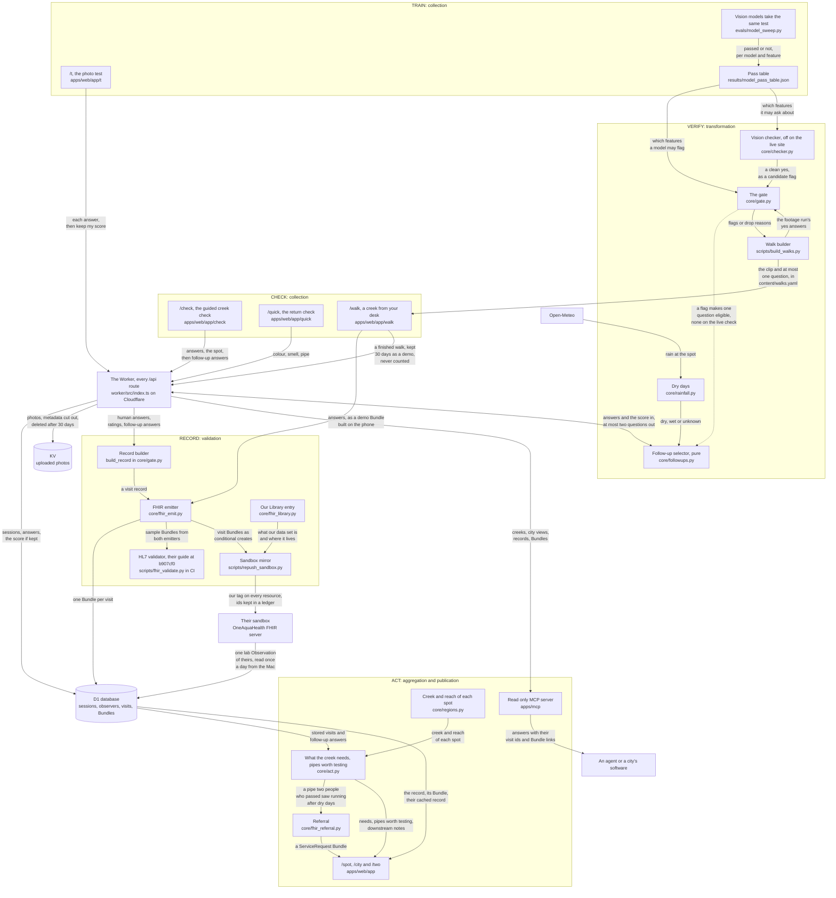

</details>

Why this architecture matters:

- The model sits behind two walls, the pass table and the gate, and has no path to the store.
- Python is the reference and the Worker runs the same functions, proved equal by golden vectors, so the live site and the tests cannot quietly disagree.
- Every record is a FHIR Bundle under their profiles before it is stored, so a city that reads OneAquaHealth records reads ours.

**One creek visit as FHIR.** Every arrow is a reference in the emitted JSON, named by its FHIR path, read off [`fhir/golden/`](fhir/golden/). The Practitioner's qualification carries the test and its dates. The score itself is in the test sitting's QuestionnaireResponse, which the Provenance names as a source of every Observation.

<details>
<summary>The FHIR records one visit makes, as a diagram</summary>

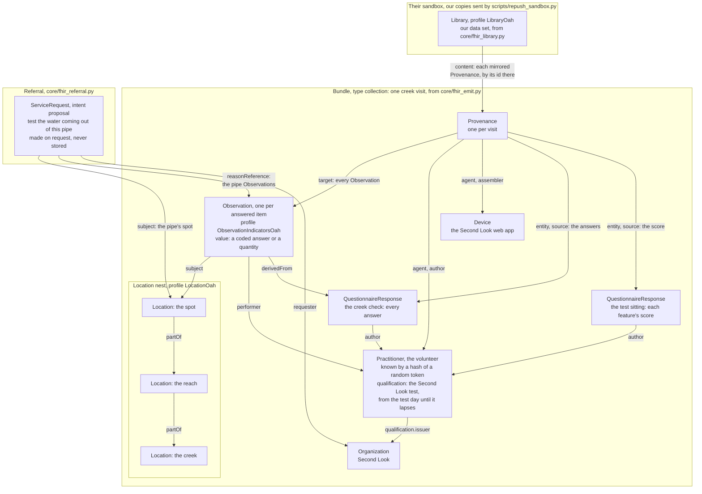

</details>

**The AI gate.** Every arrow is a call in [`core/checker.py`](core/checker.py), [`core/gate.py`](core/gate.py) or [`core/followups.py`](core/followups.py).

<details>
<summary>The gate, call by call, as a diagram</summary>

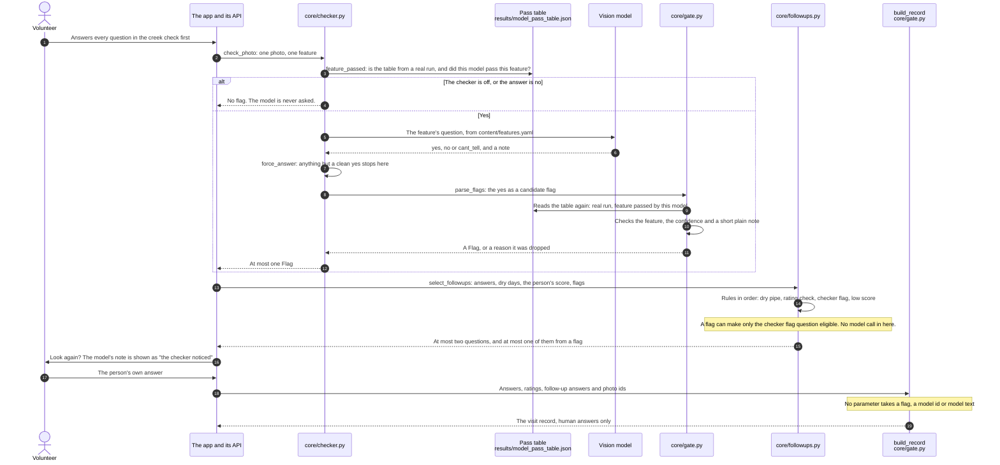

</details>

The same four as images, for places that do not draw Mermaid: [`docs/diagrams/loop.svg`](docs/diagrams/loop.svg), [`docs/diagrams/system-map.svg`](docs/diagrams/system-map.svg), [`docs/diagrams/fhir-graph.svg`](docs/diagrams/fhir-graph.svg), [`docs/diagrams/ai-gate.svg`](docs/diagrams/ai-gate.svg).

### Tech stack

<details>
<summary>The stack, part by part</summary>

| Part | Built with |
|---|---|
| Web app | Next.js 16 and React 19, a static export on Cloudflare Pages, a service worker that keeps the creek check, and a test once it has started, working offline after one visit, for a background download of <!--v:results/precache_budget.json#/megabytes-->2.3<!--/v--> MB, self-hosted fonts, no third party script |
| API, live | a TypeScript Worker on Cloudflare Workers, with D1 for records and Workers KV for photos |
| API, reference | Python 3.12, FastAPI, SQLModel and Alembic, SQLite locally and Postgres in docker compose |
| Pure logic | [`core/`](core/): the gate, the follow-ups, scoring, labels, the FHIR emitter; ported to TypeScript and proved equal by golden vectors |
| Standards | FHIR R4 4.0.1 under OneAquaHealth's guide pinned at b907cf0, FSH built by SUSHI, checked by the HL7 validator <!--v:results/fhir_validation.json#/validator_version-->6.10.4<!--/v--> with terminology on |
| AI | Claude vision models through the Anthropic API, behind the gate, only where they passed the test |
| Agents | a read only MCP server on the `mcp` Python SDK |
| Checks | pytest with Hypothesis, Playwright, ruff, mypy, gitleaks, and `make check` in GitHub Actions |
| Weather | Open-Meteo, for the dry pipe question |

FHIR R4 4.0.1 under OneAquaHealth's guide, pinned at hl7-eu/oah b907cf0 and built with SUSHI 3.20.1; their sandbox, read at one request per second and written with conditional creates; Open-Meteo for the rainfall behind the dry pipe rule; the Cal-IPC Inventory for the Bay Area plant list (approved for the team by Alex Velazquez on 2026-09-25, each species linked to its Cal-IPC profile); four vision models (Claude Haiku 4.5, Sonnet 5, Opus 5.5 and Fable 5.1), called directly and kept behind a gate. No names, emails, addresses or free text in the test; EXIF stripped from uploads, which are deleted after 30 days; a hash-chained audit log.

</details>

### API

<details>
<summary>Every route, what it is for</summary>

The live site's API is a TypeScript Worker on Cloudflare with <!--v:results/api_inventory.json#/worker/count-->35<!--/v--> routes, under `/api` on the site's own origin. The Python API in [`apps/api/`](apps/api/) is the reference, with <!--v:results/api_inventory.json#/python/count-->29<!--/v--> routes. Every route, what it does, what it stores and its limit or lock is in [`docs/API.md`](docs/API.md); a test fails when a route is added without a row there.

| Route | What it is for |
|---|---|
| `POST /api/test/session`, `/response`, `/complete` | the two-minute test; `x-qa-key` marks a live check as a test |
| `POST /api/check/draft`, `/api/check/finalize` | a creek check and the follow-up questions code picked |
| `GET /api/spot/{spot_id}`, `/api/city/{creek}` | a record, and the analyst's view of a creek, every number with the visit ids behind it |
| `GET /api/fhir/Bundle/{visit_id}`, `/api/fhir/referral/{spot_id}` | the FHIR behind every record, and a ServiceRequest for a pipe worth testing |
| `GET /api/two` | one of our Observations beside a laboratory one from their sandbox |
| `POST /api/walk`, `GET /api/walk/{record_id}`, `/api/walk/{record_id}/fhir` | a finished video walk's demo record, kept 30 days and never counted: store it, read it back on any device, and its FHIR Bundle alone |
| `POST /api/demo/answer`, `/api/t2/demo` | judge mode: right or wrong only, open since the second lock |

</details>

### MCP tools

<details>
<summary>Every tool the MCP server offers</summary>

[`apps/mcp/server.py`](apps/mcp/server.py) is a read only MCP server over our records, run locally over stdio. Every answer carries `resource_ids` and `fhir`, the visits it was counted from, so an agent cannot state a number it cannot trace. It has <!--v:results/api_inventory.json#/mcp/count-->5<!--/v--> tools; inputs and outputs in [`docs/MCP.md`](docs/MCP.md), a real session in [`examples/mcp/transcript.md`](examples/mcp/transcript.md).

| Tool | Answers |
|---|---|
| `list_creeks` | every creek with a record |
| `get_creek_record` | one creek: findings, what it needs in approved words, pipes worth testing, reaches, downstream notes |
| `list_findings` | findings across creeks, filtered by feature, by how many people, and by whether they passed |
| `get_observer_score` | an observer's dated qualification and score per feature, as the record carries it |
| `explain_number` | the visit ids behind one figure on a creek's record |

</details>

## How OneAquaHealth is used

OneAquaHealth says citizen data should stand beside lab data under the same profiles and value sets. A lab result is trusted because its quality checks travel with it. Second Look gives a volunteer's observation the same thing: their per-feature score, stored in the record of their test sitting beside a dated Practitioner qualification for the test, and linked through Provenance to every Observation they make. The four features are the ones the project lead named. The creek check asks the official Citizen Science App's questions in their order and in the app's own words and languages, quoted from its public translation bundle ([`docs/notes/app_strings.md`](docs/notes/app_strings.md)). The city actions are OneAquaHealth's own restoration measures, from the [OneAquaHealth Policy Brief (2026), page 9](https://www.oneaquahealth.eu/app/uploads/2026/05/OneAquaHealth-Policy-Brief.pdf): replant margins, fix sewers, reconnect the floodplain, remove barriers, take out the concrete. The official app has no question for a dug-out channel, so the check asks none, and "reconnect the floodplain" waits for one; plants have no city measure of their own.

### Every surface of theirs we use, and where

<details>
<summary>The table, surface by surface</summary>

| Their surface | What we use it for | Where |
|---|---|---|
| The official Citizen Science App's question wording | The creek check asks its questions word for word, in its order, with its closing question on feelings, each credited to the app and checked against its public bundle by `make app-strings-check` | [`content/form.yaml`](content/form.yaml), [`content/app_strings.json`](content/app_strings.json) |
| The official app's own translations | The creek check speaks the app's own languages (English, Portuguese, Dutch, Norwegian, French, Italian), so a volunteer in any pilot city sees the questions they know. Each translation was read beside the English first; the 14 whose meaning differs show in English, marked, and the list is written up for the organizers | `/check`, `/walk`, [`docs/notes/app_translations.md`](docs/notes/app_translations.md) |
| Their Location and Observation profiles | Every spot and every answer | [`core/fhir_emit.py`](core/fhir_emit.py), [`docs/fhir_mapping.md`](docs/fhir_mapping.md) |
| Their value sets and UCUM units | Present, absent, the indicator groups, metres | [`core/fhir_emit.py`](core/fhir_emit.py) |
| Two Questionnaires of our own, which each QuestionnaireResponse names | The test and the check, answered as QuestionnaireResponses; the guide's form extension is not used | [`fhir/fsh/questionnaires-second-look.fsh`](fhir/fsh/questionnaires-second-look.fsh) |
| Nested Locations | Creek, reach and spot with `partOf` | [`core/regions.py`](core/regions.py), [`content/regions/`](content/regions/) |
| The HL7 validator with their guide, terminology on | Sample records from both emitters in CI; golden vectors hold the live emitter to them | [`scripts/fhir_validate.py`](scripts/fhir_validate.py), [`fhir/ig.lock`](fhir/ig.lock) |
| Their sandbox | Conditional creates with our tag and a ledger, and a Library entry for the data set | [`scripts/repush_sandbox.py`](scripts/repush_sandbox.py), [`fhir/sandbox_ledger.jsonl`](fhir/sandbox_ledger.jsonl) |
| Their decision tool's measures | What a creek needs, in their words, from the Policy Brief, page 9 | [`content/approved_sentences.yaml`](content/approved_sentences.yaml), `/city` |
| The five One Digital Health dimensions and FAIR | Stated in words under One Digital Health and FAIR | this section |
| The follower city recipe | `make new-city NAME=Aarhus COUNTRY=Denmark LAT=56.1629 LON=10.2039` scaffolds a city in seconds; Heraklion was made that way, as a dry example | [`scripts/new_city.py`](scripts/new_city.py), [`docs/cities/`](docs/cities/) |
| Their SpecimenOah profile | The shape of a laboratory result coming back to a volunteer's pipe, marked EXAMPLE | [`core/fhir_referral.py`](core/fhir_referral.py) |
| Not theirs: iNaturalist's public API, under its [terms](https://www.inaturalist.org/pages/terms); each observation keeps its observer's licence | One context line per creek: research grade sightings of the region's listed invasive plants near its spots, shown once a finished check on that creek has answered the plant question, never in the check and never counted. The Bay Area list was approved for the team on 2026-09-25; the daily job has stored sightings near Strawberry Creek, and no finished check there has answered the plant question yet, so the line shows nothing so far. | [`docs/adr/0011-inaturalist-context.md`](docs/adr/0011-inaturalist-context.md) |

</details>

### Contributed back

Sent to OneAquaHealth's implementation guide on 2026-09-24, in the open:

- [hl7-eu/oah pull request 5](https://github.com/hl7-eu/oah/pull/5): our citizen observer example, five FSH files that build inside their guide with SUSHI 3.20.1 at no errors, and a proposal for carrying observer quality in their guide ([`docs/ig_proposal.md`](docs/ig_proposal.md)), with the gaps our validator runs found. It asks which resource should stand for a citizen observer.
- [hl7-eu/oah issue 6](https://github.com/hl7-eu/oah/issues/6): their temporary code system spells one code `morophology`. We kept their spelling so our records validate.
- [hl7-eu/oah issue 7](https://github.com/hl7-eu/oah/issues/7): `SpecimenOah.collection.collector` allows only a PractitionerRole, which leaves out a laboratory and a volunteer who takes a sample.
- [hl7-eu/oah issue 8](https://github.com/hl7-eu/oah/issues/8): their sandbox's name stopped resolving on 2026-09-23, with the evidence from their own nameserver. It came back on Sep 28 and has come and gone since (Known weaknesses).

And for anyone, not sent to them: a read only MCP server over our own records, so any software agent can ask for a creek's records with the resource ids behind every answer ([`examples/mcp/README.md`](examples/mcp/README.md)).

### Feasibility: set up for Berkeley the way a follower city would

OneAquaHealth calls a city that adopts the method a follower city. Berkeley has not adopted it. We set up the five steps for Berkeley's creeks the way a follower city would, and this is how far each one got:

1. Name the streams: done, as nested Locations.
2. Adopt the form: done; it asks their app's questions word for word, in the app's order and in six of its languages, checked against the app's public translation file by `make app-strings-check`.
3. Train and test the volunteers, in about four minutes: the lesson and the test are live. Neither study wave retained eligible completed sittings, so their benefit remains unmeasured.
4. Collect and validate every visit against their profiles: the check is live and CI validates the records the code makes, and no real visit exists yet.
5. Publish to the sandbox with a Library entry, and repeat with the three-question return check: publishing ran with the hand-made example visit, and the return check opens from a creek record (`/quick?spot=<id>`).

`make new-city NAME=<city> COUNTRY=<country> LAT=<lat> LON=<lon> SITE=<site>` scaffolds the first three steps for a new city and points its poster at the city's own site; [`docs/ADOPT.md`](docs/ADOPT.md) is the one page a follower city follows from `uv sync` to its own deploy. Cost through Oct 15: nothing. Cloudflare Pages and a Worker with D1 and KV, on the free plan, with no card. One part does not scale yet: the daily jobs, the backups, the uptime check and the one run of the analysis after each lock run on one team member's laptop (Known weaknesses); a city would move them to the Worker's own scheduled jobs, which already delete old walk records and old upload rows each day.

### One Digital Health and FAIR

<details>
<summary>The five dimensions and the FAIR principles, one line each</summary>

Story: a student walks to Strawberry Creek, takes a two-minute test on her phone, and from then on every observation she makes carries how well she sees each kind of damage. A city analyst reads her record beside a lab result under the same profile and knows how much weight to give each. The health card gives her one thing for herself, one for her dog and one for her city.

Five dimensions, in words, because no script produces them: citizen engagement, strong; education, strong; human and veterinary healthcare, partial (approved sentences for the person and the pet, no diagnosis, no site risk); industry 4.0, partial (FHIR records, a gated vision model, an audit log); environment, strong.

FAIR: findable through a Library entry in their sandbox and a public repository; accessible through a read-only FHIR endpoint; interoperable through their profiles, value sets and UCUM; reusable through MIT code, a pinned guide, Provenance on every record and a tagged analysis plan.

</details>

## Evals

Every number is graded by code and written to [`results/`](results/); [`scripts/verify_claims.py`](scripts/verify_claims.py) checks this README against those files in CI.

- The 16-photo test, taken by four vision models, three runs each: [`evals/model_sweep.py`](evals/model_sweep.py) writes the pass table; [`evals/benchmark.py`](evals/benchmark.py) adds per-feature accuracy with Wilson intervals.
- The same models on open creek footage: [`evals/footage.py`](evals/footage.py) reports agreement between models, what the gate stopped, and the adversarial frames; [`evals/footage_pool.py`](evals/footage_pool.py) writes the numbers no model touches.
- The ablation (rules only, context only, vision only, all three), as a shape only: [`evals/ablation.py`](evals/ablation.py) runs only with `--synthetic`, on stubs with a set accuracy and the fake vision client, and has never run on a real model. Its one result, [`results/ablation_20260921T001415Z.json`](results/ablation_20260921T001415Z.json), is stamped SYNTHETIC, no number here comes from it, and `make reproduce` cannot grade it again.
- The pre-registered analysis of the two-minute test, written and tested on synthetic data before the tag: [`evals/usability_analysis.py`](evals/usability_analysis.py). It runs once, after the lock: with at least 20 finished sessions per arm (each of the two groups, lesson first or photos first) it makes its one confirmatory test, and with fewer it reports a description with counts.
- Part 2, the assisted second look: after the score, people may take eight more photos. Half of them, at random in blocks of 4 within each part 1 group, meet the checker's one question, "The checker noticed something here. Look again?", whenever a flag the gate kept disagrees with their answer; they keep or change it, and their final answer is scored. The flags were computed once from the models' stored answers and the pass table ([`evals/assist_flags.py`](evals/assist_flags.py), [`results/assist_flags.json`](results/assist_flags.json)), so every person meets the same checker and no model is called while they answer ([`docs/MODEL_CARD.md`](docs/MODEL_CARD.md), Part 2, where people meet the checker's question). The plan was tagged `prereg-v2` before any part 2 session ([`docs/analysis_plan_v2.md`](docs/analysis_plan_v2.md), its hash in [`docs/notes/plan_hash.md`](docs/notes/plan_hash.md)). [`evals/assist_analysis.py`](evals/assist_analysis.py) was tested on three synthetic cases, the question helps, does nothing, or leads people to wrong answers, and runs once after the lock.
- The second wave: nobody took the test before the first lock, and the hackathon then moved its deadline, so the same study runs a second time, from <!--v:results/wave2_window.json#/open_utc-->2026-09-30T04:00:00Z<!--/v--> to the second lock at <!--v:results/wave2_window.json#/lock_utc-->2026-10-03T04:00:00Z<!--/v-->, under [`docs/analysis_plan_v3.md`](docs/analysis_plan_v3.md), which is binding from its tag, `prereg-v3`; [`docs/notes/plan_hash.md`](docs/notes/plan_hash.md) gives the tag's commit and hash. The design and the analysis are those of `prereg-v1` and `prereg-v2`: [`evals/wave2_analysis.py`](evals/wave2_analysis.py) calls the two scripts above, not edited, on the sittings that started inside that window, once, after the second lock. The plan says what to hold against this wave: judge mode, which shows the answers, was open between the first lock and the wave, and the wave was decided after the first analysis had run and shown only that an arm was empty.
- Cost is logged per call in [`results/cost_log.jsonl`](results/cost_log.jsonl).
- `make reproduce` grades the AI numbers again from the committed raw replies in [`evals/fixtures/raw/`](evals/fixtures/raw/) and the seeds, with no network and no key, and fails if one differs. `make judge-check` and CI run it. The pass table, each sweep's answers and the footage runs are graded again from their replies. Some numbers can only be checked as recorded, and it prints a note under each file that holds them: the right-answer counts of the benchmark runs, which kept counts and no replies, so each model's right answers in the table above, of all 16 photos and without the plant photos; those runs' share of can't tell answers; and their count of malformed replies. For those it checks that each accuracy and interval follows from the recorded counts. The footage runs kept only each model's majority answer on the adversarial frames, so those answers are as recorded too, and three old synthetic files, the ablation among them, are not graded again.

### Tests

`make check` runs everything below except the browser suite, the Worker end to end and the mutation run, and prints `CHECK GREEN`. The counts are taken by [`scripts/count_tests.py`](scripts/count_tests.py) into [`results/test_counts.json`](results/test_counts.json).

- **Python:** <!--v:results/test_counts.json#/python/tests-->2642<!--/v--> tests (`uv run pytest`), including property tests that throw arbitrary model output at the gate and the follow-up selector.
- **Ports:** <!--v:results/test_counts.json#/worker_golden/cases-->282<!--/v--> golden cases written by the Python reference, which the TypeScript Worker must reproduce exactly, in <!--v:results/test_counts.json#/worker_golden/node_tests-->27<!--/v--> tests (`make worker-check`).
- **Browser:** <!--v:results/test_counts.json#/playwright/tests-->259<!--/v--> Playwright tests in <!--v:results/test_counts.json#/playwright/spec_files-->33<!--/v--> spec files on a phone viewport, against the production build and a mock API that refuses what the servers refuse (`make e2e`).
- **Worker end to end:** <!--v:results/test_counts.json#/worker_e2e/sections-->19<!--/v--> sections that drive the real Worker's routes under `wrangler dev` with a local D1 and KV (`make worker-e2e`, in CI).
- **Records:** the HL7 validator checks sample Bundles from Python and from the Worker against OneAquaHealth's guide: <!--v:results/fhir_validation.json#/errors-->0<!--/v--> errors (`make fhir-validate`).
- **Mutation:** small bugs planted on purpose in four modules, the gate, the follow-up selector, scoring and the FHIR emitter (`make mutation`, mutmut): the gate caught <!--v:results/mutation.json#/by_name/gate/killed-->226<!--/v--> of <!--v:results/mutation.json#/by_name/gate/mutants-->229<!--/v-->, the follow-up picker <!--v:results/mutation.json#/by_name/followups/killed-->336<!--/v--> of <!--v:results/mutation.json#/by_name/followups/mutants-->341<!--/v-->, scoring <!--v:results/mutation.json#/by_name/scoring/killed-->53<!--/v--> of <!--v:results/mutation.json#/by_name/scoring/mutants-->53<!--/v-->, the FHIR record writer <!--v:results/mutation.json#/by_name/fhir_emit/killed-->1678<!--/v--> of <!--v:results/mutation.json#/by_name/fhir_emit/mutants-->1752<!--/v-->; each must catch <!--v:results/mutation.json#/threshold_percent-->85.0<!--/v--> percent or more ([`results/mutation.json`](results/mutation.json)). [`core/checker.py`](core/checker.py), [`core/rainfall.py`](core/rainfall.py) and the Worker's TypeScript ports are not in this run.

## What is real and what is synthetic

The full list, kept current, is [`docs/REAL_VS_SYNTHETIC.md`](docs/REAL_VS_SYNTHETIC.md). In short:

<details>
<summary>Each part, real or synthetic, and how you can tell</summary>

| Thing | Status |
|---|---|
| The test flow, its scoring and the photos in it | real, openly licensed photos from several countries |
| Frames from open creek footage | real, cut from openly licensed video; labels only where the video's own description supports one, never called a gold standard |
| A video walk's record | real shape, demo content, made on the phone and kept 30 days as a demo so its link opens anywhere, never counted |
| The golden Strawberry Creek visit | example, hand shaped from a worked visit |
| A referral for a pipe worth testing | real, computed on request from stored visits |
| The laboratory result coming back | example, tagged and labelled EXAMPLE everywhere |
| The model pass table and the AI numbers | real, from paid calls on Sep 23, Pacific time (Sep 24 UTC): the sweep that set the pass table, a second set behind the right-answer counts, and the footage run ([`results/model_pass_table.json`](results/model_pass_table.json) says `"real": true`); the earlier fake runs stay in [`results/`](results/), stamped SYNTHETIC |
| The simulation of weighted votes under Known weaknesses | synthetic by design: made-up people, stamped SYNTHETIC |

</details>

## Security and privacy

The two-minute test is anonymous and field use is pseudonymous. We keep coded answers, a coarse location unless the person places the pin, a hash of a random browser token, and a score under a random contributor token only when the person asks us to keep it. We also keep the language a creek check was shown in, and, for a person who takes the second look after the test, its answers and times, joined to the test by the session id. We never keep names, emails, internet addresses or photo metadata, and no free text but the name typed for a new spot, which is public; the site loads nothing from anyone else. Uploads are deleted after 30 days and served only with their own token.

- `QA_KEY` only marks a live check as a test; `EXPORT_TOKEN` opens the anonymous export; neither can read a person's answers. No secret is in the repository: `make check` runs gitleaks over the history and scans every file git would commit.
- The data locks are enforced in code: judge mode's answer routes refused access before the second lock, <!--v:results/wave2_window.json#/lock_utc-->2026-10-03T04:00:00Z<!--/v-->, and each analysis refuses real data before its lock or without its tag (`prereg-v1`, `prereg-v2`, `prereg-v3`).
- The Python API rate-limits per address in memory; the deployed Worker has no rate limit on purpose, because counting per visitor would mean holding something that identifies them.

Everything, with the known gaps and how to report a problem: [`SECURITY.md`](SECURITY.md) and [`docs/DATA_HANDLING.md`](docs/DATA_HANDLING.md).

## Quickstart

Needs git, [uv](https://docs.astral.sh/uv/) (it fetches Python 3.12) and Node 20 or later with npm; `make worker-e2e` needs Node 22 or later, because the Worker's wrangler refuses to start on anything older ([`DEPLOY.md`](DEPLOY.md)). No Java, no key, no network after the setup.

```
git clone https://github.com/alejandro-publius/second-look && cd second-look
uv sync && (cd apps/web && npm ci && npx playwright install chromium) && (cd worker && npm ci) && (cd tools/diagrams && npm ci)
make judge-check
```

`make judge-check` needs no key and no network: it runs the Python tests and the Worker's golden vectors, grades the AI numbers again from the raw replies where a run kept them (`make reproduce`, whose notes it prints under its summary: the benchmark's right-answer counts, its share of can't tell answers and its count of malformed replies are checked only as recorded, as Evals says), reads the last HL7 validator run, builds the web app with its design check, verifies the audit log and scans for secrets, in about five minutes after the setup (`make fhir-validate` runs the validator itself, with Java). Its last recorded run, at commit <!--v:results/judge_check.json#/commit-->473ae2c<!--/v-->, took <!--v:results/judge_check.json#/seconds-->250<!--/v--> seconds after the setup ([`results/judge_check.json`](results/judge_check.json), written by [`scripts/judge_check.py`](scripts/judge_check.py) with its `--out` option):

<!--block:judge-check results/judge_check.json-->
- **tests**: python: 2346 passed, 2 skipped, 9 xfailed in 206.17s (0:03:26); worker: pass 17
- **reproduce**: 28603 values in 23 files regraded from raw replies and seeds, with no network and no key; every one matches; 3 files not regraded and 5 notes, each named below
  - results/benchmark_20260924T031225Z.json and results/benchmark_20260924T054939Z.json: the right-answer counts per feature, the share of cant_tell answers and the count of malformed replies are as recorded: the run kept counts, not answers, so no reply is left to grade them from; the accuracies, intervals and cost are regraded
  - results/footage_20260924T032230Z.json: the run kept only each model's majority answer on the adversarial frames, so those answers are as recorded; the cost of their 144 calls is regraded
  - results/footage_20260924T060539Z.json: the run kept only each model's majority answer on the adversarial frames, so those answers are as recorded; the cost of their 192 calls is regraded
  - results/cost_log.jsonl: 41.11 USD paid in all, every line accounted for
  - results/ablation_20260921T001415Z.json: not regraded: its rule stub is keyed to the bytes of gray placeholder images the repository no longer has
  - results/consensus_synthetic.json: not regraded: made by an earlier rule of evals/consensus.py that was dropped as biased (docs/DECISIONS.md, 2026-09-23); today's script makes a different file
  - results/agreement_20260921T001415Z.json: not regraded: no model and no seed: it counts the two label columns of the photo manifest as it stood on Sep 20, with 18 gray placeholders the repository no longer has
- **fhir**: last validator run: 15 file(s) against hl7-eu/oah at b907cf0, 0 errors, validator 6.10.4
- **web**: next build ok; design-check: clean. 91 source files and 23 content files scanned, contrast computed from tokens.css, tap targets 3 passed (3.3s); served on port 3100, which is free again
- **audit log**: 3 entries, chain intact, 1 stamped line(s) still in place, last hash 3d3cbb4da01ac26e9e9579dac9681d67e5b034006cfc1ddd4215ea28d0fb3cc3
- **secrets**: working tree: nothing shaped like a live key; gitleaks: history clean
- judge-check: 6 of 6 steps passed, offline, with no key
<!--/block-->

The web step builds the app and measures it on port 3100, or, when something else holds 3100 (such as `make demo-offline`), on a free port it picks and names, and it frees that port after. Two judge-checks in one checkout take turns at the web step.

### Running locally

With no network and no key, on made-up demo data:

```
uv sync
(cd apps/web && npm ci)
make demo-offline
```

[`scripts/seed_demo.py`](scripts/seed_demo.py) fills `data/demo` through the API's own routes with every socket to another machine refused, and fails if one was tried: two test sittings that never count, three creek checks on Strawberry Creek, and one pipe worth testing. Then the API serves that folder on port 8000 and the site runs on http://localhost:3100. Open http://localhost:3100/city?creek=strawberry-creek. The first two lines, `uv sync` and the web app's install, are the only steps that use the network.

`make dev` runs the same two servers on an empty local database, with the network. Deploying, the D1 schema, the secrets by name, the jobs on the Mac and a table of every setting the code reads are in [`DEPLOY.md`](DEPLOY.md). Pre-commit hooks for the fast checks: `uv tool install pre-commit && pre-commit install`.

`WEB_PORT=3200 make demo-offline` (or `make dev`) moves the site to another port; `make e2e` and the design check read the same variable. Every production deploy is recorded in [`docs/notes/hosting.md`](docs/notes/hosting.md), and `make rollback` puts back the last Worker version and site build that passed the phone tests (a dry run unless `ROLLBACK=yes`).

## For judges

A path of about ten minutes: [the test](https://second-look-79t.pages.dev/t?src=other) (about four minutes with its lesson; the server puts you at random in one of two groups, and one group sees the 16 photos first and is offered the lesson after its score), [a creek from your desk](https://second-look-79t.pages.dev/walk), [a record made on your phone](https://second-look-79t.pages.dev/walk/v02) (a 40 second clip, then the full creek check), what the city sees, from the end of that walk ("See this creek as a city would"; [`/city?creek=strawberry-creek`](https://second-look-79t.pages.dev/city?creek=strawberry-creek) stays empty until the first real check), [a volunteer record beside a lab result, in the viewer built for lab results](https://second-look-79t.pages.dev/two), and [how we know](https://second-look-79t.pages.dev/how-we-know): which features each model passed and what the gate did on real creek footage. The main doors are on [/judges](https://second-look-79t.pages.dev/judges). Judge mode closed during the second wave because it shows the answers to the study's photos. It reopened after that wave's lock, <!--v:results/wave2_window.json#/lock_local-->Friday Oct 2, 2026 at 21:00 PDT<!--/v-->. From then, [judge mode](https://second-look-79t.pages.dev/demo) shows the same 16 photos with right or wrong after each answer and stores nothing, and [the AI's one question](https://second-look-79t.pages.dev/t2/demo) shows part 2's eight photos: answer Can't tell on a photo of a bank, a channel or a pipe, and the checker asks you to look again; you keep or change your answer, and nothing is stored. [`docs/JUDGE_DAY.md`](docs/JUDGE_DAY.md) is a ten minute path that starts there, with what you should see at each step.

See *Quickstart* above for `make judge-check`, the one command that needs no key and no network.

| Proof | Where |
|---|---|
| Every gate and the command that proves it | [`docs/ACCEPTANCE.md`](docs/ACCEPTANCE.md) |
| A sample record | [`fhir/golden/visit-strawberry-creek-1.json`](fhir/golden/visit-strawberry-creek-1.json) |
| Eval results | [`results/`](results/) |
| Architecture, the deep version | [`docs/ARCHITECTURE.md`](docs/ARCHITECTURE.md) |
| The technical report, about fifteen minutes to read | [`docs/REPORT.pdf`](docs/REPORT.pdf) |
| Our own scorecard, weaknesses included | [`docs/JUDGE_SCORECARD.md`](docs/JUDGE_SCORECARD.md) |
| A judge's day: the path on the live site, with what you should see at each step | [`docs/JUDGE_DAY.md`](docs/JUDGE_DAY.md) |
| The 20 hardest questions, with honest answers and the file or command that proves each | [`docs/submission/JUDGE_QA.md`](docs/submission/JUDGE_QA.md) |
| The known bugs, each kept as a test that fails until it is fixed | [`docs/KNOWN_BUGS.md`](docs/KNOWN_BUGS.md) |
| The demo script and how the video is built | [`docs/video/SHOTLIST.md`](docs/video/SHOTLIST.md), read aloud from [`docs/video/VOICE_SCRIPT.md`](docs/video/VOICE_SCRIPT.md); built by `make video-final` ([`docs/video/README.md`](docs/video/README.md)) |

### What was built, screen by screen

<details>
<summary>Each route and what it shows</summary>

- `/t`: consent, the warm-up pair, then, by the arm the server picks at random, the lesson and the 16 items, or the 16 items first and the lesson offered after the score; each item with Yes, No and Can't tell, the score per feature, the share card.
- `/demo`: judge mode with feedback after each answer. It is shut while the second wave of the study runs and open from the second lock, <!--v:results/wave2_window.json#/lock_local-->Friday Oct 2, 2026 at 21:00 PDT<!--/v-->; before then the page says so. `/demo?script=1` shows the photos in one fixed order, for the screen recording.
- `/t2/demo`: part 2's judge mode, the eight photos of the assisted second look with the checker's question when it disagrees with you. Shut and open at the same times as `/demo`.
- `/check`: the guided creek check, one question per screen, with follow-ups chosen by [`core/followups.py`](core/followups.py); once the site has been opened on a phone, it keeps working offline and sends when the phone is back online.
- `/walk`: a creek from your desk, a clip of a creek in Russia, the United Kingdom or the United States, the same check, a demo record made on the phone with a link that opens it anywhere.
- `/spot?id=`: the record, each answer beside the observer's score, View as FHIR with the validation badge, the health card. It needs a stored record, so on the live site today it is empty; [`docs/screens/`](docs/screens/README.md) shows it on a local build.
- `/city?creek=strawberry-creek`: what the creek needs, pipes worth testing with a FHIR referral, the downstream note by reach. It is empty until the first real check; `make demo-offline` shows it full.
- `/two`: a lab Observation from their sandbox beside one of ours, from a copy the Mac (a team member's laptop) fetches once a day, shown with the time it was fetched and the lab's own figures. When no copy is stored, ours stands alone and the page says so.
- `/quick?spot=<id>`: the three-question return check. It opens from a creek record, so like `/spot?id=` it needs a stored record.
- `/how-we-know`: which features each vision model passed on the 16-photo test and what the gate did on real creek footage, read from [`results/`](results/), with one kept and one dropped flag and their frames.
- `/verify`: the audit log checked again in your browser, with its Bitcoin stamps.
- `/poster`, `/judges`, `/credits`.
- A read only MCP server over our own records: [`examples/mcp/README.md`](examples/mcp/README.md).

</details>

### See it work

One worked visit to Strawberry Creek in Berkeley, from the golden record in this repository. It is an example, hand shaped, as the table of what is real and what is synthetic above says: no person has made a real record yet, because a record comes only from a person at a creek or in the test. The loop you can run live, today, is the walk at the end of this section, which builds your own record on your phone.

<details>
<summary>The worked visit, step by step, with where to check each step</summary>

| Step | What happened | Where to check |
|---|---|---|
| The person | Took the test first. Their per-feature score is in the QuestionnaireResponse of their test sitting; their Practitioner record carries a dated qualification for the test, valid for 90 days. | [`fhir/golden/visit-strawberry-creek-1.json`](fhir/golden/visit-strawberry-creek-1.json), Practitioner |
| What they reported | A U shaped channel, a built bank present, a pipe they could not judge, the water height, a plant that does not belong. | the five Observations in the same file |
| What code asked next | The follow-up selector chose the questions from the answers, the weather and the person's score. No model call is in that path. | [`core/followups.py`](core/followups.py), [`core/tests/test_followups.py`](core/tests/test_followups.py) |
| What validated | The whole Bundle, against OneAquaHealth's guide at b907cf0 with terminology on. | [`results/fhir_validation.json`](results/fhir_validation.json), `make fhir-validate` |
| What went to their sandbox | Every resource by conditional create, tagged as ours, with a ledger of ids, and a Library entry that points back here. | [`fhir/sandbox_ledger.jsonl`](fhir/sandbox_ledger.jsonl); the read-back, [`docs/notes/sandbox_library.md`](docs/notes/sandbox_library.md), with its screenshot [`docs/notes/sandbox-library.png`](docs/notes/sandbox-library.png); while their name resolves (it has come and gone since Sep 23, hl7-eu/oah issue 8), `curl -H "Accept: application/fhir+json" https://sandbox.hl7europe.eu/oneaquahealth/fhir/Library/466` |
| What the city then saw | What the creek needs, in OneAquaHealth's own restoration measures from their Policy Brief, page 9, each with its source. The live creek has no visits yet and says so. The walk clips show natural creeks, so on the page a walk opens (`/city?walk=v02`) a measure appears when the walk reports damage, for example Artificial for the bank; `make demo-offline` shows the full view. | `/city?creek=strawberry-creek`, [`docs/screens/walk-city.webp`](docs/screens/walk-city.webp) |

</details>

You can run the same loop from your desk on a creek somewhere else: **`/walk`**, "Check a creek from your desk". Each walk plays a short clip from an openly licensed video with its credit on screen, you do the same guided check while watching, and the record is built on your phone and tagged as a demo. When you finish, it is kept for 30 days so its link opens on any device, and it is never counted or sent to their sandbox. A walk runs the creek check's own follow-up rules on your answers: answer Good after Artificial for the bank and it asks whether you want to keep your rating, and the record shows the checks that ran. A clip has no weather, so the dry pipe question is never asked. The clips are 540 lines at about 1 Mbps and load only when you press play.

The AI's part, step by step: [`examples/footage-flag/`](examples/footage-flag/README.md) shows one frame of real creek footage where the gate kept a model's flag, with the question that flag makes eligible and the model's note labelled "the checker noticed", and one frame where the gate dropped the flag, because that model had not passed that feature. Each step quotes the model's answer as committed in [`evals/fixtures/raw/`](evals/fixtures/raw/), and [`evals/footage_example.py`](evals/footage_example.py) writes the page from committed files, so `make check` fails if it drifts. The checker is off on the live site, so this is the paid footage run's record, not something a volunteer saw.

## Known weaknesses

- Part 2 cannot show that the checker never misleads. Every one of the <!--v:results/assist_flags.json#/n_flags-->6<!--/v--> flags in its set points the way of the gold label ([`results/assist_flags.json`](results/assist_flags.json)), so the question only ever follows a first answer that was wrong or Can't tell. Part 2 measures whether the question helps that person, nothing more; a checker that is sometimes wrong would need wrong flags in the set.
- One labeller. The gold labels came from the picks file Alex wrote with the planner, a Claude chat (commit 81e62ed), and no second, blind label exists yet, so read every accuracy as agreement with this key ([`docs/DATA_CARD.md`](docs/DATA_CARD.md)).
- Four photos per feature is coarse: enough to show a person what to practise and to flag an answer worth a second look, too coarse to weight votes by feature. In our simulation with made-up people ([`results/consensus_coarseness.json`](results/consensus_coarseness.json)), weights from each feature's own photos did worse than a plain majority in all <!--v:results/consensus_coarseness.json#/summary/at_headline_size/n_patterns_where_feature_only_clearly_loses-->5<!--/v--> skill patterns.
- A test started online keeps going if the network drops, from smaller copies of its photos. A reload while offline does not bring the sitting back: it opens the test at its start, or the offline page when the phone has not kept that exact link. The end of the lesson is not sent again once the network is back.
- The test and lesson photos are sent as the full-size JPEGs, so on a slow phone line each can take a few seconds to appear. That is on purpose: they are the study's pre-registered materials, and every person must see the same pixels; only the landing page and the poster serve smaller copies to everyone. A phone also keeps a smaller copy of each test and lesson photo, shown only when a photo cannot be fetched at all, mid-sitting.
- The official app has no question for a dug-out channel, so the creek check asks none: that score stands beside no answer, and the city measure it would lead to waits for one. Plants that do not belong have no city measure of their own.
- Of the <!--v:results/footage_latest.json#/gate/kept-->35<!--/v--> footage flags the gate kept, <!--v:results/model_card.json#/footage_kept/by_feature/dug_out_channel-->32<!--/v--> are on a dug-out channel, so they ask nothing. The other <!--v:results/model_card.json#/footage_kept/by_feature/artificial_bank-->3<!--/v--> are one model's runs on built banks, all on one frame of creek water over stones seen from above, where the other models that passed built banks said can't tell. Passing four photos did not stop that flag, which is why a flag can only ask ([`examples/footage-flag/`](examples/footage-flag/README.md)).
- The photos come from open collections in several countries and seasons, not from the creeks a Berkeley visitor will stand in.
- The footage labels come from the videos' own descriptions, and almost none names a feature, so the footage result leans on agreement between models, which is not accuracy.
- The citizen observer is modelled as a FHIR Practitioner, for want of a better fit in the guide; our proposal says so.
- The answer key can be rebuilt after the lock. Judge mode says right or wrong on the same 16 photos the test uses, and a retake in a fresh browser shows the score per feature each time, so a person who wants to can learn all 16 answers, take the test, keep 4 of 4 on every feature and carry that score into their creek checks, and nothing marks such a score. Judge mode is shut while a wave of the study runs, so it cannot leak the key to that wave, and the study counts only the first finished sitting from a browser. But it was open for two days between the waves, from the first lock on Sep 28 until Sep 29, and anyone who used it then may know the answers; it stores nothing, so nobody can say who did. It stayed shut until the second lock, <!--v:results/wave2_window.json#/lock_local-->Friday Oct 2, 2026 at 21:00 PDT<!--/v-->, and reopened then ([`docs/analysis_plan_v3.md`](docs/analysis_plan_v3.md), item 5). A separate bank of photos for judge mode and retakes would close it ([`docs/THREAT_MODEL.md`](docs/THREAT_MODEL.md)).
- The second wave could not estimate a human benefit. Both arms were empty after the pre-registered exclusions. The results are published, and the failed job and its late retry are recorded in [`docs/deviations.md`](docs/deviations.md).
- Human benefit remains unmeasured. Neither wave retained an eligible completed sitting. The first plan did not plan recruitment; plan v3 allowed a paid research panel alongside the public link. The published results report the exclusions and leave the human effect uncomputed. The study has had no ethics review; it was designed as an anonymous usability test that keeps no name or contact ([`docs/analysis_plan_v3.md`](docs/analysis_plan_v3.md), [`docs/deviations.md`](docs/deviations.md)).
- Their sandbox's name, `sandbox.hl7europe.eu`, stopped resolving on Sep 23, came back on Sep 28, and has come and gone since. `/two` shows their lab record from the last copy the Mac fetched and says when that was. The re-push of Sep 28 found 14 of our resources there and created one Observation that was not; their server refused the update of our Library entry with HTTP 400 ([`fhir/sandbox_ledger.jsonl`](fhir/sandbox_ledger.jsonl)).
- The dated and daily jobs run on one laptop, Alex's Mac, under his own logins: the copy of their record for `/two`, the iNaturalist line, the backup, the uptime check every 10 minutes, the OpenTimestamps stamp of the audit log, the sandbox re-push, the watch on our pull request and issues in their guide, and the one run of the analysis after each lock. While that laptop sleeps, they wait; the live site keeps working, and the lock itself is the Worker's clock, not a job ([`DEPLOY.md`](DEPLOY.md), Jobs on the Mac).
- The tests step shows some tests as xfailed. Each is a known bug in our own code, in the gate, the FHIR writer, the referral check, the follow-up picker or the content loader, kept as a test of the right behaviour, marked as a strict expected failure so the run goes red the day it is fixed. Each is named in [`docs/KNOWN_BUGS.md`](docs/KNOWN_BUGS.md).
- The AI numbers come from paid calls on Sep 23, Pacific time: four models, three runs each, on 16 photos, once for the pass table and once more for the right-answer counts, plus the footage run. That is small. Read the intervals in the benchmark file, not the point numbers, and read them as too narrow: they count each run's answer as new, but the three runs repeat the same 16 photos and a model mostly answers a photo the same way each time ([`results/model_sweep_20260924T054756Z.json`](results/model_sweep_20260924T054756Z.json) has every answer); counted over photos, each interval would be wider.
- Our own words are English only: the buttons, notes, follow-up questions, record pages, the test and its lessons. The creek check's questions and answers, and its Back, Next and Send, are in the official app's six languages, and a phone set to one of them opens the check in it; a translation whose meaning differs from the English shows in English, marked ([`docs/notes/app_translations.md`](docs/notes/app_translations.md)). The app's Greek has no assessment questions, so it is not offered. A Spanish draft of our words waits for a fluent person to sign it.

## How this was built

The engineering challenges, each with the file and test that prove it: [`WRITEUP.md`](WRITEUP.md). How to deploy, with every setting: [`DEPLOY.md`](DEPLOY.md). Decisions as records: [`docs/adr/`](docs/adr/README.md).

The repository is public after `make go-public GO=yes`. The remaining submission steps are in [`docs/SUBMISSION_DAY.md`](docs/SUBMISSION_DAY.md); `make go-public GO=dry` rehearses every step before the flip in a throwaway worktree, and its last run is [`results/go_public_dryrun.json`](results/go_public_dryrun.json).

<details>
<summary>The tools, the people and the record of how it was made</summary>

The technical report, <!--v:results/report_pdf.json#/pages-->9<!--/v--> pages built by `make report-pdf` from this README, the docs and [`results/`](results/): [`docs/REPORT.pdf`](docs/REPORT.pdf). What the checker may and may not do: [`docs/MODEL_CARD.md`](docs/MODEL_CARD.md). Where the photos and footage come from and who labelled them: [`docs/DATA_CARD.md`](docs/DATA_CARD.md). Who might attack and what stops them: [`docs/THREAT_MODEL.md`](docs/THREAT_MODEL.md).

AI coding tools wrote most of the code and text here. Claude Code built the project from written briefs, with subagents for independent pieces. Codex reviewed the sources and claims, corrected the documentation, and fixed test and release issues. Alex Velazquez wrote the briefs, chose the photos and their gold labels with the planner (the labels came from the picks file, commit 81e62ed; no second, blind labeller yet, [`docs/DATA_CARD.md`](docs/DATA_CARD.md)), and set the question wording. The team is Alex Velazquez and [Rachel Selbrede](https://github.com/rachelselbrede). The changes and their checks are recorded in git and GitHub Actions.

</details>

## Credits

- The photos in the test and the lessons are openly licensed, each credited at the exact licence version in [`photos/manifest.csv`](photos/manifest.csv) and on the app's `/credits` page.
- The creek footage in the video comes from Wikimedia Commons, and the three walks are cut from CC BY 3.0 videos on YouTube; every clip and photo is credited on screen, in [`docs/video/CREDITS.md`](docs/video/CREDITS.md) and on `/credits`. The video is released under CC BY-SA 4.0. The captions only cut is built by `make video-final` and uploaded as [`docs/video/UPLOAD.md`](docs/video/UPLOAD.md) says; its length, its captions file's hash and whether a voice was used are in [`docs/video/final_cut.json`](docs/video/final_cut.json). Its screen clips were recorded from a build of the deployed commit with the mock API, so none added a session anywhere.
- OneAquaHealth's implementation guide (hl7-eu/oah), their sandbox and their Citizen Science App's questions and answers in its six languages, listed in [`docs/THIRD_PARTY.md`](docs/THIRD_PARTY.md) under Words we quote and credited on `/credits`; Open-Meteo for rainfall; the Cal-IPC Inventory for the Bay Area plant list.
- Dependencies and their licences: [`docs/THIRD_PARTY.md`](docs/THIRD_PARTY.md).

## Repo map

```
apps/web/    the phone web app (Next.js, static export on Cloudflare Pages)
worker/      the API on Cloudflare Workers with D1 and KV, and its golden tests
apps/api/    the Python reference API          apps/mcp/   the read only MCP server
core/        pure functions: scoring, follow-ups, gate, checker, labels, FHIR, walks
content/     lessons, test items, the form, follow-ups, approved sentences, regions, walks, locales
photos/      every image with its manifest row   videos/  the footage we chose, and why
evals/       every reported number               results/ their outputs, failures included
fhir/        the pinned guide, our FSH, golden records, the sandbox ledger
scripts/     checks, gates, the footage pipeline, the sandbox mirror
tools/diagrams/  the pinned Mermaid renderer: make diagrams-render draws docs/diagrams, make diagrams checks them
docs/        product docs
CHANGELOG.md  what shipped, day by day, Sep 16 to Oct 3; the v1.0 release notes come from it
```

## Licence

Code is MIT ([`LICENSE`](LICENSE)). Our own photos and copy are CC BY 4.0. The creek check's questions and answers, in [`content/app_strings.json`](content/app_strings.json) and [`content/form.yaml`](content/form.yaml), are the OneAquaHealth Citizen Science App's own words, quoted with credit; they belong to the OneAquaHealth project and are not under our licences. A photograph or video from somewhere else keeps its own licence, recorded at the exact version in [`photos/manifest.csv`](photos/manifest.csv) and [`videos/manifest.csv`](videos/manifest.csv), and every one a visitor can see is credited on `/credits`. No AI-generated images anywhere; no faces, house numbers or plates. Third-party dependencies and licences: [`docs/THIRD_PARTY.md`](docs/THIRD_PARTY.md).
