Track 3, AI-Supported Assessment. The track says citizen observations can be inconsistent and error-prone. We measure that, per person and per feature, with a two-minute photo test, and we save the result with every observation. AI takes the same test. It may only raise a question on features where it passed, and the volunteer always answers first.

# Second Look

> **A creek observation should carry how well its observer sees.**
>
> People walk past concrete banks, dug-out channels, plants that do not belong and pipes. A two-minute photo test measures who does, per feature. The score travels with every observation, in OneAquaHealth's own FHIR profiles.
>
> Second Look teaches a volunteer the four kinds of creek damage people usually miss, tests them on 16 real photos, and stores their per-feature score in the record of their test sitting, with a dated qualification for the test, both linked by Provenance to every Observation they later make. A vision model takes the same test and may only ever raise one question, on a feature it passed, after the person has answered. A city analyst reads each answer beside the score of the person who gave it.
>
> **Train. Check. Verify. Record. Act.**

[](https://github.com/alejandro-publius/second-look/actions/workflows/check.yml)


<!-- claim: results/fhir_validation.json#/errors = 0 -->
<!-- claim: results/fhir_validation.json#/terminology_checks_ran = True -->

Which creek is healthier? Take the two-minute test, no camera needed: **https://second-look-79t.pages.dev**

| Norman Creek | Nurton Brook |
|---|---|
|  |  |
| Gregwadley, CC BY-SA 4.0, Wikimedia Commons | Roger Kidd, CC BY-SA 2.0, Wikimedia Commons |

<details><summary>The answer</summary>

The tidy park on the left hides a concrete channel. The messy bend on the right is the healthier creek.

</details>

**[Take the two-minute test](https://second-look-79t.pages.dev/t?src=other)** | **[Judges start here](https://second-look-79t.pages.dev/judges)** | **[Walk a creek from your desk](https://second-look-79t.pages.dev/walk)**

<p align="center"></p>

The two-minute test from consent to the score screen: <!--v:results/screens.json#/gif/frames-->32<!--/v--> frames over <!--v:results/screens.json#/gif/seconds-->32.8<!--/v--> seconds. It was made from a local build with the mock API, so it added no session anywhere, and no frame shows a chosen answer on a test photo.

How this answers the organizers' five headers: *The problem* and *Innovation and practical value* are under Why trust a volunteer, and the AI?; *How the solution aligns with OneAquaHealth* under How OneAquaHealth is used; *Effective use of data, technology, AI, APIs and standards* under Architecture and Evals; *A clear demonstration of what was built* under For judges. The Devpost text keeps the five headers as they are.

## Numbers at a glance

### The AI, on the same 16 photos and on real creek footage

| | The 16-photo test people take | Frames from open creek footage |
|---|---|---|
| Pool | 16 photos, 4 per feature, the frozen question wording | <!--v:results/footage_pool.json#/frames_kept-->46<!--/v--> frames from <!--v:results/footage_pool.json#/videos_kept-->5<!--/v--> openly licensed videos in <!--v:results/footage_pool.json#/countries_kept-->3<!--/v--> countries, screened for people and text |
| Right answers, three runs of the 16 photos | Claude Haiku 4.5 <!--v:results/benchmark_20260924T054939Z.json#/models/claude-haiku-4-5-20251001/all/correct-->31<!--/v--> of <!--v:results/benchmark_20260924T054939Z.json#/models/claude-haiku-4-5-20251001/all/n-->48<!--/v-->, Claude Sonnet 5 <!--v:results/benchmark_20260924T054939Z.json#/models/claude-sonnet-5/all/correct-->33<!--/v--> of <!--v:results/benchmark_20260924T054939Z.json#/models/claude-sonnet-5/all/n-->48<!--/v-->, Claude Opus 5.5 <!--v:results/benchmark_20260924T054939Z.json#/models/claude-opus-5-5/all/correct-->33<!--/v--> of <!--v:results/benchmark_20260924T054939Z.json#/models/claude-opus-5-5/all/n-->48<!--/v-->, Claude Fable 5.1 <!--v:results/benchmark_20260924T054939Z.json#/models/claude-fable-5-1/all/correct-->34<!--/v--> of <!--v:results/benchmark_20260924T054939Z.json#/models/claude-fable-5-1/all/n-->48<!--/v-->; per feature, with intervals, in `results/benchmark_20260924T054939Z.json` | not measured: none of the frames has a label, so this column reports agreement |
| Which features each model passed | the table below | not asked: footage decides nothing, a pass is earned on the test |
| Agreement between models | not asked | Haiku 4.5 and Fable 5.1, the pair that agreed least, gave the same answer on <!--v:results/footage_latest.json#/agreement/artificial_bank/pairs/claude-haiku-4-5-20251001 vs claude-fable-5-1/agree-->41<!--/v--> of <!--v:results/footage_latest.json#/agreement/artificial_bank/frames-->46<!--/v--> frames for built banks, <!--v:results/footage_latest.json#/agreement/dug_out_channel/pairs/claude-haiku-4-5-20251001 vs claude-fable-5-1/agree-->15<!--/v--> for a dug-out channel, <!--v:results/footage_latest.json#/agreement/invasive_plant/pairs/claude-haiku-4-5-20251001 vs claude-fable-5-1/agree-->38<!--/v--> for invasive plants and <!--v:results/footage_latest.json#/agreement/pipe_running/pairs/claude-haiku-4-5-20251001 vs claude-fable-5-1/agree-->30<!--/v--> for pipes |
| Flags the gate stopped | not asked: an answer on the test is scored, never flagged | <!--v:results/footage_latest.json#/gate/dropped-->29<!--/v--> of <!--v:results/footage_latest.json#/gate/candidates-->64<!--/v--> candidate flags dropped, <!--v:results/footage_latest.json#/gate/kept-->35<!--/v--> kept, because a model may flag only a feature it passed |
| Cost per 100 frames | not asked | <!--v:results/footage_latest.json#/cost/per_100_frames_usd-->51.3<!--/v--> USD, with direct calls at the full price, four models |

Which features each model passed on the 16-photo test: all four photos of a feature right in at least two of three runs (`results/model_pass_table.json`).

| Model | Built bank | Dug-out channel | Invasive plant | Pipe running |
|---|---|---|---|---|
| Claude Haiku 4.5 | <!--v:results/model_pass_table.json#/models/claude-haiku-4-5-20251001/artificial_bank/passed-->passed<!--/v--> | <!--v:results/model_pass_table.json#/models/claude-haiku-4-5-20251001/dug_out_channel/passed-->passed<!--/v--> | <!--v:results/model_pass_table.json#/models/claude-haiku-4-5-20251001/invasive_plant/passed-->did not pass<!--/v--> | <!--v:results/model_pass_table.json#/models/claude-haiku-4-5-20251001/pipe_running/passed-->did not pass<!--/v--> |
| Claude Sonnet 5 | <!--v:results/model_pass_table.json#/models/claude-sonnet-5/artificial_bank/passed-->passed<!--/v--> | <!--v:results/model_pass_table.json#/models/claude-sonnet-5/dug_out_channel/passed-->passed<!--/v--> | <!--v:results/model_pass_table.json#/models/claude-sonnet-5/invasive_plant/passed-->did not pass<!--/v--> | <!--v:results/model_pass_table.json#/models/claude-sonnet-5/pipe_running/passed-->did not pass<!--/v--> |
| Claude Opus 5.5 | <!--v:results/model_pass_table.json#/models/claude-opus-5-5/artificial_bank/passed-->passed<!--/v--> | <!--v:results/model_pass_table.json#/models/claude-opus-5-5/dug_out_channel/passed-->passed<!--/v--> | <!--v:results/model_pass_table.json#/models/claude-opus-5-5/invasive_plant/passed-->did not pass<!--/v--> | <!--v:results/model_pass_table.json#/models/claude-opus-5-5/pipe_running/passed-->passed<!--/v--> |
| Claude Fable 5.1 | <!--v:results/model_pass_table.json#/models/claude-fable-5-1/artificial_bank/passed-->passed<!--/v--> | <!--v:results/model_pass_table.json#/models/claude-fable-5-1/dug_out_channel/passed-->did not pass<!--/v--> | <!--v:results/model_pass_table.json#/models/claude-fable-5-1/invasive_plant/passed-->did not pass<!--/v--> | <!--v:results/model_pass_table.json#/models/claude-fable-5-1/pipe_running/passed-->passed<!--/v--> |

The full loop, from a desk: <!--v:results/footage_pool.json#/walks-->3<!--/v--> video walks from <!--v:results/footage_pool.json#/walk_country_count-->3<!--/v--> countries, each ending in a FHIR record made on the phone. The HL7 validator checked <!--v:results/fhir_validation.json#/files_validated-->14<!--/v--> records against OneAquaHealth's guide, <!--v:results/fhir_validation.json#/walk_records_validated-->2<!--/v--> of them walk records, with <!--v:results/fhir_validation.json#/errors-->0<!--/v--> errors.

No recruited study. The two-minute test stays live as the volunteer's own calibration step and for judges. No session from a person has arrived through the public link, so there is no human row here; if sessions arrive they are reported as a description with their count.

## Gallery

<!--v:results/screens.json#/screen_count-->26<!--/v--> phone screens at <!--v:results/screens.json#/phone/css_width-->390<!--/v--> by <!--v:results/screens.json#/phone/css_height-->844<!--/v-->, in one drawn frame. <!--v:results/screens.json#/live_count-->20<!--/v--> come from the live site. The <!--v:results/screens.json#/local_mock_count-->6<!--/v--> marked (mock) come from a local build with the mock API: the test flow, so no screenshot joined the study, and the sample record, which the live site does not have yet. `make screens` makes them all again, and `results/screens.json` lists each one with its route, bytes and source. The photos in them belong to their authors and are credited on /credits.

<table>
<tr>
<td align="center"><br>Landing<br><code>/</code></td>
<td align="center">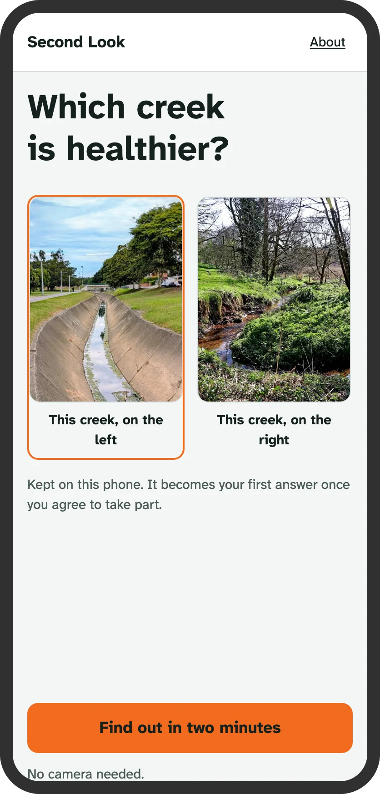<br>The guess<br><code>/</code></td>
<td align="center">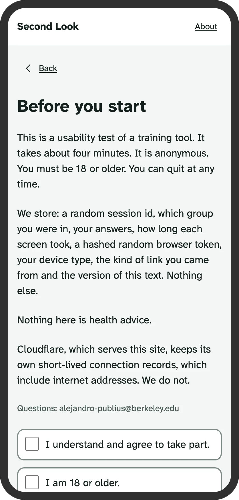<br>Consent<br><code>/t</code> (mock)</td>
<td align="center">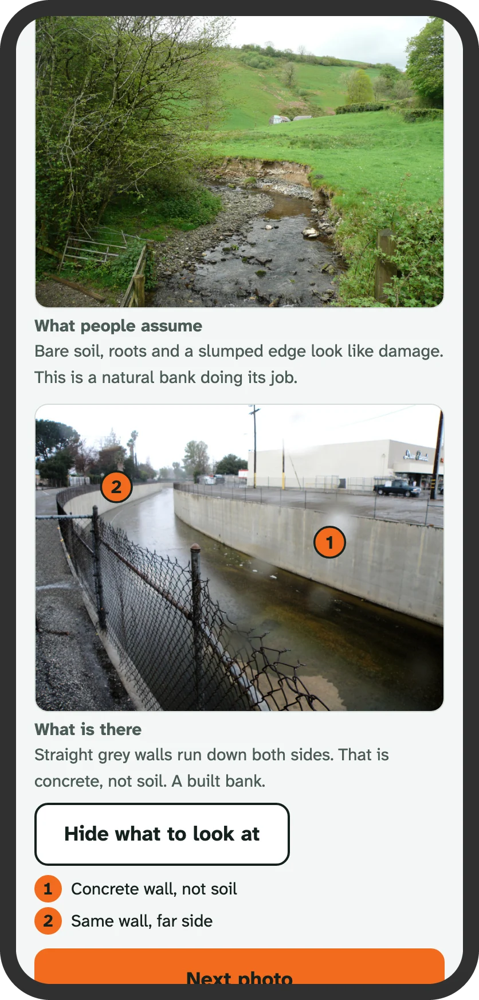<br>A lesson card with its marks<br><code>/t</code> (mock)</td>
</tr>
<tr>
<td align="center">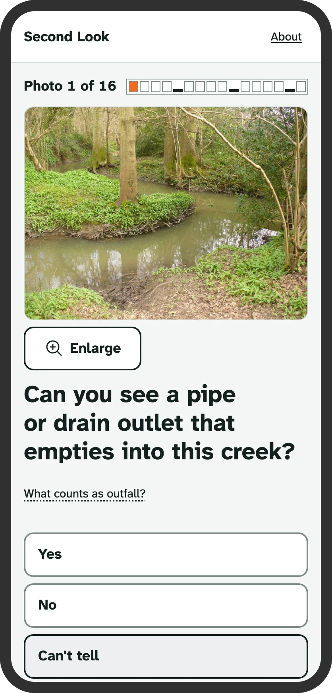<br>A test item<br><code>/t</code> (mock)</td>
<td align="center"><br>The score<br><code>/t</code> (mock)</td>
<td align="center"><br>Judge mode today<br><code>/demo</code></td>
<td align="center">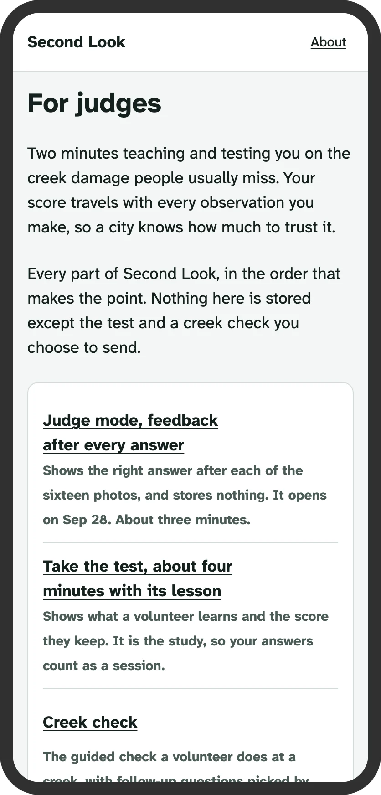<br>For judges<br><code>/judges</code></td>
</tr>
<tr>
<td align="center">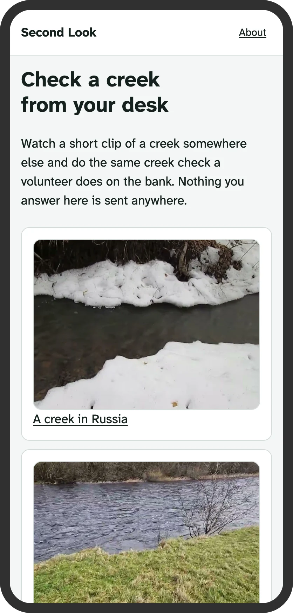<br>Walks<br><code>/walk</code></td>
<td align="center"><br>A walk<br><code>/walk/v02</code></td>
<td align="center">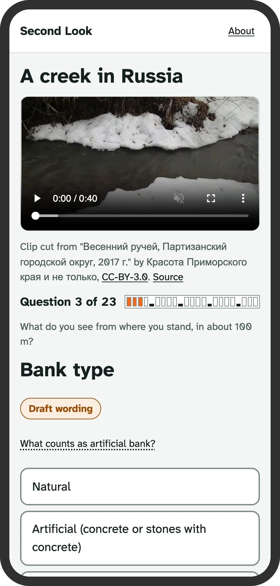<br>A walk in progress<br><code>/walk/v02</code></td>
<td align="center"><br>The walk record<br><code>/walk/v02</code></td>
</tr>
<tr>
<td align="center"><br>The walk as a city sees it<br><code>/city?walk=v02</code></td>
<td align="center">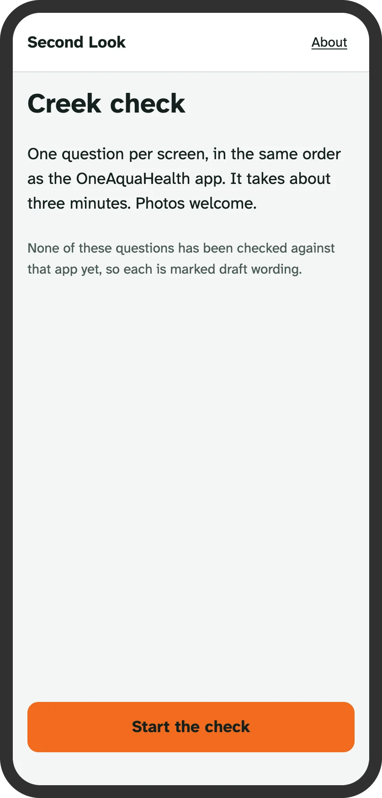<br>Creek check<br><code>/check</code></td>
<td align="center">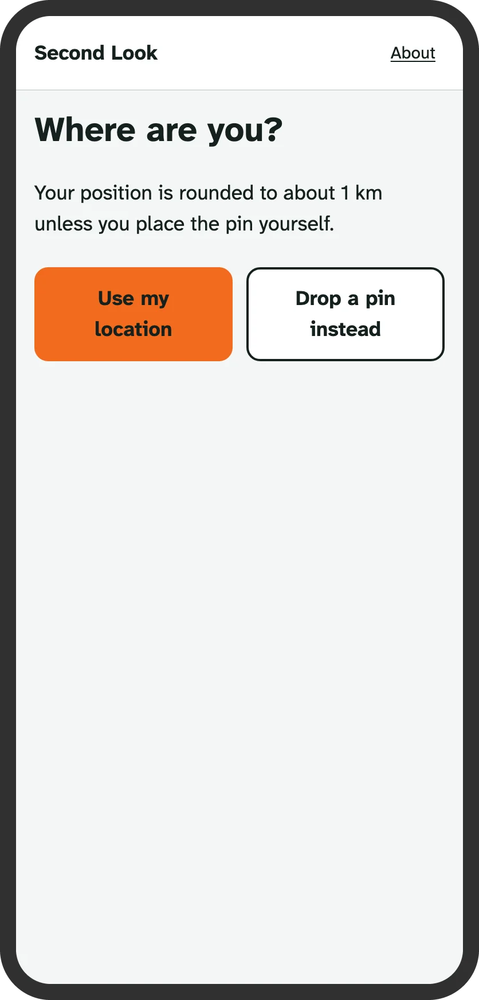<br>Where are you?<br><code>/check</code></td>
<td align="center">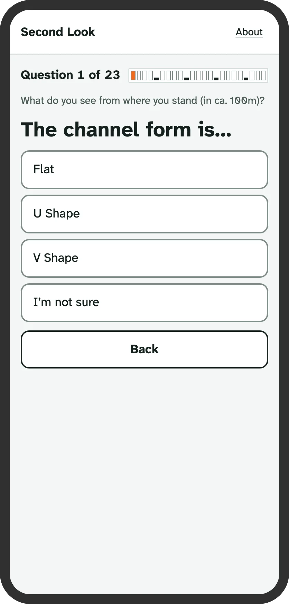<br>First question<br><code>/check</code></td>
</tr>
<tr>
<td align="center">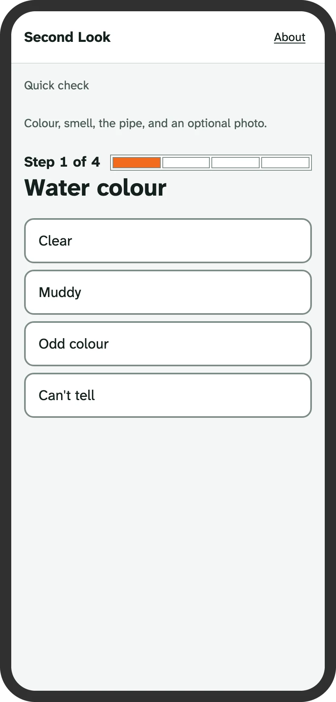<br>Quick check<br><code>/quick</code></td>
<td align="center">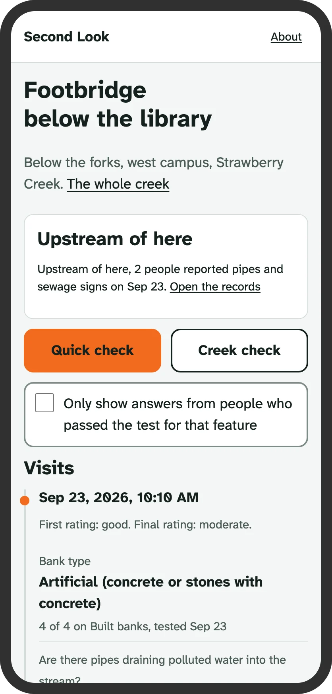<br>A sample record<br><code>/spot?id=example</code> (mock)</td>
<td align="center">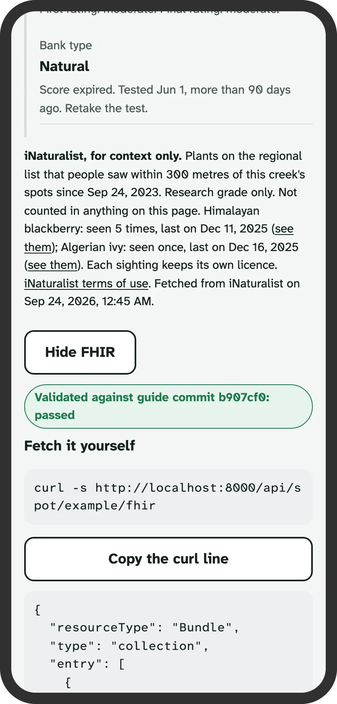<br>View as FHIR<br><code>/spot?id=example</code> (mock)</td>
<td align="center">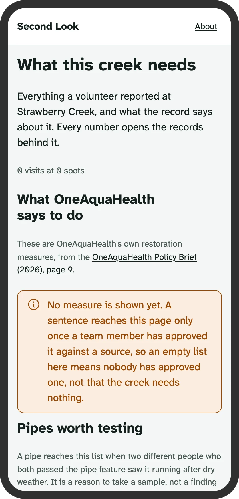<br>City view<br><code>/city?creek=strawberry-creek</code></td>
</tr>
<tr>
<td align="center">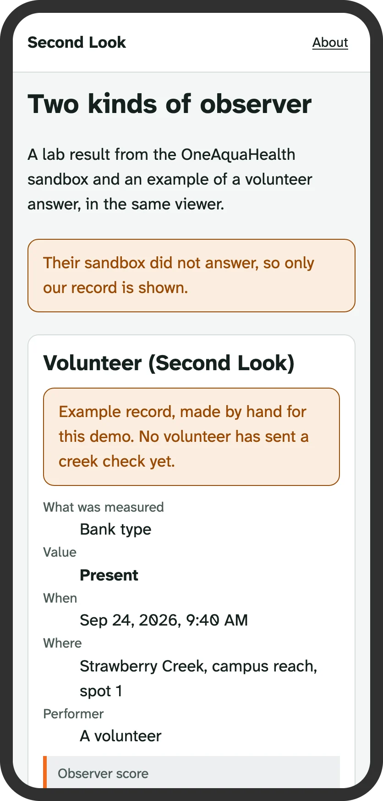<br>Two kinds of observer<br><code>/two</code></td>
<td align="center">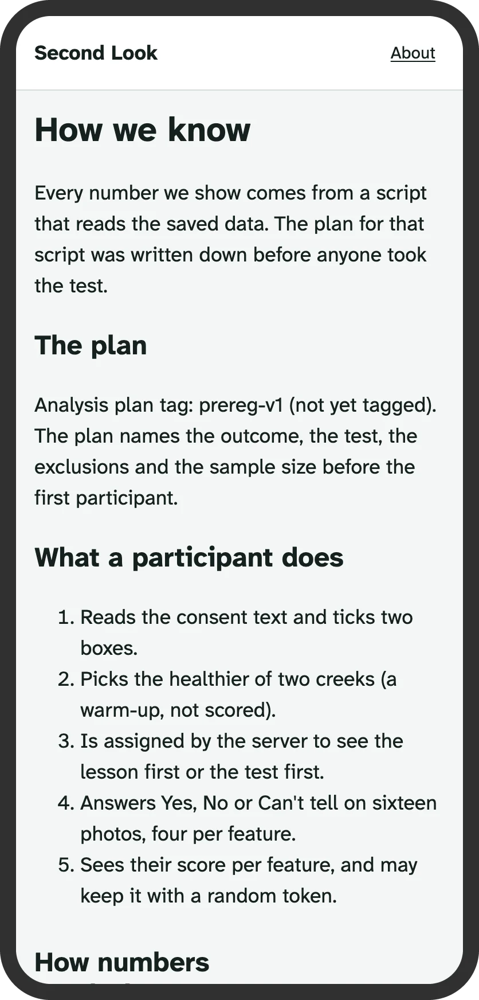<br>How we know<br><code>/how-we-know</code></td>
<td align="center">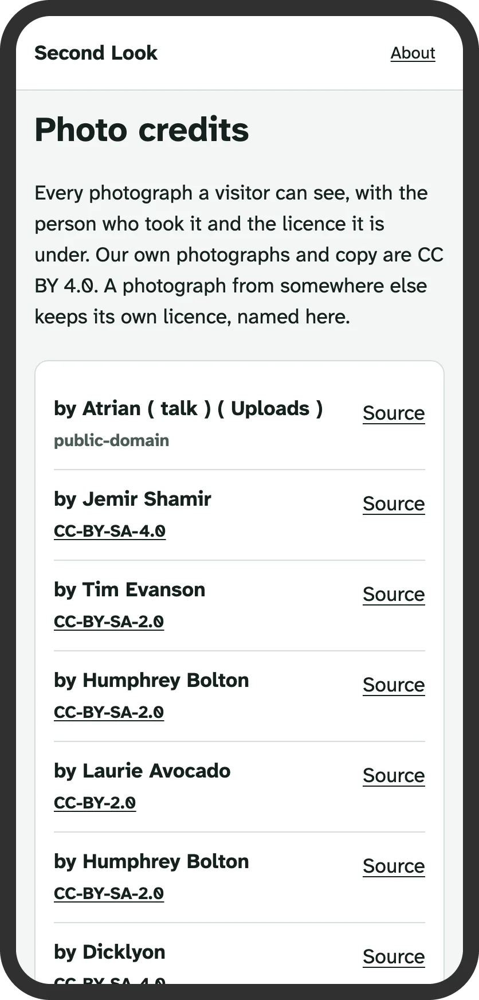<br>Credits<br><code>/credits</code></td>
<td align="center">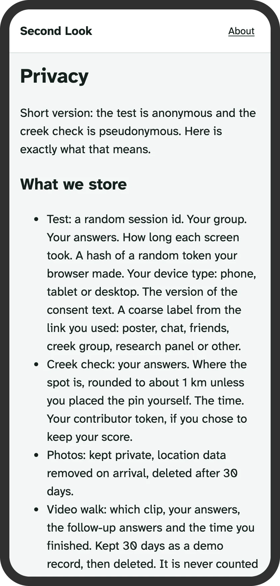<br>Privacy<br><code>/privacy</code></td>
</tr>
<tr>
<td align="center">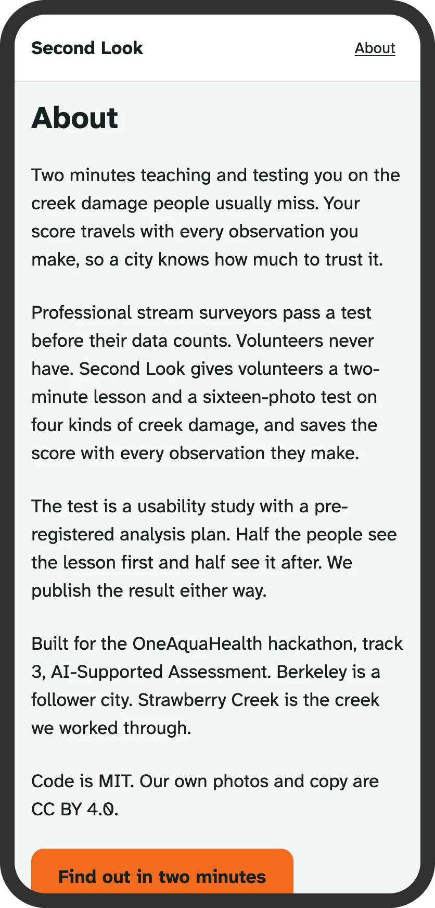<br>About<br><code>/about</code></td>
<td align="center">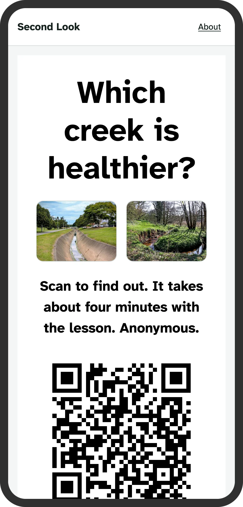<br>Poster<br><code>/poster</code></td>
</tr>
</table>

Two lesson photos with their marks, as a person sees them on the lesson cards:

<p>


</p>

Photos: Laurie Avocado, CC BY 2.0, and Jonathan Hutchins, CC BY-SA 2.0, both from Wikimedia Commons.

For the licence section: the screenshots, the GIF and the social preview show photos by other people under their own licences (CC BY and CC BY-SA, credited on /credits and in photos/manifest.csv). The social preview and the pipe lesson photo are shared under CC BY-SA 4.0 because their photos are CC BY-SA.

## Why trust a volunteer, and the AI?

People judge a creek the way they judge a park. Tidy and green reads as healthy. OneAquaHealth's project lead said it in the first workshop: volunteers catch smell, foam and colour, and walk past concrete banks, a channel that was dug out, and pretty plants that do not belong. So the best-looking creek can get the best rating and deserve the worst.

Professional surveyors fixed this long ago. In the UK's River Habitat Survey, "only surveys from accredited surveyors will be entered on the RHS database", and accreditation means attending a course and passing a test (RHS manual 2003, pages 3 and 20; see `docs/notes/sources.md`). Volunteers have never had that. Their observations arrive with no mark of how far to trust them.

Measure each volunteer, per feature, and store the measure with the data. The analyst sees "4 of 4 on built banks, tested Sep 23" beside an answer, never a blended grade or a probability. Follow-up questions are chosen by code from the answers, the person's scores and the weather, two at most: "It has not rained here for N days. Is anything coming out of that pipe?" The AI takes the same test as the people and earns the right to ask one question, feature by feature.

| What can go wrong | What stops it, by construction | Proof |
|---|---|---|
| A volunteer walks past a built bank | The lesson teaches the four features people miss, and the test measures each one; the score is stored with every answer | `content/lessons/`, `core/scoring.py`, `core/tests/test_scoring.py` |
| Someone taps at random | Four items per feature, two present and two absent, so chance scores about 2 of 4; a low scorer who answers No is asked for a photo | `content/test_items.yaml`, `core/followups.py` rule `low_score` |
| A pretty creek gets the best rating | A good rating beside a reported built bank, sewage or plant that does not belong triggers one question asking the person to keep or change it | `content/followups.yaml` rule `rating_check`, `core/tests/test_followups.py` |
| A pipe report means nothing without the weather | The dry pipe question fires only after dry days from Open-Meteo, and is skipped when the weather is unknown | `core/rainfall.py`, `core/tests/test_rainfall.py` |
| The model invents a feature | Model output becomes a Flag through the gate or is dropped; a fuzz test throws arbitrary output at it | `core/gate.py`, `core/tests/test_gate.py` |
| The model was never good at that feature | A model may flag only a feature it passed on the same test as the people; the pass table is a committed file, and one from the fake client licenses nothing | `results/model_pass_table.json`, `core/tests/test_checker.py` |
| Duplicate and test pins fill the map | A precise pin within 30 metres of an existing spot is offered as that spot; test-looking names are refused; a coarse pin is never compared | `core/act.py`, `core/tests/test_act.py` |
| A record a city's systems cannot read | Every emitted resource is validated against their guide in CI, in Python and in the TypeScript Worker | `scripts/fhir_validate.py`, `worker/test/golden.test.ts` |
| Someone edits history | A hash-chained audit log, checked by a script | `audit/`, `scripts/verify_audit.py` |
| We fool ourselves with the statistics | The analysis plan is tagged before any data; every README number is checked against `results/` in CI; a synthetic result is cited only where the sentence says it is a simulation | `docs/analysis_plan.md` at `prereg-v1`, `scripts/verify_claims.py` |
| Judge mode leaks the answer key | Judge mode is shut until Sep 28 by a lock constant, and its answer route refuses before then on the Worker and in the Python API | `core/lock.py`, `apps/api/tests/test_study.py::test_demo_answer_is_shut_before_the_lock`, `worker/test/e2e.mjs` |
| A refresh loses a session | The session resumes from the server; the creek check queues offline and sends later | `apps/web/lib/offline.ts`, `apps/web/tests/` |

## What the AI cannot do

| It cannot | Enforced by | Test |
|---|---|---|
| Decide anything stored | The record builder accepts human answers only | `core/tests/test_gate.py`, the fuzz test on stored answers |
| Speak on a feature it did not pass | `core/checker.py` refuses to ask, and `core/gate.py` drops the flag | `core/tests/test_checker.py::test_unpassed_feature_returns_nothing_even_when_the_model_is_confident` |
| Speak on a fake pass table | The gate reads `"real": true` or licenses nothing | `core/tests/test_checker.py::test_synthetic_pass_table_never_licenses_a_flag_by_default` |
| Ask more than one question, or ask first | Follow-up selection is a pure function, two questions at most, the model's at most one, shown after the person answers | `core/tests/test_followups.py` |
| Put its own words in front of a person | Its note is shown only as "the checker noticed", cut to 160 characters | `core/checker.py`, `core/gate.py` |
| State a risk for a named site | Every health or ecology sentence comes from `content/approved_sentences.yaml` with a source | `core/tests/test_labels.py` |

## The gate, the heart of it

A vision model can help a volunteer look again. It can never decide what is stored. Every model answer takes this path:

1. **The person answers first.** The creek check asks the official app's questions (`content/form.yaml`), and the answers are the person's own.
2. **The model is asked only where it passed.** `core/checker.py` reads the committed pass table, `results/model_pass_table.json`, and does not even ask about a feature that model did not pass on the same 16-photo test the volunteers take. A table that does not say `"real": true` licenses nothing.
3. **Its answer is forced.** One photo, one feature, the frozen question wording. Anything that is not yes, no or can't tell with a short note becomes can't tell and counts as malformed (`force_answer` in `core/checker.py`).
4. **The gate turns it into a flag or drops it.** `parse_flags` in `core/gate.py` keeps a `Flag` only for a known feature the model passed, with a sane confidence and a short plain note, and drops everything else with a reason in plain words. It never raises. On the footage run it dropped <!--v:results/footage_latest.json#/gate/dropped-->29<!--/v--> of <!--v:results/footage_latest.json#/gate/candidates-->64<!--/v--> candidate flags, each for a feature that model had not passed.
5. **A flag can only make one question eligible.** `core/followups.py` picks the follow-up questions from the answers, the rain (`core/rainfall.py`), the person's scores and the flags, by the rules in `content/followups.yaml`: two questions at most, the model's at most one, and no model call inside it.
6. **The person answers again.** The model's note is shown only as "the checker noticed" (`core/checker.py`, `apps/web/components/WalkFlow.tsx`).
7. **The record is built from human inputs only.** `build_record` in `core/gate.py` has no parameter that could carry a flag, a model id or model text. `core/fhir_emit.py` writes the record under OneAquaHealth's profiles with the person's score attached, and `scripts/fhir_validate.py` checks it in CI.

Where it runs today: the model's flags reach a person in the video walks, where `scripts/build_walks.py` sends the footage run's answers through the same gate at build time. The live creek check runs with the checker off (`CHECKER_ENABLED`), so both servers pass it no flags and no model is called.

## Three properties that follow

| Property | Why it holds | The test that fails if it breaks |
|---|---|---|
| The model cannot write the record | The only way to make a record takes no model output | `core/tests/test_gate.py::test_build_record_signature_carries_human_inputs_only`, and the fuzz test `core/tests/test_gate.py::test_fuzz_model_output_never_reaches_answers_or_labels` |
| A model speaks only where it passed, and a made-up pass table licenses nothing | The gate and the checker both read the committed table and require `"real": true` | `core/tests/test_harden_gate_properties.py::test_every_kept_flag_is_licensed_for_that_exact_model`, `core/tests/test_checker.py::test_synthetic_pass_table_never_licenses_a_flag_by_default` |
| Code chooses the questions: two at most, the model's at most one, no network and no model call | Follow-up selection is a pure function | `core/tests/test_harden_followups_properties.py::test_the_content_table_never_asks_more_than_two_questions_for_any_input`, `core/tests/test_harden_followups_properties.py::test_the_selector_runs_with_http_and_the_model_client_patched_to_raise` |

The hard parts of building this, and how each is proved, are in `WRITEUP.md`. The decisions are in `docs/adr/`.

## Architecture

The deep version, with every file named, is `docs/ARCHITECTURE.md`. The loop is five verbs: Train, Check, Verify, Record, Act. Each diagram below is a source in `docs/diagrams/`, drawn as an SVG next to it by the Mermaid CLI pinned in `tools/diagrams`. `make diagrams` draws each one again, in CI too. It fails when a drawing is stale, was edited by hand, or has an edge that does not say what flows along it.

**The system map.** Every edge says what flows. Where a part is a `core/` file, the live site runs its TypeScript port in `worker/src/core/`, held equal to the Python by golden vectors.

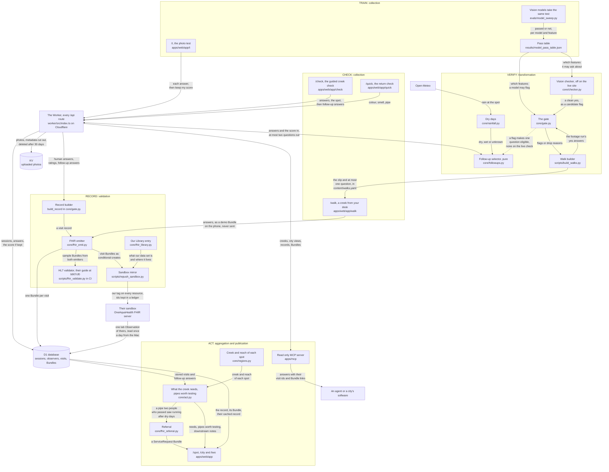
```mermaid
flowchart TB
  accTitle: The system map, by the five verbs Train, Check, Verify, Record and Act
  accDescr: A volunteer takes the photo test on /t and the Worker keeps the per-feature score in D1. Vision models take the same test, and the pass table says which features each may flag. On /check the Worker hands the answers, the dry days and the person's score to the follow-up selector, which returns at most two questions. The finished visit becomes a record of human answers only, then a FHIR Bundle stored in D1, checked by the HL7 validator in CI and mirrored to their sandbox. From the stored visits, core/act.py works out what the creek needs and which pipes are worth testing, a pipe becomes a ServiceRequest, and the read only MCP server hands any agent the same records with their ids.
  subgraph TRAIN["TRAIN: collection"]
    TPAGE["/t, the photo test<br/>apps/web/app/t"]
    SWEEP["Vision models take the same test<br/>evals/model_sweep.py"]
    PASS["Pass table<br/>results/model_pass_table.json"]
  end
  subgraph CHECK["CHECK: collection"]
    CPAGE["/check, the guided creek check<br/>apps/web/app/check"]
    QPAGE["/quick, the return check<br/>apps/web/app/quick"]
    WPAGE["/walk, a creek from your desk<br/>apps/web/app/walk"]
  end
  WORKER["The Worker, every /api route<br/>worker/src/index.ts on Cloudflare"]
  D1[("D1 database<br/>sessions, observers, visits, Bundles")]
  KV[("KV<br/>uploaded photos")]
  METEO["Open-Meteo"]
  subgraph VERIFY["VERIFY: transformation"]
    RAIN["Dry days<br/>core/rainfall.py"]
    FOLLOW["Follow-up selector, pure<br/>core/followups.py"]
    GATE["The gate<br/>core/gate.py"]
    CHECKER["Vision checker, off on the live site<br/>core/checker.py"]
    WALKS["Walk builder<br/>scripts/build_walks.py"]
  end
  subgraph RECORD["RECORD: validation"]
    BUILD["Record builder<br/>build_record in core/gate.py"]
    EMIT["FHIR emitter<br/>core/fhir_emit.py"]
    VALID["HL7 validator, their guide at b907cf0<br/>scripts/fhir_validate.py in CI"]
    LIB["Our Library entry<br/>core/fhir_library.py"]
    MIRROR["Sandbox mirror<br/>scripts/repush_sandbox.py"]
  end
  SANDBOX["Their sandbox<br/>OneAquaHealth FHIR server"]
  subgraph ACT["ACT: aggregation and publication"]
    REGIONS["Creek and reach of each spot<br/>core/regions.py"]
    ACTF["What the creek needs, pipes worth testing<br/>core/act.py"]
    REFER["Referral<br/>core/fhir_referral.py"]
    VIEWS["/spot, /city and /two<br/>apps/web/app"]
    MCP["Read only MCP server<br/>apps/mcp"]
  end
  CLIENT["An agent or a city's software"]
  TPAGE -- "each answer,<br/>then keep my score" --> WORKER
  WORKER -- "sessions, answers,<br/>the score if kept" --> D1
  SWEEP -- "passed or not,<br/>per model and feature" --> PASS
  PASS -- "which features<br/>a model may flag" --> GATE
  PASS -- "which features<br/>it may ask about" --> CHECKER
  CPAGE -- "answers, the spot,<br/>then follow-up answers" --> WORKER
  QPAGE -- "colour, smell, pipe" --> WORKER
  WORKER -- "photos, metadata cut out,<br/>deleted after 30 days" --> KV
  METEO -- "rain at the spot" --> RAIN
  RAIN -- "dry, wet or unknown" --> FOLLOW
  WORKER <-- "answers and the score in,<br/>at most two questions out" --> FOLLOW
  CHECKER -- "a clean yes,<br/>as a candidate flag" --> GATE
  GATE -. "a flag makes one<br/>question eligible,<br/>none on the live check" .-> FOLLOW
  WALKS -- "the footage run's<br/>yes answers" --> GATE
  GATE -- "flags or drop reasons" --> WALKS
  WALKS -- "the clip and at most<br/>one question, in<br/>content/walks.yaml" --> WPAGE
  WORKER -- "human answers,<br/>ratings, follow-up answers" --> BUILD
  BUILD -- "a visit record" --> EMIT
  EMIT -- "one Bundle per visit" --> D1
  WPAGE -- "answers, as a demo Bundle<br/>on the phone, never sent" --> EMIT
  EMIT -- "sample Bundles from<br/>both emitters" --> VALID
  EMIT -- "visit Bundles as<br/>conditional creates" --> MIRROR
  LIB -- "what our data set is<br/>and where it lives" --> MIRROR
  MIRROR -- "our tag on every resource,<br/>ids kept in a ledger" --> SANDBOX
  SANDBOX -- "one lab Observation<br/>of theirs, read once<br/>a day from the Mac" --> D1
  D1 -- "stored visits and<br/>follow-up answers" --> ACTF
  REGIONS -- "creek and reach<br/>of each spot" --> ACTF
  ACTF -- "a pipe two people<br/>who passed saw running<br/>after dry days" --> REFER
  ACTF -- "needs, pipes worth testing,<br/>downstream notes" --> VIEWS
  REFER -- "a ServiceRequest Bundle" --> VIEWS
  D1 -- "the record, its Bundle,<br/>their cached record" --> VIEWS
  WORKER -- "creeks, city views,<br/>records, Bundles" --> MCP
  MCP -- "answers with their<br/>visit ids and Bundle links" --> CLIENT
```

Why this architecture matters:

- The model sits behind two walls, the pass table and the gate, and has no path to the store.
- Python is the reference and the Worker runs the same functions, proved equal by golden vectors, so the live site and the tests cannot quietly disagree.
- Every record is a FHIR Bundle under their profiles before it is stored, so a city that reads OneAquaHealth records reads ours.

**One creek visit as FHIR.** Every arrow is a reference in the emitted JSON, named by its FHIR path, read off `fhir/golden/`. The Practitioner's qualification carries the test and its dates. The score itself is in the test sitting's QuestionnaireResponse, which the Provenance names as a source of every Observation.

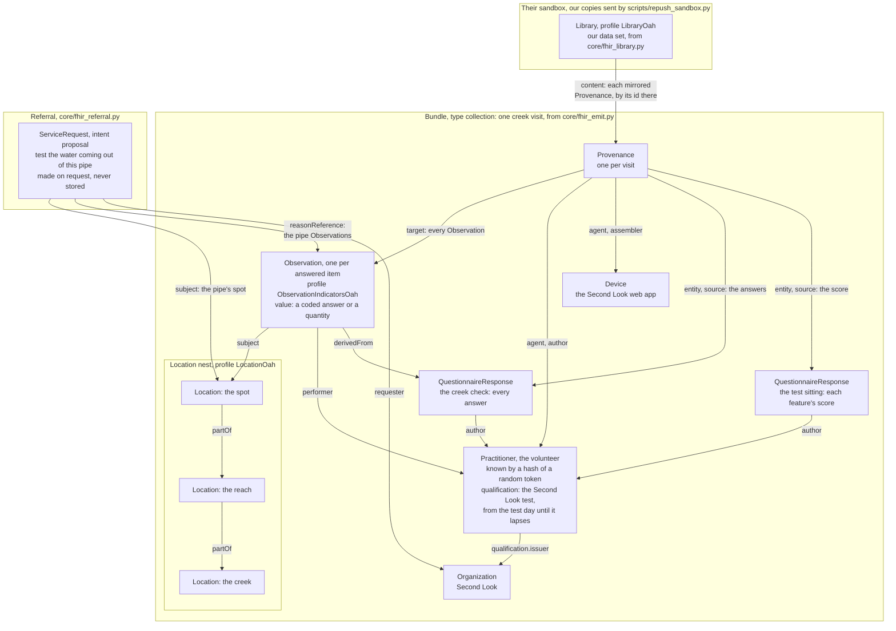
```mermaid
flowchart TB
  accTitle: The FHIR resources of one creek visit, and how they point at each other
  accDescr: One creek visit is emitted as a collection Bundle by core/fhir_emit.py. Its Observations sit on the spot, which is part of a reach, which is part of a creek. Each Observation names the volunteer as performer and the creek check answers as its source. The volunteer is a pseudonymous Practitioner whose dated qualification is issued by Second Look, and the test sitting with the per-feature score is authored by the same Practitioner. One Provenance ties every Observation to the volunteer, the software and both sets of answers. A pipe worth testing becomes a ServiceRequest made on request by core/fhir_referral.py, and our Library entry on their sandbox lists the mirrored Provenance.
  subgraph VISIT["Bundle, type collection: one creek visit, from core/fhir_emit.py"]
    ORG["Organization<br/>Second Look"]
    DEV["Device<br/>the Second Look web app"]
    PRAC["Practitioner, the volunteer<br/>known by a hash of a random token<br/>qualification: the Second Look test,<br/>from the test day until it lapses"]
    QRT["QuestionnaireResponse<br/>the test sitting: each feature's score"]
    QRV["QuestionnaireResponse<br/>the creek check: every answer"]
    OBS["Observation, one per answered item<br/>profile ObservationIndicatorsOah<br/>value: a coded answer or a quantity"]
    PROV["Provenance<br/>one per visit"]
    subgraph NEST["Location nest, profile LocationOah"]
      SPOT["Location: the spot"]
      REACH["Location: the reach"]
      CREEK["Location: the creek"]
    end
  end
  subgraph REFER["Referral, core/fhir_referral.py"]
    SR["ServiceRequest, intent proposal<br/>test the water coming out of this pipe<br/>made on request, never stored"]
  end
  subgraph SANDBOX["Their sandbox, our copies sent by scripts/repush_sandbox.py"]
    LIB["Library, profile LibraryOah<br/>our data set, from core/fhir_library.py"]
  end
  SPOT -- "partOf" --> REACH
  REACH -- "partOf" --> CREEK
  PRAC -- "qualification.issuer" --> ORG
  QRT -- "author" --> PRAC
  QRV -- "author" --> PRAC
  OBS -- "subject" --> SPOT
  OBS -- "performer" --> PRAC
  OBS -- "derivedFrom" --> QRV
  PROV -- "target: every Observation" --> OBS
  PROV -- "agent, author" --> PRAC
  PROV -- "agent, assembler" --> DEV
  PROV -- "entity, source: the answers" --> QRV
  PROV -- "entity, source: the score" --> QRT
  SR -- "subject: the pipe's spot" --> SPOT
  SR -- "reasonReference:<br/>the pipe Observations" --> OBS
  SR -- "requester" --> ORG
  LIB -- "content: each mirrored<br/>Provenance, by its id there" --> PROV
```

**The AI gate.** Every arrow is a call in `core/checker.py`, `core/gate.py` or `core/followups.py`. On the live creek check the checker is off and the Worker passes no flags, so no model is in that request path. The walks run the same gate when they are built, in `scripts/build_walks.py`.

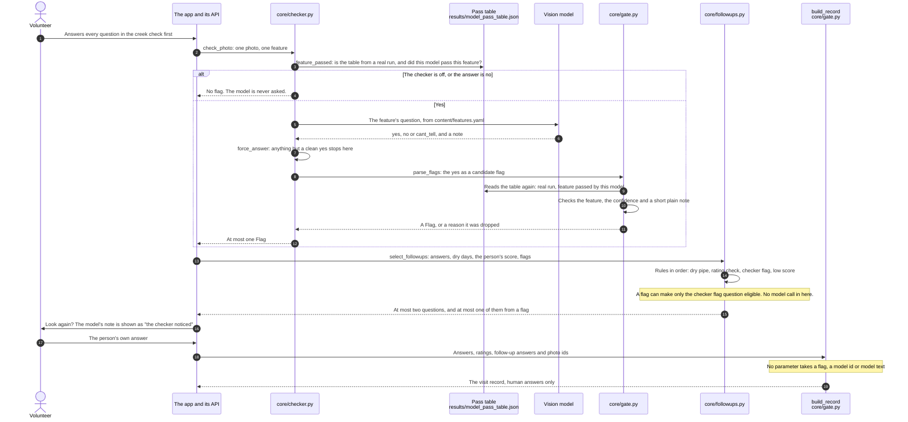
```mermaid
sequenceDiagram
  accTitle: The AI gate, step by step
  accDescr: The volunteer answers every question first. Only then may a vision model answer one question about one photo, and only for a feature it passed on the same test the volunteers take. The gate turns that answer into a flag or drops it. A flag can make one follow-up question eligible. The follow-up selector, which calls no model, picks at most two questions. The person answers them, and the record is built from the person's answers alone.
  autonumber
  actor V as Volunteer
  participant App as The app and its API
  participant C as core/checker.py
  participant P as Pass table<br/>results/model_pass_table.json
  participant M as Vision model
  participant G as core/gate.py
  participant F as core/followups.py
  participant R as build_record<br/>core/gate.py
  V->>App: Answers every question in the creek check first
  App->>C: check_photo: one photo, one feature
  C->>P: feature_passed: is the table from a real run, and did this model pass this feature?
  alt The checker is off, or the answer is no
    C-->>App: No flag. The model is never asked.
  else Yes
    C->>M: The feature's question, from content/features.yaml
    M-->>C: yes, no or cant_tell, and a note
    C->>C: force_answer: anything but a clean yes stops here
    C->>G: parse_flags: the yes as a candidate flag
    G->>P: Reads the table again: real run, feature passed by this model
    G->>G: Checks the feature, the confidence and a short plain note
    G-->>C: A Flag, or a reason it was dropped
    C-->>App: At most one Flag
  end
  App->>F: select_followups: answers, dry days, the person's score, flags
  F->>F: Rules in order: dry pipe, rating check, checker flag, low score
  Note over F: A flag can make only the checker flag question eligible. No model call in here.
  F-->>App: At most two questions, and at most one of them from a flag
  App->>V: Look again? The model's note is shown as "the checker noticed"
  V->>App: The person's own answer
  App->>R: Answers, ratings, follow-up answers and photo ids
  Note over R: No parameter takes a flag, a model id or model text
  R-->>App: The visit record, human answers only
```

The same three as images, for places that do not draw Mermaid: `docs/diagrams/system-map.svg`, `docs/diagrams/fhir-graph.svg`, `docs/diagrams/ai-gate.svg`.

### Tech stack

| Part | Built with |
|---|---|
| Web app | Next.js 16 and React 19, a static export on Cloudflare Pages, a service worker for offline checks, self-hosted fonts, no third party script |
| API, live | a TypeScript Worker on Cloudflare Workers, with D1 for records and Workers KV for photos |
| API, reference | Python 3.12, FastAPI, SQLModel and Alembic, SQLite locally and Postgres in docker compose |
| Pure logic | `core/`: the gate, the follow-ups, scoring, labels, the FHIR emitter; ported to TypeScript and proved equal by golden vectors |
| Standards | FHIR R4 4.0.1 under OneAquaHealth's guide pinned at b907cf0, FSH built by SUSHI, checked by the HL7 validator <!--v:results/fhir_validation.json#/validator_version-->6.10.4<!--/v--> with terminology on |
| AI | Claude vision models through the Anthropic API, behind the gate, only where they passed the test |
| Agents | a read only MCP server on the `mcp` Python SDK |
| Checks | pytest with Hypothesis, Playwright, ruff, mypy, gitleaks, and `make check` in GitHub Actions |
| Weather | Open-Meteo, for the dry pipe question |

FHIR R4 4.0.1 under OneAquaHealth's guide, pinned at hl7-eu/oah b907cf0 and built with SUSHI 3.20.1; their sandbox, read at one request per second and written with conditional creates; Open-Meteo for the rainfall behind the dry pipe rule; the Cal-IPC Inventory for the Bay Area plant list; four vision models (Claude Haiku 4.5, Sonnet 5, Opus 5.5 and Fable 5.1), called directly and kept behind a gate. No names, emails, addresses or free text in the test; EXIF stripped from uploads, which are deleted after 30 days; a hash-chained audit log.

### API

The live site's API is a TypeScript Worker on Cloudflare with <!--v:results/api_inventory.json#/worker/count-->25<!--/v--> routes, under `/api` on the site's own origin. The Python API in `apps/api/` is the reference, with <!--v:results/api_inventory.json#/python/count-->25<!--/v--> routes. Every route, what it does, what it stores and its limit or lock is in `docs/API.md`; a test fails when a route is added without a row there.

| Route | What it is for |
|---|---|
| `POST /api/test/session`, `/response`, `/complete` | the two-minute test; `x-qa-key` marks a live check as a test |
| `POST /api/check/draft`, `/api/check/finalize` | a creek check and the follow-up questions code picked |
| `GET /api/spot/{spot_id}`, `/api/city/{creek}` | a record, and the analyst's view of a creek, every number with the visit ids behind it |
| `GET /api/fhir/Bundle/{visit_id}`, `/api/fhir/referral/{spot_id}` | the FHIR behind every record, and a ServiceRequest for a pipe worth testing |
| `GET /api/two` | one of our Observations beside a laboratory one from their sandbox |
| `POST /api/demo/answer` | judge mode: right or wrong only, shut until the data lock |

### MCP tools

`apps/mcp/server.py` is a read only MCP server over our records, run locally over stdio. Every answer carries `resource_ids` and `fhir`, the visits it was counted from, so an agent cannot state a number it cannot trace. It has <!--v:results/api_inventory.json#/mcp/count-->5<!--/v--> tools; inputs and outputs in `docs/MCP.md`, a real session in `examples/mcp/transcript.md`.

| Tool | Answers |
|---|---|
| `list_creeks` | every creek with a record |
| `get_creek_record` | one creek: findings, what it needs in approved words, pipes worth testing, reaches, downstream notes |
| `list_findings` | findings across creeks, filtered by feature, by how many people, and by whether they passed |
| `get_observer_score` | an observer's dated qualification and score per feature, as the record carries it |
| `explain_number` | the visit ids behind one figure on a creek's record |

## How OneAquaHealth is used

OneAquaHealth says citizen data should stand beside lab data under the same profiles and value sets. A lab result is trusted because its quality checks travel with it. Second Look gives a volunteer's observation the same thing: their per-feature score, stored in the record of their test sitting beside a dated Practitioner qualification for the test, and linked through Provenance to every Observation they make. The four features are the ones the project lead named. The creek check mirrors the official Citizen Science App's items in their order. The city actions are OneAquaHealth's own restoration measures, from the [OneAquaHealth Policy Brief (2026), page 9](https://www.oneaquahealth.eu/app/uploads/2026/05/OneAquaHealth-Policy-Brief.pdf): replant margins, fix sewers, reconnect the floodplain, remove barriers, take out the concrete.

| Their surface | What we use it for | Where |
|---|---|---|
| The official Citizen Science App's question wording | The creek check mirrors its items, in its order, with its closing question on feelings | `content/form.yaml` |
| Their Location and Observation profiles | Every spot and every answer | `core/fhir_emit.py`, `docs/fhir_mapping.md` |
| Their value sets and UCUM units | Present, absent, the indicator groups, metres | `core/fhir_emit.py` |
| A Questionnaire through their form extension | The test and the check, answered as QuestionnaireResponses | `fhir/fsh/` |
| Nested Locations | Creek, reach and spot with `partOf` | `core/regions.py`, `content/regions/` |
| The HL7 validator with their guide, terminology on | Every emitted resource in CI | `scripts/fhir_validate.py`, `fhir/ig.lock` |
| Their sandbox | Conditional creates with our tag and a ledger, and a Library entry for the data set | `scripts/repush_sandbox.py`, `fhir/sandbox_ledger.jsonl` |
| Their decision tool's measures | What a creek needs, in their words, from the Policy Brief, page 9 | `content/approved_sentences.yaml`, `/city` |
| The five One Digital Health dimensions and FAIR | Stated in words below | this README |
| The follower city recipe | `make new-city`, run once for Heraklion as a dry example | `scripts/new_city.py`, `docs/cities/` |
| Their SpecimenOah profile | The shape of a laboratory result coming back to a volunteer's pipe, marked EXAMPLE | `core/fhir_referral.py` |

### Contributed back

- A proposal for carrying observer quality in their guide, with three gaps our validator runs found: no profile for the person or the trail from an answer to them; a volunteer modelled as a Practitioner for want of a better fit; `SpecimenOah.collection.collector` allowing only a PractitionerRole. Its FSH builds inside their guide in CI. `docs/ig_proposal.md`.
- A friendly note that their temporary code system spells one code `morophology`. We kept their spelling so our records validate.
- A read only MCP server over our own records, so any software agent can ask for a creek's records with the resource ids behind every answer. `examples/mcp/README.md`.

### Feasibility: Berkeley as a follower city

OneAquaHealth calls a city that adopts the method a follower city. Run on Berkeley: name the streams as nested Locations; adopt the form, which mirrors their app; train and test the volunteers in two minutes; collect and validate every visit against their profiles; publish to the sandbox with a Library entry and repeat with the 20 second return check. `make new-city` scaffolds the first three steps for a new city. Cost through Oct 15: nothing. Cloudflare Pages and a Worker with D1 and KV, on the free plan, with no card.

### One Digital Health and FAIR

Story: a student walks to Strawberry Creek, takes a two-minute test on her phone, and from then on every observation she makes carries how well she sees each kind of damage. A city analyst reads her record beside a lab result under the same profile and knows how much weight to give each. The health card tells her one thing for herself, one for her dog and one her city could do.

Five dimensions, in words, because no script produces them: citizen engagement, strong; education, strong; human and veterinary healthcare, partial (approved sentences for the person and the pet, no diagnosis, no site risk); industry 4.0, partial (FHIR records, a gated vision model, an audit log); environment, strong.

FAIR: findable through a Library entry in their sandbox and a public repository; accessible through a read-only FHIR endpoint; interoperable through their profiles, value sets and UCUM; reusable through MIT code, a pinned guide, Provenance on every record and a tagged analysis plan.

## Evals

Every number is graded by code and written to `results/`; `scripts/verify_claims.py` checks this README against those files in CI.

- The 16-photo test, taken by four vision models, three runs each, called directly (a batch once waited three hours in the queue): `evals/model_sweep.py` writes the pass table and per-item accuracy; `evals/benchmark.py` adds per-feature accuracy with Wilson intervals.
- The same models on frames from open creek footage: `evals/footage.py` reports accuracy against description labels with its count, agreement between models on unlabelled frames, what the gate stopped, and the adversarial frames. `evals/footage_pool.py` writes the numbers no model touches.
- The ablation (rules only, context only, vision only, all three): `evals/ablation.py`.
- The pre-registered analysis of the two-minute test, written and tested on synthetic data before the tag: `evals/usability_analysis.py`. Nobody is recruited, so it reports a description with counts.
- Cost is logged per call in `results/cost_log.jsonl`. A fake run logs to `results/cost_log_fake.jsonl` and spends nothing.

### Tests

`make check` runs everything below except the browser suite and the Worker end to end, and prints `CHECK GREEN`. The counts are taken by `scripts/count_tests.py` into `results/test_counts.json`.

- **Python:** <!--v:results/test_counts.json#/python/tests-->1604<!--/v--> tests (`uv run pytest`), including property tests that throw arbitrary model output at the gate and the follow-up selector.
- **Ports:** <!--v:results/test_counts.json#/worker_golden/cases-->113<!--/v--> golden cases written by the Python reference, which the TypeScript Worker must reproduce exactly, in <!--v:results/test_counts.json#/worker_golden/node_tests-->12<!--/v--> tests (`make worker-check`).
- **Browser:** <!--v:results/test_counts.json#/playwright/tests-->59<!--/v--> Playwright tests in <!--v:results/test_counts.json#/playwright/spec_files-->15<!--/v--> spec files on a phone viewport, against the production build and a mock API that refuses what the servers refuse (`make e2e`).
- **Worker end to end:** <!--v:results/test_counts.json#/worker_e2e/sections-->8<!--/v--> sections that drive the real Worker's routes under `wrangler dev` with a local D1 and KV (`make worker-e2e`, in CI).
- **Records:** the HL7 validator checks every emitted Bundle, from Python and from the Worker, against OneAquaHealth's guide: <!--v:results/fhir_validation.json#/errors-->0<!--/v--> errors (`make fhir-validate`).

## What is real and what is synthetic

The full list, kept current, is `docs/REAL_VS_SYNTHETIC.md`. In short:

| Thing | Status |
|---|---|
| The test flow, its scoring and the photos in it | real, openly licensed photos from several countries |
| Frames from open creek footage | real, cut from openly licensed video; labels only where the video's own description supports one, never called a gold standard |
| A video walk's record | real shape, demo content, made on the phone and never stored |
| The golden Strawberry Creek visit | example, hand shaped from a worked visit |
| A referral for a pipe worth testing | real, computed on request from stored visits |
| The laboratory result coming back | example, tagged and labelled EXAMPLE everywhere |
| The model pass table and the AI numbers | real, from one paid run on Sep 23 and 24 (`results/model_pass_table.json` says `"real": true`); the earlier fake runs stay in `results/`, stamped SYNTHETIC |
| The simulation of weighted votes under Known weaknesses | synthetic by design: made-up people, stamped SYNTHETIC |

## Security and privacy

The two-minute test is anonymous and field use is pseudonymous. We keep coded answers, a coarse location unless the person places the pin, a hash of a random browser token, and a score under a random contributor token only when the person asks us to keep it. We never keep names, emails, internet addresses, free text or photo metadata, and the site loads nothing from anyone else. Uploads are deleted after 30 days and served only with their own token.

- `QA_KEY` only marks a live check as a test; `EXPORT_TOKEN` opens the anonymous export; neither can read a person's answers. No secret is in the repository: `make check` runs gitleaks over the history and scans every file git would commit.
- The data lock, 2026-09-28T01:00:00Z, is enforced in code: judge mode's answer route is shut until then, and the analysis refuses real data before the lock or without the `prereg-v1` tag.
- The Python API rate-limits per address in memory; the deployed Worker has no rate limit on purpose, because counting per visitor would mean holding something that identifies them.

Everything, with the known gaps and how to report a problem: `SECURITY.md` and `docs/DATA_HANDLING.md`.

## Quickstart

```
git clone https://github.com/alejandro-publius/second-look && cd second-look
uv sync && (cd apps/web && npm ci) && (cd worker && npm ci) && (cd tools/diagrams && npm ci)
make judge-check
```

`make judge-check` needs no key and no network. It runs the Python tests and the Worker's golden vector tests. It reads the result of the last HL7 validator run from `results/fhir_validation.json` and checks the golden Bundles against the emitter; it does not run the validator itself, which needs Java and a download, so `make fhir-validate` is the command for that. It builds the web app and runs the design check, verifies the audit log and scans for secrets, then prints five lines.

### Running locally

With no network and no key, on made-up demo data:

```
uv sync
(cd apps/web && npm ci)
make demo-offline
```

`scripts/seed_demo.py` fills `data/demo` through the API's own routes with every socket to another machine refused, and fails if one was tried: two test sittings that never count, three creek checks on Strawberry Creek, and one pipe worth testing. Then the API serves that folder on port 8000 and the site runs on http://localhost:3100. Open http://localhost:3100/city?creek=strawberry-creek. The first `uv sync` and `npm ci` are the only steps that use the network.

`make dev` runs the same two servers on an empty local database, with the network. Deploying, the D1 schema, the secrets by name, the jobs on the Mac and a table of every setting the code reads are in `DEPLOY.md`. Pre-commit hooks for the fast checks: `uv tool install pre-commit && pre-commit install`.

## For judges

A 45 second path: [the test](https://second-look-79t.pages.dev/t?src=other), [a creek from your desk](https://second-look-79t.pages.dev/walk), [a record made on your phone](https://second-look-79t.pages.dev/walk/v02), [what the city sees](https://second-look-79t.pages.dev/city?creek=strawberry-creek), [lab and volunteer side by side](https://second-look-79t.pages.dev/two). Every door is on [/judges](https://second-look-79t.pages.dev/judges).

See *Quickstart* above for `make judge-check`, the one command that needs no key and no network.

| Proof | Where |
|---|---|
| Every gate and the command that proves it | `docs/ACCEPTANCE.md` |
| A sample record | `fhir/golden/visit-strawberry-creek-1.json` |
| Eval results | `results/` |
| Architecture, the deep version | `docs/ARCHITECTURE.md` |
| Our own scorecard, weaknesses included | `docs/JUDGE_SCORECARD.md` |
| The demo script | `docs/video_script.md` |

### What was built, screen by screen

- `/t`: consent, the warm-up pair, the lesson, 16 items with Yes, No and Can't tell, the score per feature, the share card.
- `/demo`: judge mode with feedback after each answer, opening Sep 28. `/demo?script=1` replays one fixed path.
- `/check`: the guided creek check, one question per screen, with follow-ups chosen by `core/followups.py`, working offline.
- `/walk`: a creek from your desk, a clip from another country, the same check, a demo record made on the phone.
- `/spot?id=`: the record, each answer beside the observer's score, View as FHIR with the validation badge, the health card.
- `/city?creek=strawberry-creek`: what the creek needs, pipes worth testing with a FHIR referral, the downstream note by reach.
- `/two`: a lab Observation from their sandbox beside one of ours, from a copy the Mac fetches once a day. While their sandbox's name does not resolve, ours stands alone and the page says so. `/quick`, `/poster`, `/judges`, `/credits`.
- A read only MCP server over our own records: `examples/mcp/README.md`.

### See it work

One worked visit to Strawberry Creek in Berkeley, from the golden record in this repository. It is an example, hand shaped, as the table of what is real and what is synthetic below says.

| Step | What happened | Where to check |
|---|---|---|
| The person | Took the test first. Their per-feature score is in the QuestionnaireResponse of their test sitting; their Practitioner record carries a dated qualification for the test, valid for 90 days. | `fhir/golden/visit-strawberry-creek-1.json`, Practitioner |
| What they reported | A U shaped channel, a built bank present, a pipe they could not judge, the water height, a plant that does not belong. | the five Observations in the same file |
| What code asked next | The follow-up selector chose the questions from the answers, the weather and the person's score. No model call is in that path. | `core/followups.py`, `core/tests/test_followups.py` |
| What validated | The whole Bundle, against OneAquaHealth's guide at b907cf0 with terminology on. | `results/fhir_validation.json`, `make fhir-validate` |
| What went to their sandbox | Every resource by conditional create, tagged as ours, with a ledger of ids, and a Library entry that points back here. | `fhir/sandbox_ledger.jsonl`, `docs/notes/sandbox_library.md`, `curl -H "Accept: application/fhir+json" https://sandbox.hl7europe.eu/oneaquahealth/fhir/Library/466` |
| What the city then saw | What the creek needs, in OneAquaHealth's own restoration measures from their Policy Brief, page 9, each with its source. | `/city?creek=strawberry-creek`, `docs/screens/city.webp` |

You can run the same loop from your desk on a creek in another country: **`/walk`**, "Check a creek from your desk". Each walk plays a short clip from an openly licensed video with its credit on screen, you do the same guided check while watching, and the record is built on your phone, tagged as a demo, and never stored or counted.

## Known weaknesses

- One labeller. Every gold label was set by one person, so we report no agreement figure.
- Four photos per feature is coarse. It shows a person what to practise and flags an answer worth a second look. It is too coarse to weight votes by feature. In our simulation with made-up people (`results/consensus_coarseness.json`), for groups of <!--v:results/consensus_coarseness.json#/summary/at_headline_size/group_size-->5<!--/v-->, a plain majority was best in <!--v:results/consensus_coarseness.json#/summary/at_headline_size/n_patterns_where_plain_is_best-->3<!--/v--> of <!--v:results/consensus_coarseness.json#/summary/at_headline_size/n_patterns-->5<!--/v--> skill patterns, and weights from each feature's own photos did worse than a plain majority in all <!--v:results/consensus_coarseness.json#/summary/at_headline_size/n_patterns_where_feature_only_clearly_loses-->5<!--/v-->, by <!--v:results/consensus_coarseness.json#/summary/at_headline_size/feature_only_loss_points_min-->12.1<!--/v--> to <!--v:results/consensus_coarseness.json#/summary/at_headline_size/feature_only_loss_points_max-->20.6<!--/v--> points. Weights that also use a person's whole score did better in <!--v:results/consensus_coarseness.json#/summary/at_headline_size/n_patterns_where_a_weighted_method_clearly_beats_plain-->1<!--/v--> pattern, where a third of people guessed, by at most <!--v:results/consensus_coarseness.json#/summary/at_headline_size/largest_weighted_gain_over_plain_points-->1.1<!--/v--> points. Leaving out low scorers did better in <!--v:results/consensus_coarseness.json#/summary/at_headline_size/n_patterns_where_passers_only_clearly_beats_plain-->2<!--/v-->, by at most <!--v:results/consensus_coarseness.json#/summary/at_headline_size/largest_passers_only_gain_points-->2.2<!--/v--> points.
- The photos come from open collections in several countries and seasons, not from the creeks a Berkeley visitor will stand in.
- The footage labels come from the videos' own descriptions, and almost no openly licensed description names a feature, so the footage result leans on agreement between models, which is not accuracy.
- The citizen observer is modelled as a FHIR Practitioner, for want of a better fit in the guide; our proposal says so.
- Judge mode is shut until Sep 28, so the answer key cannot leak before then.
- Their sandbox's name, `sandbox.hl7europe.eu`, stopped resolving on Sep 23. `/two` can show their record only from a copy the Mac fetches while it answers, so for now it shows ours alone, and the re-push to their sandbox waits until it answers again.
- There is no recruited study. Whoever opens the link is whoever opens the link.
- The AI numbers come from one paid run: four models, three runs each, on 16 photos. That is small. Read the intervals in the benchmark file, not the point numbers.
- English only. A Spanish draft exists and stays out of the build until a fluent person signs it.

## How this was built

The engineering challenges, each with the file and test that prove it: [`WRITEUP.md`](WRITEUP.md). How to deploy, with every setting: [`DEPLOY.md`](DEPLOY.md). Decisions as records: [`docs/adr/`](docs/adr/README.md).

AI coding tools wrote most of the code and text here: Claude Code, working from written briefs, with subagents for independent pieces, every change checked by `make check` before it was committed. The humans set the direction and made every decision that needs a person. Alex Velazquez wrote the briefs, chose the photos, set every gold label alone, froze the question wording and approved every sentence a person reads; every approval recorded in this repository is his. The team is Alex Velazquez and Rachel Selbrede. All work happened inside Sep 16 to 30, 2026, in small commits, and nothing was copied from earlier projects.

## Credits

- The photos in the test and the lessons are openly licensed, each credited at the exact licence version in `photos/manifest.csv` and on the app's `/credits` page.
- The creek footage in the video and the walks comes from Wikimedia Commons; every clip and photo is credited on screen, in `docs/video/CREDITS.md` and on `/credits`. The video is released under CC BY-SA 4.0.
- OneAquaHealth's implementation guide (hl7-eu/oah), their sandbox and their Citizen Science App's question wording; Open-Meteo for rainfall; the Cal-IPC Inventory for the Bay Area plant list.
- Dependencies and their licences: `docs/THIRD_PARTY.md`.

## Repo map

```
apps/web/    the phone web app (Next.js, static export on Cloudflare Pages)
worker/      the API on Cloudflare Workers with D1 and KV, and its golden tests
apps/api/    the Python reference API          apps/mcp/   the read only MCP server
core/        pure functions: scoring, follow-ups, gate, checker, labels, FHIR, walks
content/     lessons, test items, the form, follow-ups, approved sentences, regions, walks, locales
photos/      every image with its manifest row   videos/  the footage we chose, and why
evals/       every reported number               results/ their outputs, failures included
fhir/        the pinned guide, our FSH, golden records, the sandbox ledger
scripts/     checks, gates, the footage pipeline, the sandbox mirror
tools/diagrams/  the pinned Mermaid renderer: make diagrams-render draws docs/diagrams, make diagrams checks them
docs/        product docs; docs/internal/ holds the working notes, removed before the repo opens
```

## Licence

Code is MIT (`LICENSE`). Our own photos and copy are CC BY 4.0. A photograph or video from somewhere else keeps its own licence, recorded at the exact version in `photos/manifest.csv` and `videos/manifest.csv`, and every one a visitor can see is credited on `/credits`. No AI-generated images anywhere; no faces, house numbers or plates. Third-party dependencies and licences: `docs/THIRD_PARTY.md`.
