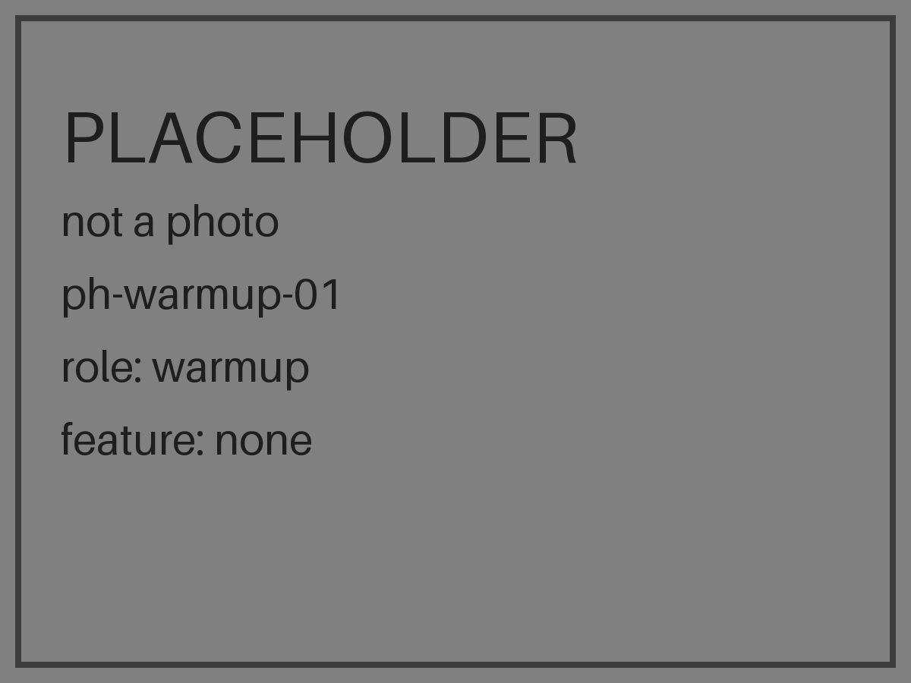

Track 3, AI-Supported Assessment. The track says citizen observations can be inconsistent and error-prone. We measure that, per person and per feature, with a two-minute photo test, and we save the result with every observation. AI takes the same test. It may only raise a question on features where it passed, and the volunteer always answers first.

# Second Look

Second Look spends two minutes teaching and testing a volunteer on the creek damage people usually miss, then saves their score with every observation they make, so a city knows how much to trust it.

**Take the two-minute test yourself. No camera needed.** Demo: DEMO_URL_PLACEHOLDER (not deployed yet; `make deploy` publishes it).

Which creek is healthier?

 

## Results

> **SYNTHETIC. No real person has taken this test yet.** Every value in the table below is a placeholder produced from synthetic sessions by `evals/make_synthetic_sessions.py` and `evals/usability_analysis.py --synthetic`, and every model value comes from the fake client. After data lock (2026-09-28T01:00:00Z) the table is regenerated from `results/` and `scripts/verify_claims.py` checks each value in CI. Nothing here is typed by hand. The `{{claim:...}}` tokens are filled by `scripts/render_readme.py` from the pointers in the comments.

<!-- claim: results/usability_synthetic.json#/primary/untrained_mean = 62.1 -->
<!-- claim: results/usability_synthetic.json#/primary/trained_mean = 68.9 -->
<!-- claim: results/usability_synthetic.json#/primary/difference = 6.8 -->
<!-- claim: results/usability_synthetic.json#/primary/ci_low = 0.1 -->
<!-- claim: results/usability_synthetic.json#/primary/ci_high = 13.4 -->
<!-- claim: results/usability_synthetic.json#/counts/completed_untrained = 42 -->
<!-- claim: results/usability_synthetic.json#/counts/completed_trained = 42 -->
<!-- claim: results/model_pass_table.json#/models/claude-haiku-4-5-20251001/artificial_bank/passed = False -->
<!-- claim: results/model_pass_table.json#/models/claude-haiku-4-5-20251001/dug_out_channel/passed = False -->
<!-- claim: results/model_pass_table.json#/models/claude-haiku-4-5-20251001/invasive_plant/passed = False -->
<!-- claim: results/model_pass_table.json#/models/claude-haiku-4-5-20251001/pipe_running/passed = False -->
<!-- claim: results/model_pass_table.json#/models/claude-sonnet-5/artificial_bank/passed = True -->
<!-- claim: results/model_pass_table.json#/models/claude-sonnet-5/dug_out_channel/passed = False -->
<!-- claim: results/model_pass_table.json#/models/claude-sonnet-5/invasive_plant/passed = False -->
<!-- claim: results/model_pass_table.json#/models/claude-sonnet-5/pipe_running/passed = True -->
<!-- claim: results/model_pass_table.json#/models/claude-opus-5/artificial_bank/passed = True -->
<!-- claim: results/model_pass_table.json#/models/claude-opus-5/dug_out_channel/passed = True -->
<!-- claim: results/model_pass_table.json#/models/claude-opus-5/invasive_plant/passed = False -->
<!-- claim: results/model_pass_table.json#/models/claude-opus-5/pipe_running/passed = True -->

SYNTHETIC. The same 16 photos, four per feature, two present and two absent.

| Observer | Mean share correct | People |
|---|---|---|
| Untrained people (test first, lesson offered after) | <!--v:results/usability_synthetic.json#/primary/untrained_mean-->62.1<!--/v--> | <!--v:results/usability_synthetic.json#/counts/completed_untrained-->42<!--/v--> |
| Trained people (two-minute lesson, then test) | <!--v:results/usability_synthetic.json#/primary/trained_mean-->68.9<!--/v--> | <!--v:results/usability_synthetic.json#/counts/completed_trained-->42<!--/v--> |

Trained minus untrained: <!--v:results/usability_synthetic.json#/primary/difference-->6.8<!--/v--> (95 percent bootstrap interval <!--v:results/usability_synthetic.json#/primary/ci_low-->0.1<!--/v--> to <!--v:results/usability_synthetic.json#/primary/ci_high-->13.4<!--/v-->), from the plan published before the first participant. If the interval covers zero, the lesson did not show an effect and this line says so.

SYNTHETIC. Where a model may speak. A model passes a feature only if it gets all four items right in at least two of three runs. Only a passed feature may ever produce a flag.

| Model | Built banks | Dug-out channel | Plants that do not belong | Pipes |
|---|---|---|---|---|
| claude-haiku-4-5-20251001 | <!--v:results/model_pass_table.json#/models/claude-haiku-4-5-20251001/artificial_bank/passed-->did not pass<!--/v--> | <!--v:results/model_pass_table.json#/models/claude-haiku-4-5-20251001/dug_out_channel/passed-->did not pass<!--/v--> | <!--v:results/model_pass_table.json#/models/claude-haiku-4-5-20251001/invasive_plant/passed-->did not pass<!--/v--> | <!--v:results/model_pass_table.json#/models/claude-haiku-4-5-20251001/pipe_running/passed-->did not pass<!--/v--> |
| claude-sonnet-5 | <!--v:results/model_pass_table.json#/models/claude-sonnet-5/artificial_bank/passed-->passed<!--/v--> | <!--v:results/model_pass_table.json#/models/claude-sonnet-5/dug_out_channel/passed-->did not pass<!--/v--> | <!--v:results/model_pass_table.json#/models/claude-sonnet-5/invasive_plant/passed-->did not pass<!--/v--> | <!--v:results/model_pass_table.json#/models/claude-sonnet-5/pipe_running/passed-->passed<!--/v--> |
| claude-opus-5 | <!--v:results/model_pass_table.json#/models/claude-opus-5/artificial_bank/passed-->passed<!--/v--> | <!--v:results/model_pass_table.json#/models/claude-opus-5/dug_out_channel/passed-->passed<!--/v--> | <!--v:results/model_pass_table.json#/models/claude-opus-5/invasive_plant/passed-->did not pass<!--/v--> | <!--v:results/model_pass_table.json#/models/claude-opus-5/pipe_running/passed-->passed<!--/v--> |

The models' share correct per feature, with Wilson intervals, and the three test items with the largest gap between trained people and the best model (chosen by script) are added here from `results/` at lock. 16 items is a small set; we say so wherever these numbers appear.

## The problem

People judge a creek the way they judge a park. Tidy and green reads as healthy. OneAquaHealth's project lead said it in the first workshop: volunteers catch smell, foam and colour, and walk past concrete banks, a channel that was dug out, and pretty plants that do not belong. So the best-looking creek can get the best rating and deserve the worst.

Professional surveyors fixed this long ago. In the UK's River Habitat Survey, "only surveys from accredited surveyors will be entered on the RHS database", and accreditation means attending a course and passing a test (RHS manual 2003, pages 3 and 20; see `docs/notes/sources.md`). Volunteers have never had that. Their observations arrive with no mark of how far to trust them, and a city cannot tell a careful observer from a hopeful one.

## How the solution aligns with OneAquaHealth

OneAquaHealth says citizen data should stand beside lab data under the same profiles and value sets. A lab result is trusted because its quality checks travel with it. Second Look gives a volunteer's observation the same thing: their per-feature score, stored as a dated Practitioner qualification and linked through Provenance to every Observation they make. The four features are the ones the project lead named. The creek check mirrors the official Citizen Science App's items in its order and keeps its closing question about how the person feels at the stream. The health card ends in one action each for the person, the pet and the city, and the city actions are the measures their Decision Support System returns: replant margins, fix sewers, reconnect the floodplain, remove barriers. Every record validates against their implementation guide at commit b907cf0 with zero errors (`results/fhir_validation.json`). It improves monitoring of water ecosystems and their connection to human, animal and environmental health by making each observation carry its own trust mark.

## Innovation and practical value

Measure each volunteer, per feature, and store the measure with the data. Three things follow. The analyst sees "4 of 4 on built banks, tested Sep 23" beside an answer, never a blended grade or a probability. Follow-up questions are chosen by code from the answers, the person's scores and the weather, two at most: "It has not rained here for N days. Is anything coming out of that pipe?" We do not weight a group's vote by these scores: our own simulation says four photos per feature is too coarse for that, and a plain majority won. This is our answer to the citizen science challenge the track names, and we check it on strangers rather than assert it.

## Effective use of data, technology, AI, APIs and standards

- Standards: FHIR R4 4.0.1. The OneAquaHealth guide pinned at hl7-eu/oah b907cf0 (`fhir/ig.lock`), built from source with SUSHI 3.20.1, every emitted resource validated in CI with the HL7 validator. Their codes where they exist, ours only for the four features and "can't tell". UCUM units. Locations nest with partOf. Mapping: `docs/fhir_mapping.md`.
- APIs and data sources: their FHIR sandbox, read at one request per second and mirrored with conditional creates, `meta.tag` on everything and a ledger of ids; Open-Meteo for the 72 hour rainfall window behind the dry pipe rule; the Cal-IPC Inventory for the Bay Area plant list; public dry-weather screening guidance for the pipe rule; the River Habitat Survey's written cues for the channel and bank lessons.
- AI: vision models take the same 16-item test as the people, same wording, three runs. `core/gate.py` turns model output into Flag objects or drops it; a flag for a feature the model did not pass is dropped and logged; a flag can only make one follow-up question eligible. The record builder accepts human answers only. A fuzz test proves that for any model output the stored answers equal the human answers. The only model text a person ever sees is a short note labelled "the checker noticed".
- Data: no names, emails, addresses, free text or third-party scripts in the study flow; a random session id and a hashed random browser token; EXIF stripped from uploads, which are deleted after 30 days; a hash-chained audit log (`audit/log.jsonl`, an audit log, not a blockchain).

## A clear demonstration of what was built

- `/t`: consent, warm-up pair, server-side assignment in permuted blocks of four, the lesson for the trained arm, 16 items with Yes, No and Can't tell, the score per feature, the share card.
- `/demo`: judge mode with feedback after each answer, and the lessons only for what you missed. Stores nothing. `/demo?script=1` replays one fixed path for the video.
- `/check`: the guided creek check, one question per screen, with follow-ups chosen by `core/followups.py`.
- `/spot/[id]`: the record, each answer beside the observer's score, "only people who passed this feature", View as FHIR with the validation badge and a curl line, the health card.
- `/two`: one lab Observation read from their sandbox and one volunteer Observation of ours in the same viewer.
- `/quick/[spot]`: the 20 second return check. `/poster`: the recruiting poster in Letter and A4. `/how-we-know`, `/about`, `/privacy`.

## Try it

Demo: DEMO_URL_PLACEHOLDER. No camera needed; the test runs on sample photos on any phone or laptop. Locally: `make dev`, then open http://localhost:3000. A record as FHIR: `curl -H "Accept: application/fhir+json" API_URL_PLACEHOLDER/api/spot/SPOT_ID_PLACEHOLDER/fhir`.

## How we know it works

- The analysis plan, `docs/analysis_plan.md`, is tagged `prereg-v1` before the first participant. Tag: PREREG_TAG_PLACEHOLDER. Plan SHA-256: PLAN_SHA256_PLACEHOLDER. Audit log hash at freeze: FREEZE_HASH_PLACEHOLDER.
- Two arms, randomized 1 to 1 in permuted blocks of four, server side. Trained: lesson then test. Untrained: test, then the lesson as a thank you. One confirmatory test: the difference in mean accuracy, percentile bootstrap with 10,000 resamples and a two-sided permutation test, seed 20260920. Exclusions were fixed in advance and each one's count is reported in `results/`.
- Participant flow: completed sessions per arm are in the table above; randomized and started counts, the exclusion counts and the count by source are in `results/usability_<stamp>.json`.
- Below 20 completed sessions per arm the result is descriptive and the first screen says so.
- Deviations from the tagged plan: `docs/deviations.md`, count DEVIATION_COUNT_PLACEHOLDER.
- Gold labels were set blind by Rachel from written definitions and labelled independently by Alex; Cohen's kappa per feature is in `results/key_agreement.json`; the key hash is in `results/key_hash.json`.

## Architecture

```
collection      phone PWA (apps/web): /t test, /check creek check, /quick return check, photos downsized and EXIF stripped
    |
transformation  core/ pure functions: scoring, followups (2 at most, no model call), gate (model output -> Flag or dropped),
    |           labels ("4 of 4 on built banks"), fhir_emit (one visit -> Locations, Practitioner, QuestionnaireResponses,
    |           Observations, Provenance); rainfall from Open-Meteo, 72 hours, fail closed
    |
validation      content loader (every photo has a manifest row, lesson and test photos disjoint), HL7 validator + IG b907cf0
    |           in CI, verify_claims over this README, hash-chained audit log, tests for every hard rule
    |
aggregation     our store (SQLite locally, Postgres in production) is the source of truth; evals/ write results/,
    |           including the usability analysis, the model sweep and the consensus analysis
    |
publication     /spot/[id] and /spot/[id]/fhir (read-only FHIR JSON), the tagged mirror in the OneAquaHealth sandbox
                with a ledger, a Library entry pointing at this repository, this README
```

## Feasibility: Berkeley as a follower city

OneAquaHealth calls a city that adopts the method a follower city and gives a five-step recipe (Workshop 4; Alex confirms the exact wording against the recording). Run on Berkeley:

1. Name the streams. Strawberry Creek, its reaches and spots become nested Locations under their Location profile. Two more East Bay creeks follow the same way.
2. Adopt the form. The creek check mirrors their Citizen Science App items, with stable ids that are FHIR linkIds, plus the two-minute test and its scores as a Questionnaire and QuestionnaireResponse.
3. Train and test the volunteers. Two minutes in the flow, per-feature scores that expire after 90 days, the lesson checked on strangers before launch.
4. Collect and validate. Every visit becomes Observations under their indicator profile with Provenance back to the observer's score, validated in CI before it is stored or mirrored.
5. Publish and repeat. Records to the sandbox with a tag and a ledger, a Library entry for the data set, return visits through the quick check, so one snapshot becomes a story.

Cost through Oct 15: one small API machine and a static site, under 5 dollars. Integration with existing systems is by their own profiles, so a city that already reads OneAquaHealth records reads ours.

## One Digital Health and FAIR

Story: a student walks to Strawberry Creek, takes a two-minute test on her phone, and from then on every observation she makes carries how well she sees each kind of damage. A city analyst reads her record beside a lab result under the same profile and knows how much weight to give each. The health card tells her one thing for herself, one for her dog and one her city could do.

Five dimensions, in words rather than numbers because no script produces them: citizen engagement, strong (the test, the check, the share card, repeat visits); education, strong (the lesson, checked on strangers); human and veterinary healthcare, partial (approved sentences for the person and the pet, no diagnosis, no site risk); industry 4.0, partial (FHIR records, a gated vision model, an audit log); environment, strong (four features of stream damage, the dry pipe rule, the regional plant list).

FAIR: findable through a Library entry in their sandbox and a public repository; accessible through a read-only FHIR endpoint and CC BY 4.0 copy; interoperable through their profiles, value sets and UCUM; reusable through MIT code, a pinned guide, Provenance on every record and a tagged analysis plan.

## Data and photo rights

Code is MIT (`LICENSE`). Our own photos and copy are CC BY 4.0. A photograph from somewhere else keeps its own licence: we take CC0, public domain, and CC BY or CC BY-SA at 2.0, 3.0 or 4.0, recorded at the exact version and never rounded up. Every image has a row in `photos/manifest.csv` with its source, author and licence, and every photograph a visitor can see is named with its author on `/credits`, which is what CC BY asks for. The web build refuses to run if a photograph that needs an author does not have one. No AI-generated images anywhere; no faces, house numbers or plates. The usability test is anonymous and the creek check is pseudonymous; `docs/DATA_HANDLING.md` says what is stored and what the hosts log on their own. Third-party dependencies and licences: `docs/THIRD_PARTY.md`.

## How this was built

Claude Code wrote most of the code and text in this repository, from briefs written by the two humans named in `docs/analysis_plan.md`. They supplied the idea, the photos, the labels, the wording and the judgment, and they own every approval flag. All work happened inside Sep 16 to 30, 2026, in small commits; nothing was copied from earlier projects. The sources behind the lesson drafts are listed with dates in `docs/notes/sources.md`.

## Known weaknesses

- 16 items is a small test. The per-feature model results in particular have wide intervals, and the pass rule is strict on purpose.
- The sample is whoever opens a link in one week in Berkeley. Below 20 completed sessions per arm the result is a description, not a claim.
- Photos come from three East Bay creeks in September. The lesson may not transfer to other regions or seasons; the plant list is regional by design.
- People see the photo at phone size; models receive it resized to 1092 px on the long side.
- The dry pipe rule depends on Open-Meteo. When rainfall or location is unknown the question is skipped rather than guessed.
- The sandbox is shared and allows deletes; our store is the source of truth and the mirror can be rebuilt from the ledger.
- The form items are marked unverified until Alex checks them against screenshots of the official app. The app has no smell item; our quick check may ask about smell.
- Four photos per feature is a coarse measure. It is enough to show a person what to practise and to flag an answer worth a second look. It is too coarse to weight votes with, and our own simulation says so. The score sharpens each time a person retakes the test on new photos.
- Every photo comes from one season or from open collections, so a creek in another month or another place may not look like these.
- The checker is off by default and speaks only on passed features. It may end up with nothing to say, and the table above will show that.
- English only. A Spanish locale ships only if a fluent person checks every string.
