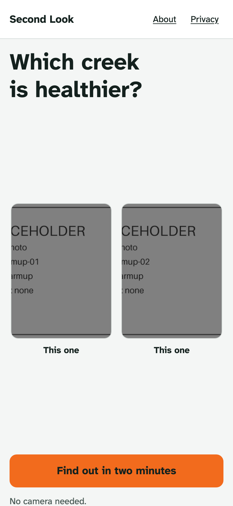
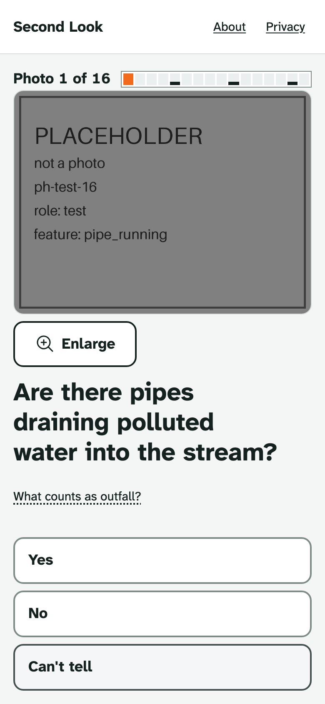
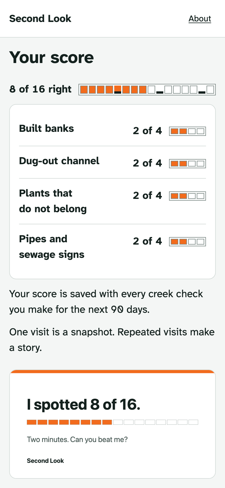
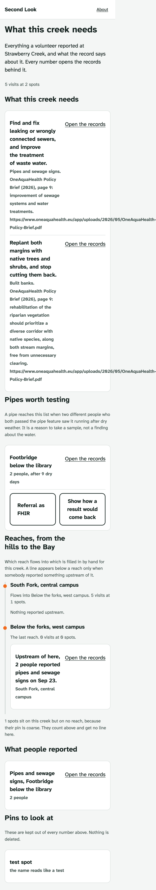
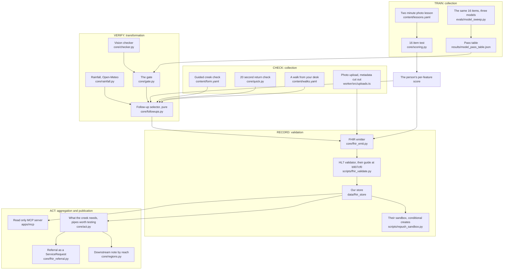
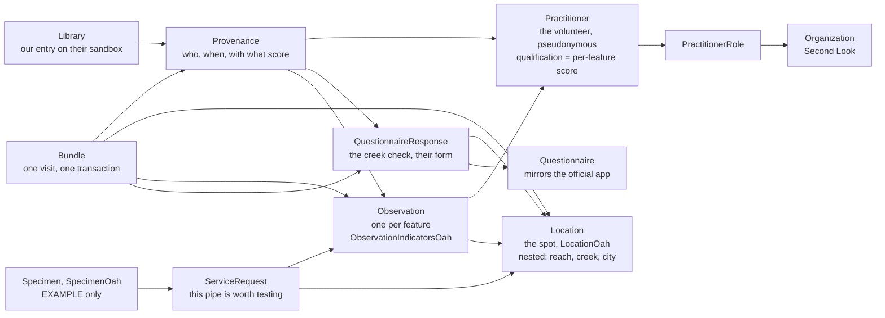
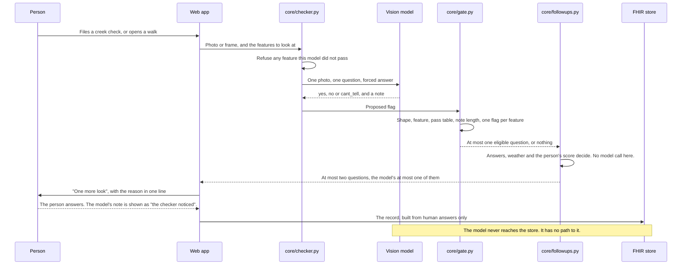

Track 3, AI-Supported Assessment. The track says citizen observations can be inconsistent and error-prone. We measure that, per person and per feature, with a two-minute photo test, and we save the result with every observation. AI takes the same test. It may only raise a question on features where it passed, and the volunteer always answers first.

# Second Look

> **A creek observation should carry how well its observer sees.**
>
> People walk past concrete banks, dug-out channels, plants that do not belong and pipes. A two-minute photo test measures who does, per feature. The score travels with every observation, in OneAquaHealth's own FHIR profiles.
>
> Second Look teaches a volunteer the four kinds of creek damage people usually miss, tests them on 16 real photos, and stores their per-feature score as a dated qualification linked by Provenance to every Observation they later make. A vision model takes the same test and may only ever raise one question, on a feature it passed, after the person has answered. A city analyst reads each answer beside the score of the person who gave it.
>
> **Train. Check. Verify. Record. Act.**

[](https://github.com/alejandro-publius/second-look/actions/workflows/check.yml)


<!-- claim: results/fhir_validation.json#/errors = 0 -->
<!-- claim: results/fhir_validation.json#/terminology_checks_ran = True -->

Which creek is healthier? Take the two-minute test, no camera needed: **https://second-look-79t.pages.dev**

| Norman Creek | Nurton Brook |
|---|---|
|  |  |
| Gregwadley, CC BY-SA 4.0, Wikimedia Commons | Roger Kidd, CC BY-SA 2.0, Wikimedia Commons |

The tidy park on the left hides a concrete channel. The messy bend on the right is the healthier creek.

### The AI, on the same 16 photos and on real creek footage

| | The 16-photo test people take | Frames from open creek footage |
|---|---|---|
| Pool | 16 photos, 4 per feature, the frozen question wording | <!--v:results/footage_pool.json#/frames_kept-->46<!--/v--> frames from <!--v:results/footage_pool.json#/videos_kept-->5<!--/v--> openly licensed videos in <!--v:results/footage_pool.json#/countries_kept-->3<!--/v--> countries, screened for people and text |
| Accuracy per feature, three models, three runs | results arrive with the model run | results arrive with the model run |
| Which features each model passed | results arrive with the model run | not asked: footage decides nothing, a pass is earned on the test |
| Agreement between models | not asked | results arrive with the model run |
| Flags the gate stopped | results arrive with the model run | results arrive with the model run |
| Cost per 100 frames | not asked | results arrive with the model run |

The full loop, from a desk: <!--v:results/footage_pool.json#/walks-->3<!--/v--> video walks from <!--v:results/footage_pool.json#/walk_country_count-->3<!--/v--> countries, each ending in a FHIR record made on the phone. The HL7 validator checked <!--v:results/fhir_validation.json#/files_validated-->14<!--/v--> records against OneAquaHealth's guide, <!--v:results/fhir_validation.json#/walk_records_validated-->2<!--/v--> of them walk records, with <!--v:results/fhir_validation.json#/errors-->0<!--/v--> errors.

No recruited study. The two-minute test stays live as the volunteer's own calibration step and for judges. No session from a person has arrived through the public link, so there is no human row here; if sessions arrive they are reported as a description with their count.

## Screens

| The question | The test | Your score | What the creek needs |
|---|---|---|---|
|  |  |  |  |

## The problem

People judge a creek the way they judge a park. Tidy and green reads as healthy. OneAquaHealth's project lead said it in the first workshop: volunteers catch smell, foam and colour, and walk past concrete banks, a channel that was dug out, and pretty plants that do not belong. So the best-looking creek can get the best rating and deserve the worst.

Professional surveyors fixed this long ago. In the UK's River Habitat Survey, "only surveys from accredited surveyors will be entered on the RHS database", and accreditation means attending a course and passing a test (RHS manual 2003, pages 3 and 20; see `docs/notes/sources.md`). Volunteers have never had that. Their observations arrive with no mark of how far to trust them.

## How the solution aligns with OneAquaHealth

OneAquaHealth says citizen data should stand beside lab data under the same profiles and value sets. A lab result is trusted because its quality checks travel with it. Second Look gives a volunteer's observation the same thing: their per-feature score, stored as a dated Practitioner qualification and linked through Provenance to every Observation they make. The four features are the ones the project lead named. The creek check mirrors the official Citizen Science App's items in their order. The city actions are OneAquaHealth's own restoration measures, from the [OneAquaHealth Policy Brief (2026), page 9](https://www.oneaquahealth.eu/app/uploads/2026/05/OneAquaHealth-Policy-Brief.pdf): replant margins, fix sewers, reconnect the floodplain, remove barriers, take out the concrete.

### How OneAquaHealth is used

| Their surface | What we use it for | Where |
|---|---|---|
| The official Citizen Science App's question wording | The creek check mirrors its items, in its order, with its closing question on feelings | `content/form.yaml` |
| Their Location and Observation profiles | Every spot and every answer | `core/fhir_emit.py`, `docs/fhir_mapping.md` |
| Their value sets and UCUM units | Present, absent, the indicator groups, metres | `core/fhir_emit.py` |
| A Questionnaire through their form extension | The test and the check, answered as QuestionnaireResponses | `fhir/fsh/` |
| Nested Locations | Creek, reach and spot with `partOf` | `core/regions.py`, `content/regions/` |
| The HL7 validator with their guide, terminology on | Every emitted resource in CI | `scripts/fhir_validate.py`, `fhir/ig.lock` |
| Their sandbox | Conditional creates with our tag and a ledger, and a Library entry for the data set | `scripts/repush_sandbox.py`, `fhir/sandbox_ledger.jsonl` |
| Their decision tool's measures | What a creek needs, in their words, from the Policy Brief, page 9 | `content/approved_sentences.yaml`, `/city` |
| The five One Digital Health dimensions and FAIR | Stated in words below | this README |
| The follower city recipe | `make new-city`, run once for Heraklion as a dry example | `scripts/new_city.py`, `docs/cities/` |
| Their SpecimenOah profile | The shape of a laboratory result coming back to a volunteer's pipe, marked EXAMPLE | `core/fhir_referral.py` |

### Contributed back

- A proposal for carrying observer quality in their guide, with three gaps our validator runs found: no profile for the person or the trail from an answer to them; a volunteer modelled as a Practitioner for want of a better fit; `SpecimenOah.collection.collector` allowing only a PractitionerRole. Its FSH builds inside their guide in CI. `docs/ig_proposal.md`.
- A friendly note that their temporary code system spells one code `morophology`. We kept their spelling so our records validate.
- A read only MCP server over our own records, so any software agent can ask for a creek's records with the resource ids behind every answer. `examples/mcp/README.md`.

## Innovation and practical value

Measure each volunteer, per feature, and store the measure with the data. The analyst sees "4 of 4 on built banks, tested Sep 23" beside an answer, never a blended grade or a probability. Follow-up questions are chosen by code from the answers, the person's scores and the weather, two at most: "It has not rained here for N days. Is anything coming out of that pipe?" The AI takes the same test as the people and earns the right to ask one question, feature by feature.

### Why trust a volunteer, and the AI?

| What can go wrong | What stops it, by construction | Proof |
|---|---|---|
| A volunteer walks past a built bank | The lesson teaches the four features people miss, and the test measures each one; the score is stored with every answer | `content/lessons/`, `core/scoring.py`, `core/tests/test_scoring.py` |
| Someone taps at random | Four items per feature, two present and two absent, so chance scores about 2 of 4; a low scorer who answers No is asked for a photo | `content/test_items.yaml`, `core/followups.py` rule `low_score` |
| A pretty creek gets the best rating | A good rating beside a reported built bank, sewage or plant that does not belong triggers one question asking the person to keep or change it | `content/followups.yaml` rule `rating_check`, `core/tests/test_followups.py` |
| A pipe report means nothing without the weather | The dry pipe question fires only after dry days from Open-Meteo, and is skipped when the weather is unknown | `core/rainfall.py`, `core/tests/test_rainfall.py` |
| The model invents a feature | Model output becomes a Flag through the gate or is dropped; a fuzz test throws arbitrary output at it | `core/gate.py`, `core/tests/test_gate.py` |
| The model was never good at that feature | A model may flag only a feature it passed on the same test as the people; the pass table is a committed file, and one from the fake client licenses nothing | `results/model_pass_table.json`, `core/tests/test_checker.py` |
| Duplicate and test pins fill the map | A precise pin within 30 metres of an existing spot is offered as that spot; test-looking names are refused; a coarse pin is never compared | `core/act.py`, `core/tests/test_act.py` |
| A record a city's systems cannot read | Every emitted resource is validated against their guide in CI, in Python and in the TypeScript Worker | `scripts/fhir_validate.py`, `worker/test/golden.test.ts` |
| Someone edits history | A hash-chained audit log, checked by a script | `audit/`, `scripts/verify_audit.py` |
| We fool ourselves with the statistics | The analysis plan is tagged before any data; every README number is checked against `results/` in CI; a synthetic result can never be cited | `docs/analysis_plan.md` at `prereg-v1`, `scripts/verify_claims.py` |
| Judge mode leaks the answer key | Judge mode is shut until Sep 28 by a lock constant, and a per-item answer is never sent before the test closes | `core/lock.py`, `core/tests/test_lock.py` |
| A refresh loses a session | The session resumes from the server; the creek check queues offline and sends later | `apps/web/lib/offline.ts`, `apps/web/tests/` |

### What the AI cannot do

| It cannot | Enforced by | Test |
|---|---|---|
| Decide anything stored | The record builder accepts human answers only | `core/tests/test_gate.py`, the fuzz test on stored answers |
| Speak on a feature it did not pass | `core/checker.py` refuses to ask, and `core/gate.py` drops the flag | `core/tests/test_checker.py::test_unpassed_feature_returns_nothing_even_when_the_model_is_confident` |
| Speak on a fake pass table | The gate reads `"real": true` or licenses nothing | `core/tests/test_checker.py::test_synthetic_pass_table_never_licenses_a_flag_by_default` |
| Ask more than one question, or ask first | Follow-up selection is a pure function, two questions at most, the model's at most one, shown after the person answers | `core/tests/test_followups.py` |
| Put its own words in front of a person | Its note is shown only as "the checker noticed", cut to 160 characters | `core/checker.py`, `core/gate.py` |
| State a risk for a named site | Every health or ecology sentence comes from `content/approved_sentences.yaml` with a source | `core/tests/test_labels.py` |

## Effective use of data, technology, AI, APIs and standards

FHIR R4 4.0.1 under OneAquaHealth's guide, pinned at hl7-eu/oah b907cf0 and built with SUSHI 3.20.1; their sandbox, read at one request per second and written with conditional creates; Open-Meteo for the rainfall behind the dry pipe rule; the Cal-IPC Inventory for the Bay Area plant list; three vision models through the Batch API, behind a gate. No names, emails, addresses or free text in the test; EXIF stripped from uploads, which are deleted after 30 days; a hash-chained audit log.

### Architecture

The deep version, with every file named, is `docs/ARCHITECTURE.md`. `make diagrams` checks that every diagram here parses, in CI.



Why this architecture matters:

- The model sits behind two walls, the pass table and the gate, and has no path to the store.
- Python is the reference and the Worker runs the same functions, proved equal by golden vectors, so the live site and the tests cannot quietly disagree.
- Every record is a FHIR Bundle under their profiles before it is stored, so a city that reads OneAquaHealth records reads ours.





### Evals

Every number is graded by code and written to `results/`; `scripts/verify_claims.py` checks this README against those files in CI.

- The 16-photo test, taken by three vision models, three runs each, through the Batch API: `evals/model_sweep.py` writes the pass table and per-item accuracy; `evals/benchmark.py` adds per-feature accuracy with Wilson intervals.
- The same models on frames from open creek footage: `evals/footage.py` reports accuracy against description labels with its count, agreement between models on unlabelled frames, what the gate stopped, and the adversarial frames. `evals/footage_pool.py` writes the numbers no model touches.
- The ablation (rules only, context only, vision only, all three): `evals/ablation.py`.
- The pre-registered analysis of the two-minute test, written and tested on synthetic data before the tag: `evals/usability_analysis.py`. Nobody is recruited, so it reports a description with counts.
- Cost is logged per call in `results/cost_log.jsonl`. A fake run logs to `results/cost_log_fake.jsonl` and spends nothing.

## A clear demonstration of what was built

- `/t`: consent, the warm-up pair, the lesson, 16 items with Yes, No and Can't tell, the score per feature, the share card.
- `/demo`: judge mode with feedback after each answer, opening Sep 28. `/demo?script=1` replays one fixed path.
- `/check`: the guided creek check, one question per screen, with follow-ups chosen by `core/followups.py`, working offline.
- `/walk`: a creek from your desk, a clip from another country, the same check, a demo record made on the phone.
- `/spot?id=`: the record, each answer beside the observer's score, View as FHIR with the validation badge, the health card.
- `/city?creek=strawberry-creek`: what the creek needs, pipes worth testing with a FHIR referral, the downstream note by reach.
- `/two`: a lab Observation read from their sandbox beside one of ours. `/quick`, `/poster`, `/judges`, `/credits`.
- A read only MCP server over our own records: `examples/mcp/README.md`.

### See it work

One worked visit to Strawberry Creek in Berkeley, from the golden record in this repository. It is an example, hand shaped, as the table of what is real and what is synthetic below says.

| Step | What happened | Where to check |
|---|---|---|
| The person | Took the test first. Their per-feature score is stored as a dated qualification on their Practitioner record, valid for 90 days. | `fhir/golden/visit-strawberry-creek-1.json`, Practitioner |
| What they reported | A U shaped channel, a built bank present, a pipe they could not judge, the water height, a plant that does not belong. | the five Observations in the same file |
| What code asked next | The follow-up selector chose the questions from the answers, the weather and the person's score. No model call is in that path. | `core/followups.py`, `core/tests/test_followups.py` |
| What validated | The whole Bundle, against OneAquaHealth's guide at b907cf0 with terminology on. | `results/fhir_validation.json`, `make fhir-validate` |
| What went to their sandbox | Every resource by conditional create, tagged as ours, with a ledger of ids, and a Library entry that points back here. | `fhir/sandbox_ledger.jsonl`, `docs/notes/sandbox_library.md`, `curl -H "Accept: application/fhir+json" https://sandbox.hl7europe.eu/oneaquahealth/fhir/Library/466` |
| What the city then saw | What the creek needs, in OneAquaHealth's own restoration measures from their Policy Brief, page 9, each with its source. | `/city?creek=strawberry-creek`, `docs/screens/10-city-needs.png` |

You can run the same loop from your desk on a creek in another country: **`/walk`**, "Check a creek from your desk". Each walk plays a short clip from an openly licensed video with its credit on screen, you do the same guided check while watching, and the record is built on your phone, tagged as a demo, and never stored or counted.

## What is real and what is synthetic

The full list, kept current, is `docs/REAL_VS_SYNTHETIC.md`. In short:

| Thing | Status |
|---|---|
| The test flow, its scoring and the photos in it | real, openly licensed photos from several countries |
| Frames from open creek footage | real, cut from openly licensed video; labels only where the video's own description supports one, never called a gold standard |
| A video walk's record | real shape, demo content, made on the phone and never stored |
| The golden Strawberry Creek visit | example, hand shaped from a worked visit |
| A referral for a pipe worth testing | real, computed on request from stored visits |
| The laboratory result coming back | example, tagged and labelled EXAMPLE everywhere |
| The model pass table and every AI number until the model run | synthetic, stamped SYNTHETIC, cited nowhere |

## For judges

A 45 second path: [the test](https://second-look-79t.pages.dev/t?src=other), [a creek from your desk](https://second-look-79t.pages.dev/walk), [a record](https://second-look-79t.pages.dev/spot?id=example), [what the city sees](https://second-look-79t.pages.dev/city?creek=strawberry-creek), [lab and volunteer side by side](https://second-look-79t.pages.dev/two). Every door is on [/judges](https://second-look-79t.pages.dev/judges).

`make judge-check` needs no key and no network. It runs the Python tests and the Worker's golden vector tests. It reads the result of the last HL7 validator run from `results/fhir_validation.json` and checks the golden Bundles against the emitter; it does not run the validator itself, which needs Java and a download, so `make fhir-validate` is the command for that. It builds the web app and runs the design check, verifies the audit log and scans for secrets, then prints five lines.

| Proof | Where |
|---|---|
| Every gate and the command that proves it | `docs/ACCEPTANCE.md` |
| A sample record | `fhir/golden/visit-strawberry-creek-1.json` |
| Eval results | `results/` |
| Architecture, the deep version | `docs/ARCHITECTURE.md` |
| Our own scorecard, weaknesses included | `docs/JUDGE_SCORECARD.md` |
| The demo script | `docs/video_script.md` |

## Feasibility: Berkeley as a follower city

OneAquaHealth calls a city that adopts the method a follower city. Run on Berkeley: name the streams as nested Locations; adopt the form, which mirrors their app; train and test the volunteers in two minutes; collect and validate every visit against their profiles; publish to the sandbox with a Library entry and repeat with the 20 second return check. `make new-city` scaffolds the first three steps for a new city. Cost through Oct 15: nothing. Cloudflare Pages and a Worker with D1 and KV, on the free plan, with no card.

## One Digital Health and FAIR

Story: a student walks to Strawberry Creek, takes a two-minute test on her phone, and from then on every observation she makes carries how well she sees each kind of damage. A city analyst reads her record beside a lab result under the same profile and knows how much weight to give each. The health card tells her one thing for herself, one for her dog and one her city could do.

Five dimensions, in words, because no script produces them: citizen engagement, strong; education, strong; human and veterinary healthcare, partial (approved sentences for the person and the pet, no diagnosis, no site risk); industry 4.0, partial (FHIR records, a gated vision model, an audit log); environment, strong.

FAIR: findable through a Library entry in their sandbox and a public repository; accessible through a read-only FHIR endpoint; interoperable through their profiles, value sets and UCUM; reusable through MIT code, a pinned guide, Provenance on every record and a tagged analysis plan.

## How this was built

AI coding tools wrote most of the code and text here: Claude Code, working from written briefs, with subagents for independent pieces, every change checked by `make check` before it was committed. The humans set the direction and made every decision that needs a person. Alex Velazquez wrote the briefs, chose the photos, set every gold label alone, froze the question wording and approved every sentence a person reads; every approval recorded in this repository is his. The team is Alex Velazquez and Rachel Selbrede. All work happened inside Sep 16 to 30, 2026, in small commits, and nothing was copied from earlier projects.

## Known weaknesses

- One labeller. Every gold label was set by one person, so we report no agreement figure.
- Four photos per feature is coarse. It shows a person what to practise and flags an answer worth a second look. It is too coarse to weight votes with, and our own simulation says so.
- The photos come from open collections in several countries and seasons, not from the creeks a Berkeley visitor will stand in.
- The footage labels come from the videos' own descriptions, and almost no openly licensed description names a feature, so the footage result leans on agreement between models, which is not accuracy.
- The citizen observer is modelled as a FHIR Practitioner, for want of a better fit in the guide; our proposal says so.
- Judge mode is shut until Sep 28, so the answer key cannot leak before then.
- There is no recruited study. Whoever opens the link is whoever opens the link.
- The AI numbers need a paid model run; until it runs, every AI slot says so.
- English only. A Spanish draft exists and stays out of the build until a fluent person signs it.

## Repo map

```
apps/web/    the phone web app (Next.js, static export on Cloudflare Pages)
worker/      the API on Cloudflare Workers with D1 and KV, and its golden tests
apps/api/    the Python reference API          apps/mcp/   the read only MCP server
core/        pure functions: scoring, follow-ups, gate, checker, labels, FHIR, walks
content/     lessons, test items, the form, follow-ups, approved sentences, regions, walks, locales
photos/      every image with its manifest row   videos/  the footage we chose, and why
evals/       every reported number               results/ their outputs, failures included
fhir/        the pinned guide, our FSH, golden records, the sandbox ledger
scripts/     checks, gates, the footage pipeline, the sandbox mirror
docs/        product docs; docs/internal/ holds the working notes, removed before the repo opens
```

## Licence

Code is MIT (`LICENSE`). Our own photos and copy are CC BY 4.0. A photograph or video from somewhere else keeps its own licence, recorded at the exact version in `photos/manifest.csv` and `videos/manifest.csv`, and every one a visitor can see is credited on `/credits`. No AI-generated images anywhere; no faces, house numbers or plates. Third-party dependencies and licences: `docs/THIRD_PARTY.md`.
