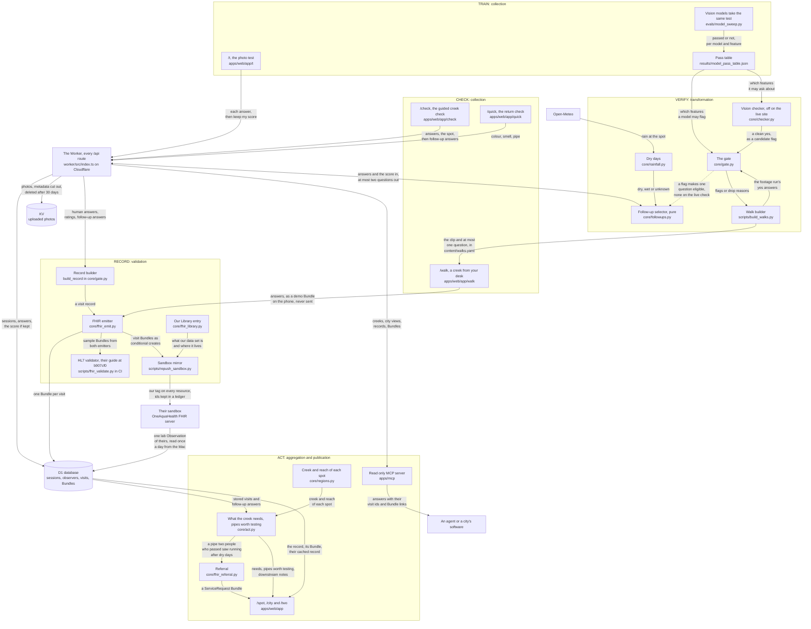
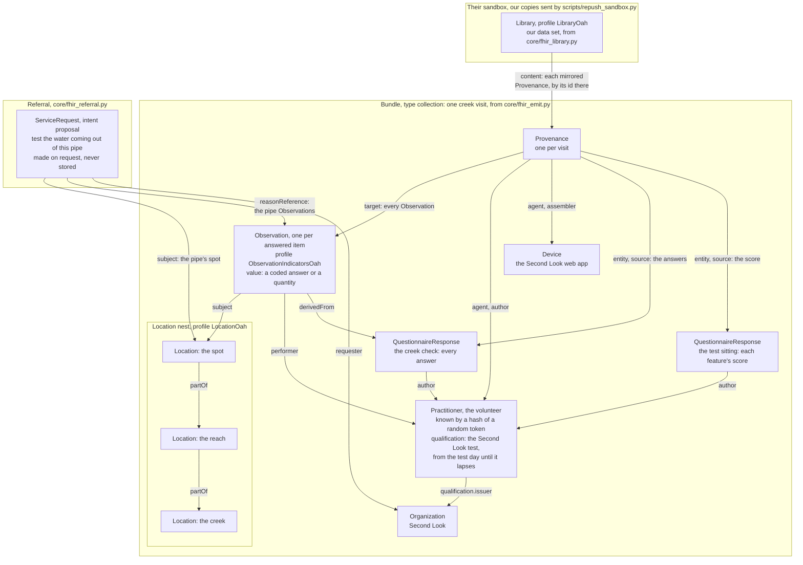
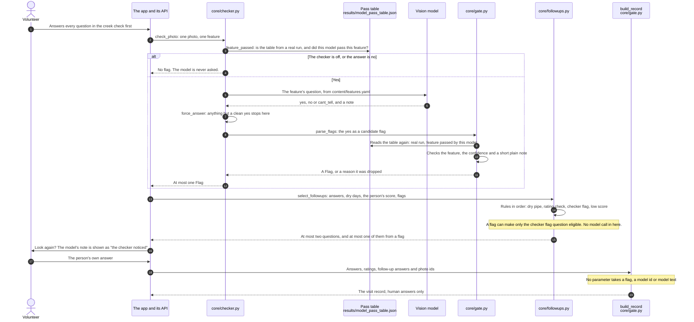

# Architecture

The deep version. The README has the four diagrams and the short reasons; this file says what
runs where, what is pure, what may write, and what stops what.

The loop is five verbs, and they line up with OneAquaHealth's own five pipeline stages:

| Verb | Their stage | What happens |
|---|---|---|
| TRAIN | collection | A volunteer passes a two minute photo test. AI takes the same test. |
| CHECK | collection | A guided creek check in the official app's own questions, and a three-question return check. |
| VERIFY | transformation | Code picks at most two follow-up questions from the answers, the weather and the person's own score. AI may only ask, and only where it passed. |
| RECORD | validation | Every visit becomes FHIR that validates against their guide, carries the observer's score, lands in our store and mirrors to their sandbox. |
| ACT | aggregation and publication | The creek's record turns into what the creek needs and which pipes are worth testing, and into an answer any software agent can fetch with its evidence attached. |

## The loop, in five boxes

The same five verbs as one line, drawn from [`docs/diagrams/loop.mmd`](diagrams/loop.mmd).

```mermaid
flowchart LR
  accTitle: The loop in five verbs, Train, Check, Verify, Record and Act
  accDescr: A volunteer trains and takes the photo test, and its per-feature score comes out. On a creek check they answer first, with at most two follow-up questions chosen by code. The answers, with the score, become a FHIR record checked against OneAquaHealth's guide. The records say what the creek needs, in OneAquaHealth's own measures, and which pipes are worth a lab test. A model may raise a question only on a feature it passed on the same test.
  TRAIN["TRAIN<br/>the two-minute photo test"]
  CHECK["CHECK<br/>the guided creek check"]
  VERIFY["VERIFY<br/>follow-ups and the gate"]
  RECORD["RECORD<br/>FHIR under their guide"]
  ACT["ACT<br/>what the creek needs"]
  TRAIN -- "a score<br/>per feature" --> CHECK
  CHECK -- "the person's<br/>answers" --> VERIFY
  VERIFY -- "answers,<br/>score, flags" --> RECORD
  RECORD -- "records<br/>by creek" --> ACT
```

## The whole system

Every edge says what flows along it. Where a part is a `core/` file, the live site runs its
TypeScript port in `worker/src/core/`, held equal to the Python by golden vectors. The same
diagram as an image: [`docs/diagrams/system-map.svg`](diagrams/system-map.svg), drawn from
[`docs/diagrams/system-map.mmd`](diagrams/system-map.mmd) by `make diagrams-render`.

### Why this architecture matters

- **The model is never on the write path.** Its output becomes a `Flag` through `core/gate.py`
  or it is thrown away. A flag can make at most one follow-up question eligible, and only on a
  feature that model passed on the same test the volunteers took. Nothing a model says is ever
  stored as an answer.
- **The parts that decide are pure functions.** `core/followups.py`, `core/gate.py`,
  `core/scoring.py`, `core/act.py` and `core/regions.py` take values and return values. They
  have no database, no clock and no network, so a test can pin every branch, and the same
  functions run in TypeScript on the edge against golden vectors written by the Python.
- **The score travels with the observation.** It is not a badge on a profile page. The test
  sitting, with each feature's score, is a `QuestionnaireResponse` in the record, the
  `Practitioner` carries a dated `qualification` for the test, and the `Provenance` on every
  `Observation` names the test sitting as a source, so an analyst who receives one observation
  receives the trust mark with it.
- **Validation is a gate, not a report.** `make check` fails if any emitted resource does not
  validate against the OneAquaHealth guide at the pinned commit. A record that their systems
  could not read never leaves this repository.
- **Every number has one road.** `evals/` write `results/`, `scripts/verify_claims.py` checks
  every number in the README against `results/`, and CI runs it. A number cannot be typed by hand.
- **Two runtimes, one reference.** Python is the reference implementation and the toolchain.
  The Worker's TypeScript reproduces it, and `make check` fails when it does not, so the edge
  is the same function twice rather than a second opinion.

## The FHIR resources, and how they point at each other

Every arrow is a link in the emitted JSON, labelled with the element that holds it. The links in
the visit and the referral were read off `fhir/golden/visit-strawberry-creek-1.json` and
`fhir/golden/referral-strawberry-creek-1.json`. The Library's `content` lists each mirrored
Provenance by its address on their server, as `fhir/golden/library-second-look.json` shows.
The Practitioner's qualification carries the test and its dates; the numbers of the score sit in
the test sitting's QuestionnaireResponse, which the Provenance names as a source of every
Observation. The image: [`docs/diagrams/fhir-graph.svg`](diagrams/fhir-graph.svg).

Their profiles are used where they exist and ours only where they do not. Feature answers are
`CodeableConcept`, never booleans, because their `Observation` profile allows only
`CodeableConcept` or `Quantity`. Their `TemporaryOahSystem` codes `present` and `absent` carry
the values. `docs/fhir_mapping.md` has every field.

## The AI gate, step by step

Every arrow between the parts of the code is a call, its return, or a read of the pass table in
`core/checker.py`, `core/gate.py` or `core/followups.py`. The arrows to and from the volunteer
are the app's screens. On the live creek check the checker is off: `apps/api/settings.py` has
`checker_enabled` false and the Worker passes no flags, so no model is in that request path.
The walks run the same gate at build time in `scripts/build_walks.py` and ask their one question
after the person has answered. The image: [`docs/diagrams/ai-gate.svg`](diagrams/ai-gate.svg).

Three rules hold that shape in place, and each has a test in the same commit as the code:

1. `core/gate.py` turns model output into a `Flag` or rejects it. There is no third outcome.
2. `core/checker.py` returns no flags unless `results/model_pass_table.json` says `real: true`,
   so a synthetic pass table can never license a flag in production.
3. `core/followups.py` is a pure function of answers, site context, scores and flags, with a cap
   of two questions and no model call inside it.

## Where things run

| Piece | Runtime | Notes |
|---|---|---|
| Web app | Static export on Cloudflare Pages | Next.js App Router, no server, strict CSP written by `apps/web/security-headers.mjs` |
| Study and judge API | TypeScript Worker on D1 and KV | `worker/src`, ported from the Python and held to golden vectors |
| Reference API | FastAPI on SQLModel | `apps/api`, the local and test runtime, and the reference for the port |
| Pure logic | Python, mirrored in TypeScript | `core/`, `worker/src/core/` |
| Evals | Python, Batch API | `evals/`, writes `results/`, never called from the app |
| FHIR toolchain | SUSHI 3.20.1 and the HL7 validator in Docker or CI | `fhir/`, pinned in `fhir/ig.lock` |
| MCP server | Python over stdio | `apps/mcp`, read only, five tools |

## What is deliberately not here

- No account, no login and no email anywhere in the product.
- No third party origin in the study flow. The map tile server in the creek check is declared in
  `docs/DATA_HANDLING.md` and is the only exception.
- No rate limit on the deployed Worker, because a Worker has no shared memory and every other way
  to count a visitor means holding something that identifies them. The hidden field, the 40 second
  rule, one arm per browser and Cloudflare's own edge protection stand in its place.
- No model call in the request path of the creek check. The checker runs on the photos a person
  uploads, and its flags reach the person only through the gate.
