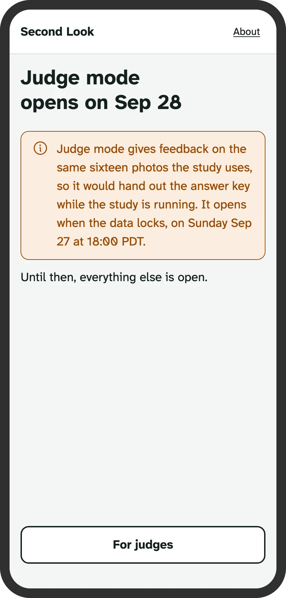
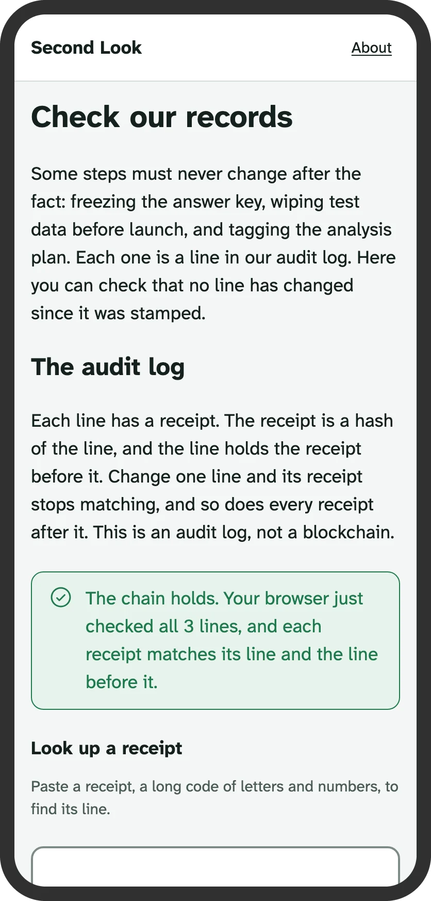
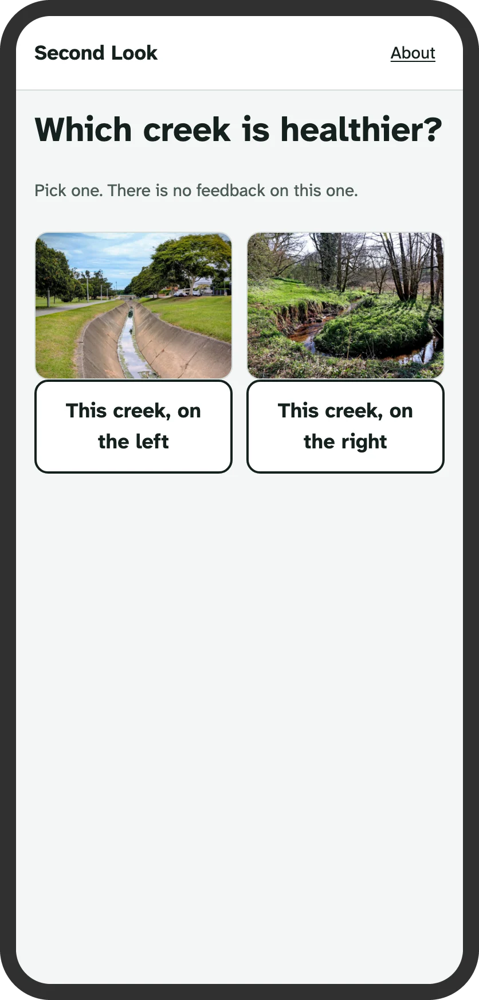
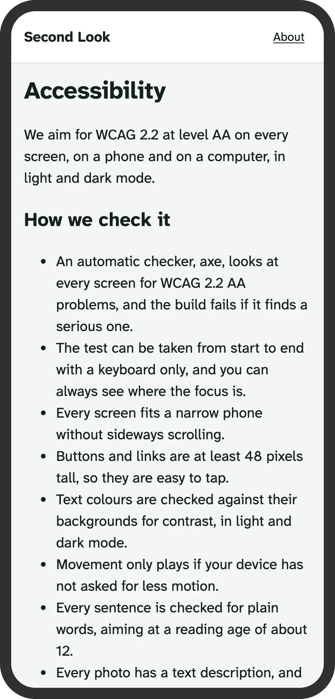
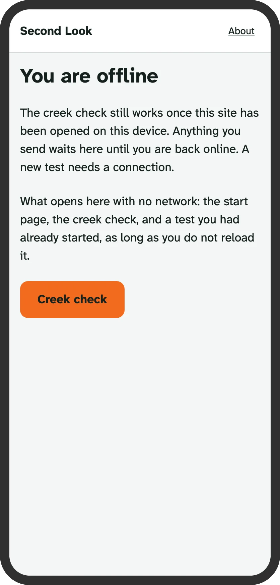
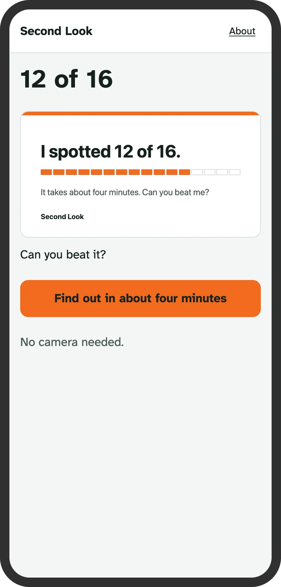
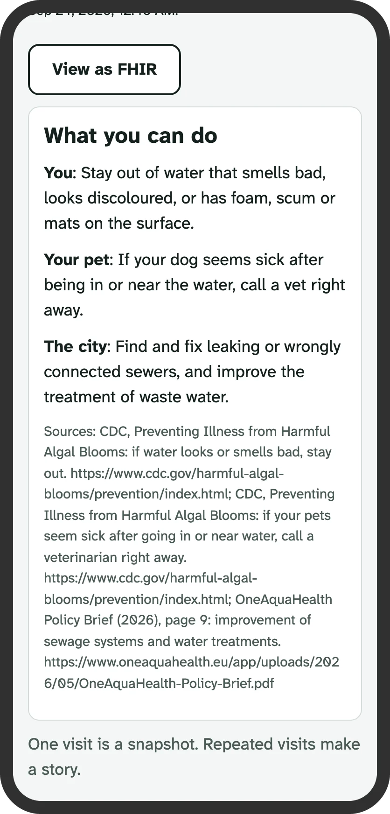

# Every screen

The phone screens of Second Look, in one drawn frame, captured by `make screens` (`apps/web/scripts/gallery.mjs`). Each caption says the route; "mock" marks a screen from a local build with the mocked API, and the rest come from the live site. The sizes, the frame and the alt text are checked by `scripts/tests/test_gallery.py` against `results/screens.json`.

<table>
<tr>
<td align="center"> Landing <code>/</code></td>
<td align="center"> The guess <code>/</code></td>
<td align="center"> Consent <code>/t</code> (mock)</td>
<td align="center"> A lesson card with its marks <code>/t</code> (mock)</td>
</tr>
<tr>
<td align="center"> A test item <code>/t</code> (mock)</td>
<td align="center"> The score <code>/t</code> (mock)</td>
<td align="center"> Judge mode today <code>/demo</code></td>
<td align="center"> For judges <code>/judges</code></td>
</tr>
<tr>
<td align="center"> Walks <code>/walk</code></td>
<td align="center"> A walk <code>/walk/v02</code></td>
<td align="center"> A walk in progress <code>/walk/v02</code></td>
<td align="center"> The walk record <code>/walk/v02</code></td>
</tr>
<tr>
<td align="center"> The walk as a city sees it <code>/city?walk=v02</code></td>
<td align="center"> Creek check <code>/check</code></td>
<td align="center"> Where are you? <code>/check</code></td>
<td align="center"> First question <code>/check</code></td>
</tr>
<tr>
<td align="center"> Quick check <code>/quick</code></td>
<td align="center"> A sample record <code>/spot?id=example</code> (mock)</td>
<td align="center"> View as FHIR <code>/spot?id=example</code> (mock)</td>
<td align="center"> City view <code>/city?creek=strawberry-creek</code></td>
</tr>
<tr>
<td align="center"> Two kinds of observer <code>/two</code></td>
<td align="center"> How we know <code>/how-we-know</code></td>
<td align="center"> Credits <code>/credits</code></td>
<td align="center"> Privacy <code>/privacy</code></td>
</tr>
<tr>
<td align="center"> About <code>/about</code></td>
<td align="center"> Poster <code>/poster</code></td>
<td align="center"> Check a record <code>/verify</code></td>
<td align="center"> The warm-up <code>/t</code> (mock)</td>
</tr>
<tr>
<td align="center"> Accessibility <code>/accessibility</code></td>
<td align="center"> Offline <code>/offline</code></td>
<td align="center"> A shared score <code>/share/12</code></td>
<td align="center"> The health card <code>/spot?id=example</code> (mock)</td>
</tr>
</table>
